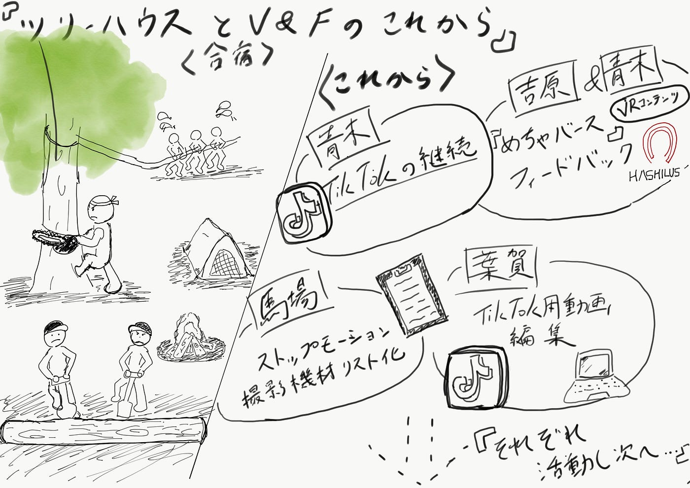

### 今週のV&F

**【今週の活動】**

青木：TikTok活動の継続

吉原：10月6日に古橋先生と参加した「めちゃバース」のフィードバックを共有

馬場：ストップモーションの撮影機材のリスト化

葉賀：TikTok用の動画の編集

**【ツリーハウス】**

週末は青木、馬場、葉賀の３人がたまたま長野のツリーハウスでバッティングし、貴重な体験をしました。

トラックの荷台に乗ったり、木を切ったり、鍋を食べるところを動画に撮って素材集めをしました。

これらを使って何本か動画を作りたい、、、。

**【グラレコ】**

