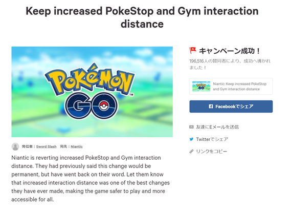
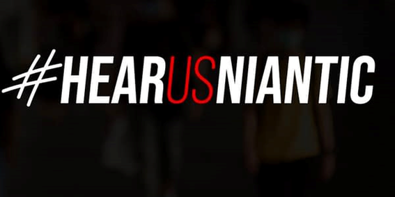
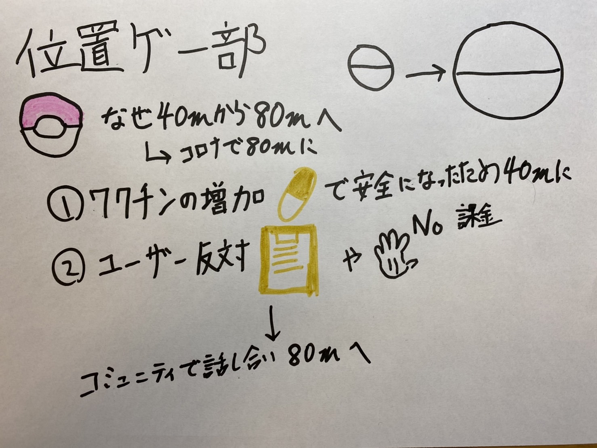

位置ゲー部：ジム、ポケストにアクセスできる距離について

前回の週報で古橋先生がお伝えしてくださったように今回は、なぜ一度40mに戻ったアクセス距離が80mに戻ったか、まとめていきます。

元々拡張した理由として、世界的に流行した新型コロナウイルスによって外出して遊ぶことが難しくなったために変更されました。

日本時間の6月23日10時に英語版のPokémon Goの公式サイトでワクチン接種が進んでいるアメリカとニュージーランドでテストを行い、他の地域でも短くすると発表しました。

そしてNianticは8月1日に40mに縮小しました。

それに対しユーザーは「Change.org」で署名活動や不買活動を行いました。

この署名活動には約20万人弱のユーザーが賛同しました。

公式動画に出ているインフルエンサーも反対しており、引退も示唆していました。

また#HearUsNiantic というタグで反対活動を行っていました。

ここで一度双方の主張をまとめていきたいと思います。

Niantic

・探検、運動、そして安全に遊ぶことが私たちの企業理念で、40ｍに戻したのは現実世界で現実の場所に繋がり、探索する価値のある場所を訪れてほしいからです。

→特にスポンサーの場所に行ってもらえないとメリットがなくなってしまう。

ユーザー

・移動手段が限られている人も楽しめる。

・障がいを持つ人や幼児にとってより安全に遊ぶことが出来る。

・新型コロナウイルスはまだ収まっていない。

・以前からコミュニティの意見が無視されていることも問題。

ユーザーからの多くの意見があり、Nianticは8月6日に各国のPokémon Goの

コミュニティリーダーと対談し、9月1日までに決まったことを公表すると発表しました。。

[詳しくはこちら](https://nianticlabs.com/blog/pgo-exploration-bonus-response/?hl=en)

そして8月26日に永久に80mにすると公表しました。

このようにユーザーの強い反対を受けて80mに戻しました。

グラレコはこちら

