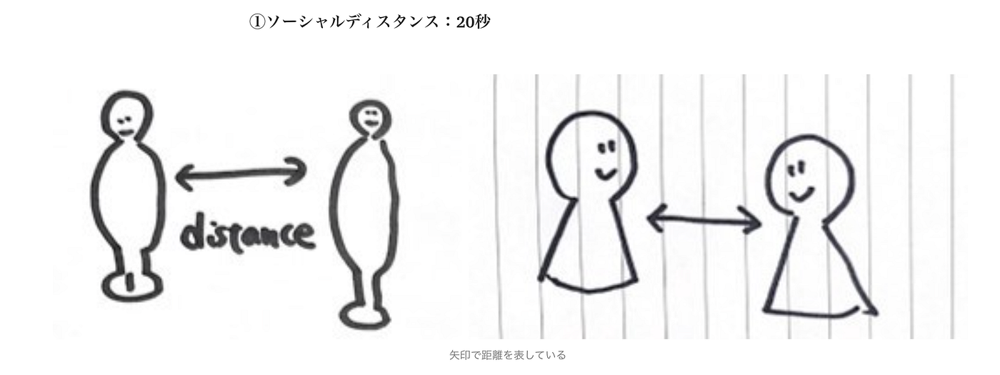
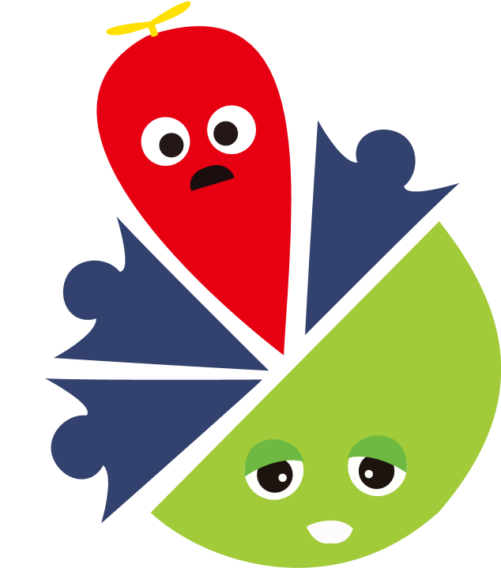
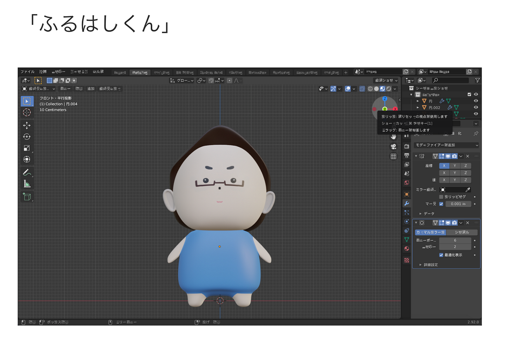
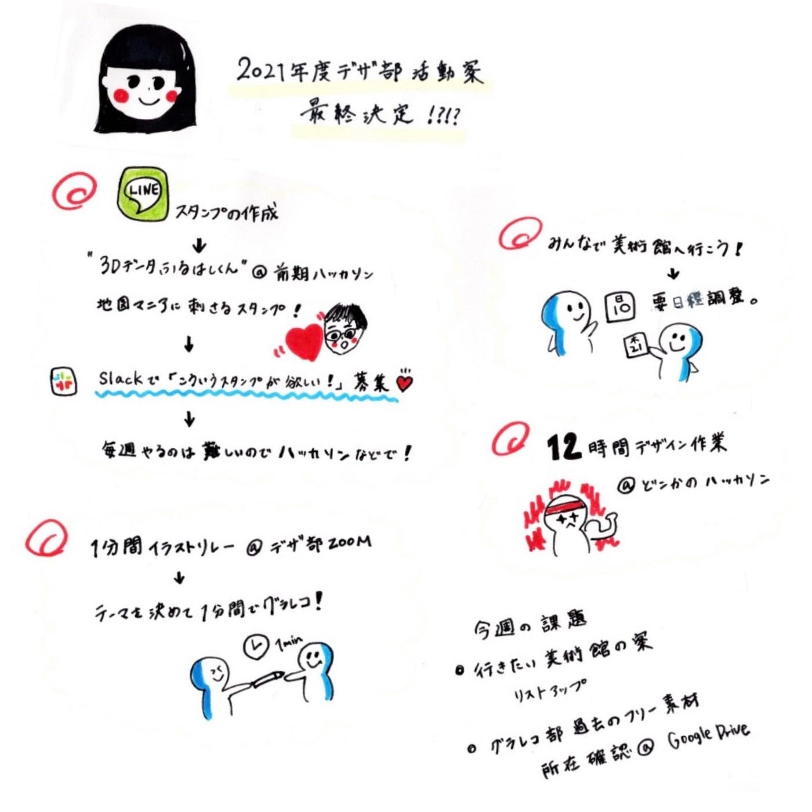

### 旧グラレコ部の“アレ”復活

こんちは！4年の佐藤です。

今週は、[後期の活動案（①〜⑨）](https://medium.com/furuhashilab/%E5%BE%8C%E6%9C%9F%E4%BD%95%E3%81%97%E3%82%88%E3%81%86-design%E9%83%A8-f0d1cfd1bcea)の精査を行いました！

### 決定した活動

まずは、毎週の活動についてです。

> “描いてみようチャレンジ”復活

これは、お題となる1つのテーマを時間を決めて描きまくる旧グラレコ部の活動です。
メンバーの希望でデザイン部でも行うことにしました。
私もやったことがないので楽しみです：）

旧グラレコ部では[こんな感じ](https://medium.com/furuhashilab/%E3%82%AC%E3%83%81%E3%83%A3%E3%83%A0%E3%82%AF%E3%81%8B%E3%81%91%E3%82%8B-910378d8245a)にやってましたね。

> フリー素材作り

前期に学んだフリー素材を自分たちで作っていこうという方向に決まりました。

こちらも旧グラレコ部が[ガチャムクの素材](https://github.com/furuhashilab/grareco4gachamuku/issues/2)を昨年作っていたので継承してやっていこうと思います。

そしてこれからの時期、防災イベントも増えてきますので、他部活の方達にも使ってもらえるような便利素材を増やしていきたいです。

そして、定期的に続けるのが

> いいと思ったデザイン・行きたい展示会のシェア

コロナ感染者が減少してきたので11月あたりみんなで行きたいです。

また、ハッカソンで（もしくは普段の活動で）やりたいこともリストアップしました。

> 古橋研究室LINEスタンプ作り

フリー素材に少々関連しますが、LINEスタンプはやはり進めていきたいです。

しかし、定期で作るよりも、ハッカソンなど集中して作成した方が効率いいのでは？という意見のもと、とりあえずハッカソン用の活動にしようと考えております。

[前期ハッカソンでV＆F](https://medium.com/furuhashilab/%E3%82%AC%E3%83%81%E3%83%A3%E3%82%AC%E3%83%81%E3%83%A3-%E3%81%B5%E3%82%8B%E3%81%AF%E3%81%97%E3%81%8F%E3%82%93-ab17bd4f9025)が作成した古橋先生のキャラ（古橋くん・・？）や、 研究室で普段使っている機材や地理キャラなどを作りたいと考えています。

思い出の古橋くん笑 ↓↓↓

フリー素材や、LINEスタンプに作って欲しいデザインがありましたら、随時Slackもしくは授業中のZoomコメントに記載をお願い致します！！

グラレコ：作うらら

