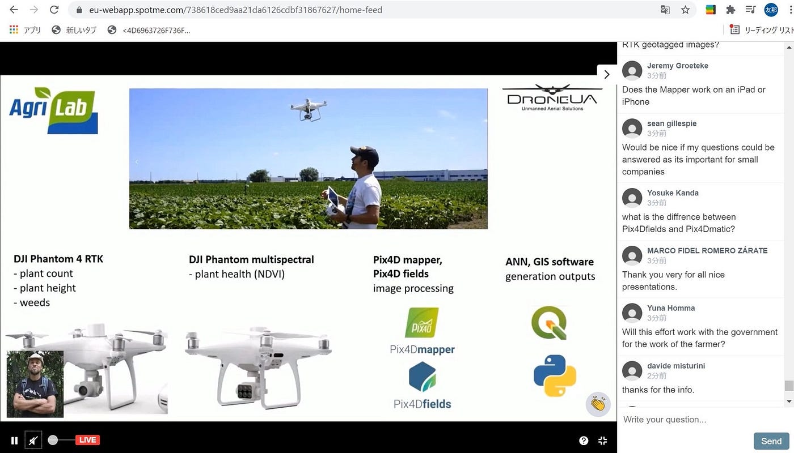
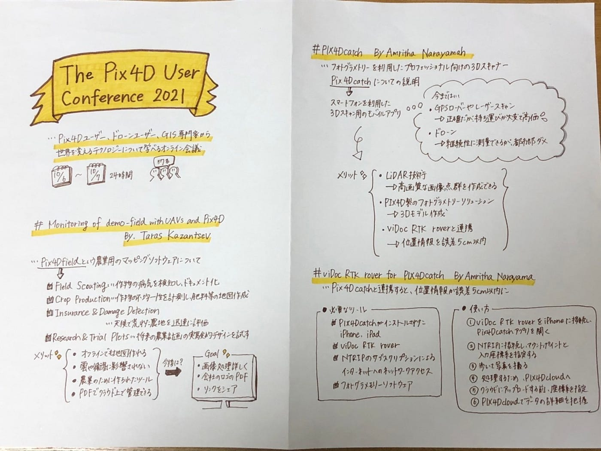

### The Pix4D User Conference 2021

国際会議The Pix4D User Conference 2021 に参加しました。24時間通して、様々な分野のプロフェッショナルの方々から、Pix4Dの使用方法についてのプレゼンを聞けて、とても有意義な時間となったと思います。いくつか視聴した中で、特に印象に残った3人の方のプレゼンについてレポートしていこうと思います。

#### #Monitoring of demo-fields with UAVs and Pix4D

#### By Taras Kazantsev

PIX 4Dfieldsという農業用のマッピングソフトウェアについてのお話を伺いました。

まず、主な機能として挙げていたのは以下のものです。

・Field Scouting…作物の病気や栄養不足、成長していない部分を検知し、注釈化やドキュメント化する

・Crop Production…作物の不均一性を計測し、肥料や作物保護のための地図を作る

・Insurance & Damage Detection…天候によって荒れた農地を迅速に評価する

・Research & Trial Plots…将来の農業計画のための実験的なデザインを試し、その分析をする

また、PIX 4Dfieldsがこれらの用途に最適なツールである理由について説明しており、具体的には以下の4つが挙げられていました。

・In-Field Results Edge Processing…オフラインでも迅速に地図を作れる

・Reliable Maps…雲の量や衛星に頼らずとも、複雑な地図を作れる

・Powerful Analytics…農業のためのビジネス的価値を生み出すために設計されたツールである

・Easy Sharing…PDF形式としてクラウド上でデータを共有できる

次に、製品の進化の歴史について説明されていました。

① 2018年6月PIX 4Dfields 1.0

・高速処理

・オルソモザイク

・帯状地図

・植物の索引リスト

② 2019年8月PIX 4Dfields 1.1–1.5

・カスタムで索引したものを計測

・ヒストグラム

・PDF形式

③ 2020年2月PIX 4Dfields 1.6–1.9

・注釈

・レイヤー

・統計

・ジオタグ

今後、PIX 4Dfieldsが農業の最も良い解決策として使用されていくための展望が必要であり、現在実際に作られているPIX 4Dfields1.10の新しい機能としては、

・GPU Processing for RGB…GPUアクセラレーションを通して画像処理を素早く行う

・Custom PDF Report…会社のロゴや情報を組み込んだPDF

・Share to PIX 4Dcloud…PIX 4Dcloudにプロジェクトをアップロードして、リンクをシェアできるようにする

#### #PIX4Dcatch

#### By Amritha Narayanan

フォトグラメモリーを利用したプロフェッショナル向けの3Dスキャナー、PIX4Dcatchについての説明を伺いました。

2012年にPix4Dソフトウェアを使用したドローンマッピングが登場したことにより、簡単かつ効率的に現場の情報を把握でき、建設業界は変革を遂げていました。さらに、2020年3Dスキャン用のモバイルアプリであるPIX4Dcatchが作られることにより、再び大きな革新をもたらされました。

今まで、GPSローバーやレーザスキャンは非常に正確である一方で、持ち運びが大変で価格が高いこと、高度な技術菜必要なこと等が問題でした。また、ドローンは継続的に現場を測量したい時に有益でしたが、飛行禁止区域が定められている都市部では使用が制限されていました。

これらの問題を解決するのが、スマートフォンを使った3Dスキャン用のモバイルアプリであるPIX4Dcatchとなります。スマートフォンに搭載されているLiDARの技術で、高画質な画像、点群を作成できるようになりました。PIX4DcloudなどのPIX4D製のフォトグラメトリーソリューションに読み込めば３Dモデルを作成できるそうです。

さらに、位置情報の精度を高めるために、昨年からviDoc RTK roverと連携し、誤差5センチ以内に位置情報を正確にすることが可能になりました。

この技術が使われている場面としては、建設業界であり、具体的には配管、ケーブル、水道等の公共事業のマッピングや、建設現場の備蓄資材の管理をするために利用されています。

今後の展望予定としては、ドローンによる撮影と、モバイルによる撮影を組み合わせた3Dモデルの作成を目指していくそうです。

#### # viDoc RTK rover for PIX4Dcatch

#### By Amritha Narayanan

ひとつ前のプレゼンの中でPIX4Dcatchの位置情報の精度の欠如を解決する手段として、viDoc RTK roverとの連携がありました。

このプレゼンではviDoc RTK roverについての説明でした。

まず、必要なツールは

・PIX4DcatchアプリがインストールされたiPhone、iPad

・viDoc RTK rover

・NTRIPのサブスクリプションによるインターネットへのネットワークアクセス

・フォトグラメモリーソフトウェア

次に、使い方は

① viDoc RTK roverをiPhone、iPadに接続し、PIX4Dcatchアプリを開く

② NTRIPに接続し、マウントポイントと入力座標系を指定する

③ 歩いて写真を撮る

④ 処理するため、PIX4Dcloudへアップロードする

⑤ クラウドへアップロードする前に、座標系を指定する

⑥ PIX4Dcloudでデータの詳細を把握

感想

一つ目のプレゼンでは、ドローンを使用した農業での統計や計測について知っていたものの、機能について詳細は理解していなかったので、とても勉強になりました。今回のお話を通して、PIX 4Dfieldsを利用してみたいと思い、ドローン部として農地がなくてもこのツールを使用した練習が出来るのか気になりました。

二つ目と三つ目のプレゼンでは、ドローンだけではなく、誰もが持っているスマートフォンで高度な3Dモデルを手軽に作成できることに驚かされました。今後もさらに使いやすく進化していくと思うので、動向を注視していきたいです。

以下は登壇者への質問の画面の画像です。

