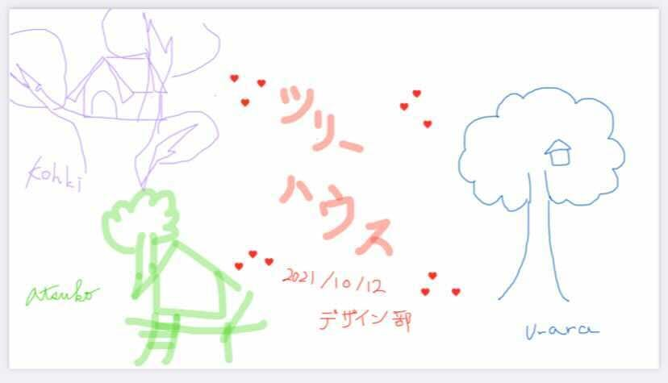
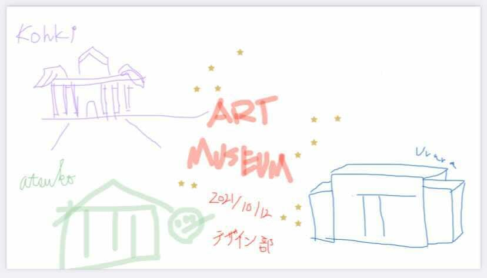
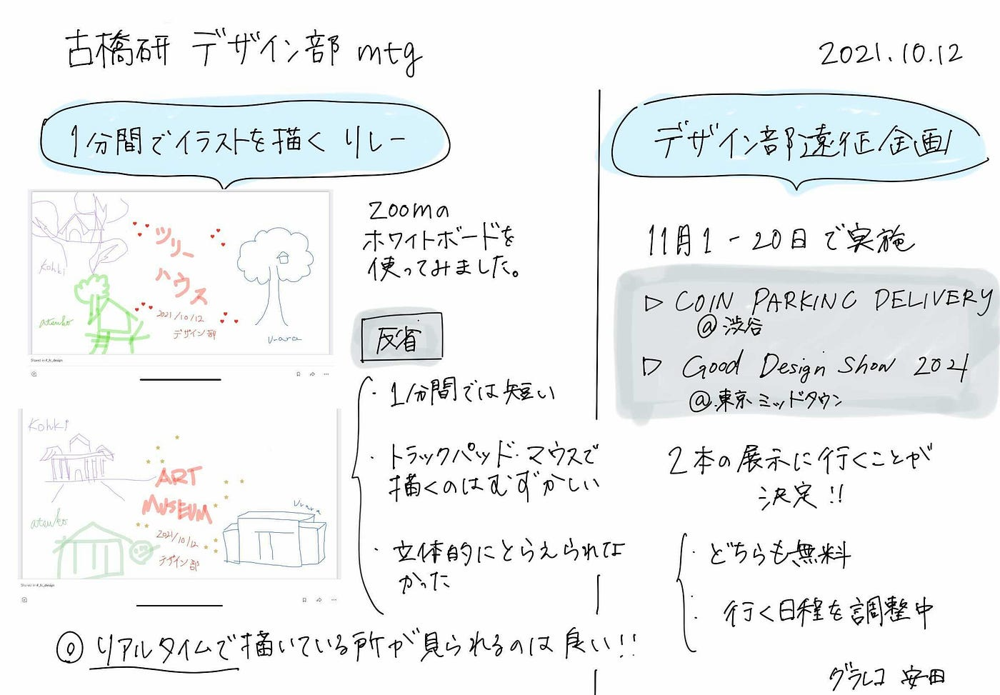

### デザ部部員で行く、美術館決定？！

初めてMediumを書いています、長島うららです。

今回のデザイン部MTでは、前回の後期活動内容の一つである「一分間リレー」を紙ではなく、ZOOMのホワイトボード共有機能を使用して行いました。

一回戦のテーマは古橋研究室にゆかりのある「ツリーハウス」です。

ツリーハウスと聞き、イメージはできるのですが実際に書くとなると難しいです。こちらがそのイラストです。

。。。

次のテーマは「美術館」でした。

これは悲惨ですね。

特に私のものはデザイン部とは思えないイラストです。

今回出た反省点は、

・立体的でなかったことや、１分間で描くのは意外と難しい、そもそもマウスで描くの難しい（次から紙に変更するかも？）でした。

反対に今回分かった良かったところは、ホワイトボードを有用できたことや、みんなが書いてるところをリアルタイムで見れるのは楽しいということでした。

これからのMTで定例化すればどんどん上手くなる（はず）。。です。

非常に楽しいのでこれから毎回やっていこうと思います。

次にデザイン部遠征について話し合いました。

緊急事態宣言も明け、ようやく活動ができそうなので、デザイン部は11月1〜20日でデザイン部遠征を開催します！

行く予定の展示会は[「COIN PARKING DELIVERY」](https://www.diesel.co.jp/art/coin_parking_delivery/)と「[GOOD DESIGN SHOW 2021](http://promo.g-mark.org/)」の2本立てです。

### 「COIN PARKING DELIVERY」

「COIN PARKING DELIVERY」はDIESEL ART GALLERY（ディーゼル アート ギャラリー）にて、スマートフォンを使いグラフィックを描画する新世代アーティストであるCOIN PARKING DELIVERY（コイン パーキング デリバリー）による個展「DIMENSION MEDIA（ディメンション メディア）」を開催しています。

**展覧会概要**

> _タイトル：DIMENSION MEDIA （ディメンション メディア）_

> _アーティスト：COIN PARKING DELIVERY (コイン パーキング デリバリー)_

> _開催期間：2021年9月11日（土）- 2022年1月13日（木）_

> _会場：DIESEL ART GALLERY_

> _住所：東京都渋谷区渋谷1–23–16 cocoti DIESEL SHIBUYA B1F_

> _電話番号：03–6427–5955_

> _開館時間：11:30–20:00 （変更になる場合がございます）_

> _入場料：無料_

これまで直接見ることがなかった新世代アーティストの作品をこの機会にみんなで見に行こうと考えています。

### 「GOOD DESIGN SHOW 2021」

公益財団法人日本デザイン振興会が10月20日に今年度のグッドデザイン賞を発表します。それらの作品を紹介するイベント「GOOD DESIGN SHOW 2021」が10月20日から11月21日まで、特設ウェブサイトと実会場での展示を中心に開催されます。

> _開催期間；2021/10/20(水)～2021/11/21(日)_

> _会場：_

> _・特設Webサイト、_

> _・東京ミッドタウン・デザインハブ東京都港区赤坂9–7–1 ミッドタウン・タワー5F_

> _時間：11:00～19:00（10/20のみ16:00開場）_

> _休館日：会期中無休_

> _入場料：無料（**事前予約制** ※10/11受付開始）_

デザイン部に非常に関係のあるイベントということでデザイン部部員全員で行かなければ！！ということになりました。このイベントからインスピレーションを受けれればいいなと思います。

今週はSlackにて日程調整を行い、決定します。

グラレコ

