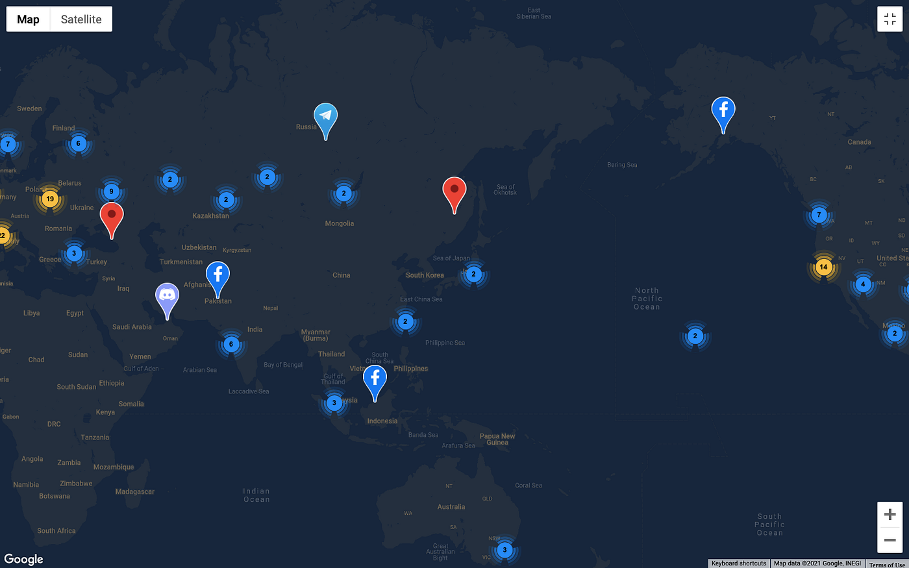
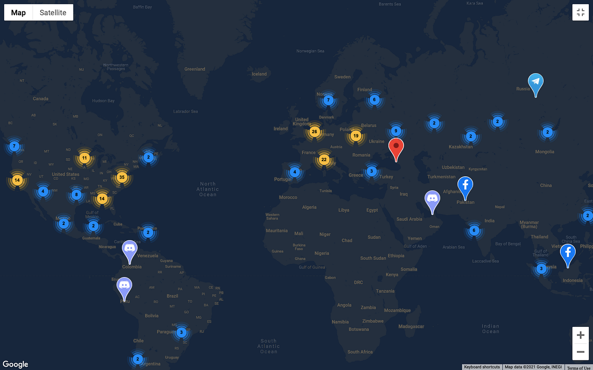
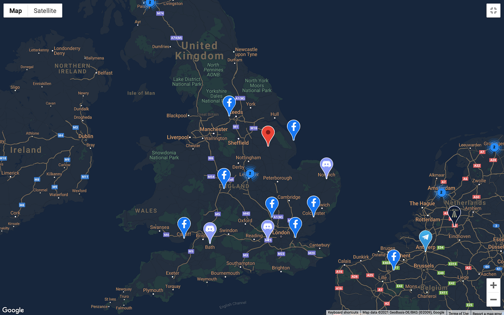
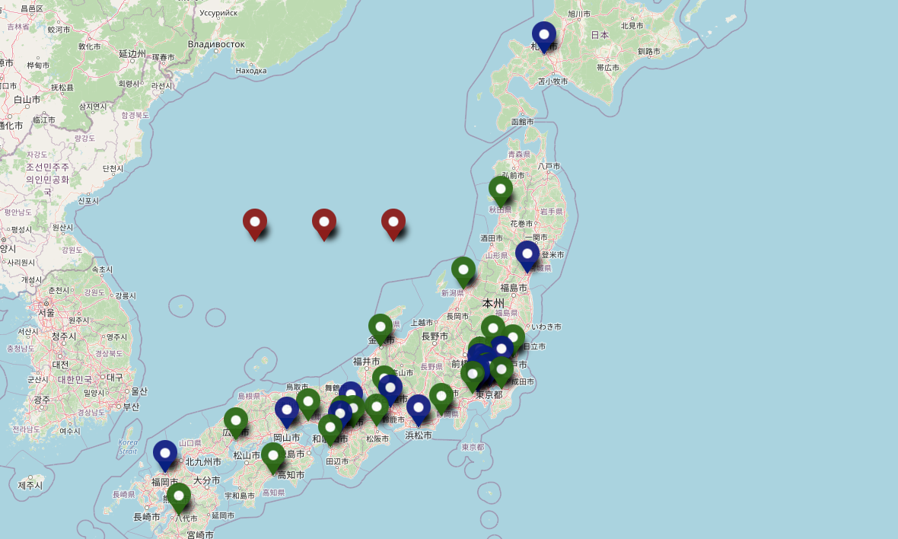
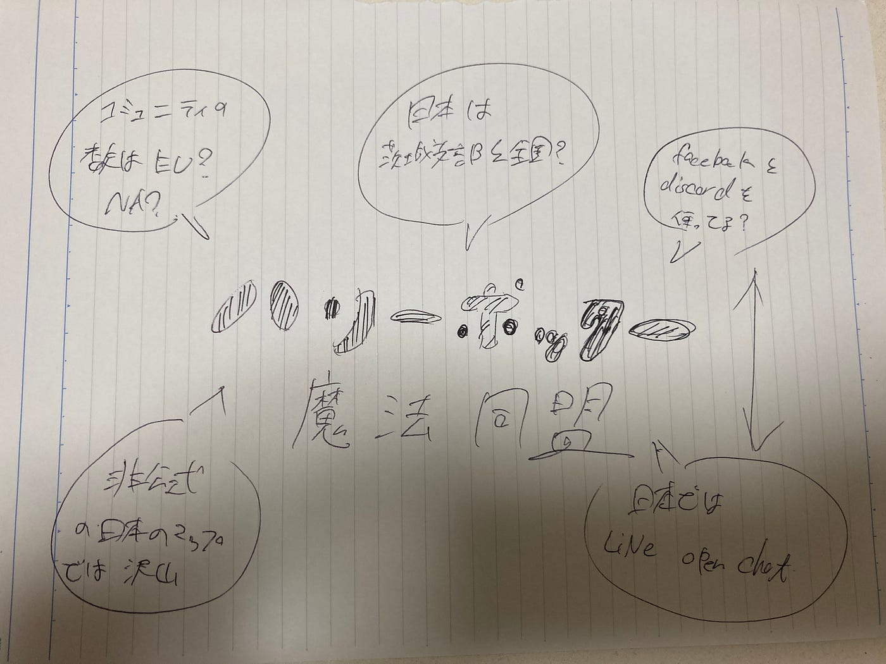

### ハリポタコミュニティマップ

皆さんお忘れのハリポタ魔法同盟。ポケモンGOとドラクエに比べると、nianticの力の入れようが違うと感じていますが、公式サイトに興味深いコミュニティマップがありましたので見てみました。

[コミュニティマップ](https://www.harrypotterwizardsunite.com/ja/map/)

おそらく、書いてある数字はコミュニティの数で、日本は2件です。全国共通のdiscordチャンネルと現在使用していない茨城支部の二つです。

コミュニティの数はNAとEUが多いですね。これは、前回のingressの時と同様です。

これは、イギリスのコミュニティマップです。facebookとdiscordを使用していますね。NAとEUのコミュニティツールを比較してみると、NAはfacebookとdiscordメインで、EUはtelegramが多く使われているようです。telegramはロシア生まれだからですかね。しかし、世界的にはdiscordが一番使われているようで、やはりゲームにはdiscordが適しているのでしょう。

**公認コミュニティマップではないものの、非公式で日本のコミュニティマップを見つけました。**

[非公式コミュニティマップ](https://umap.openstreetmap.fr/ja/map/map_424193#5/37.545/140.010)

ほぼ全てが、lineのopenchatでした。そこから、やる気がある人はdiscordに移動みたいな感じです。神奈川県支部に入りましたが、あまり活動はしてないですね、、、ちなみにオープンチャットに入っている人数は、神奈川支部は60人、埼玉支部は30人、東京は複数の支部に分かれてますが合わせて300人ぐらいかなと思われます。NAのdiscordは各100名ぐらいいましたね。

しかし、全国版discordに入ったらすごい活動してました。650人が参加して雑談はもちろん、呪文やボス戦の研究など有識者が沢山いて、初心者にも丁寧に教えてました。まだ、日本でもハリポタは廃れてないですね。これから伸びることを期待しています。

グラレコ

