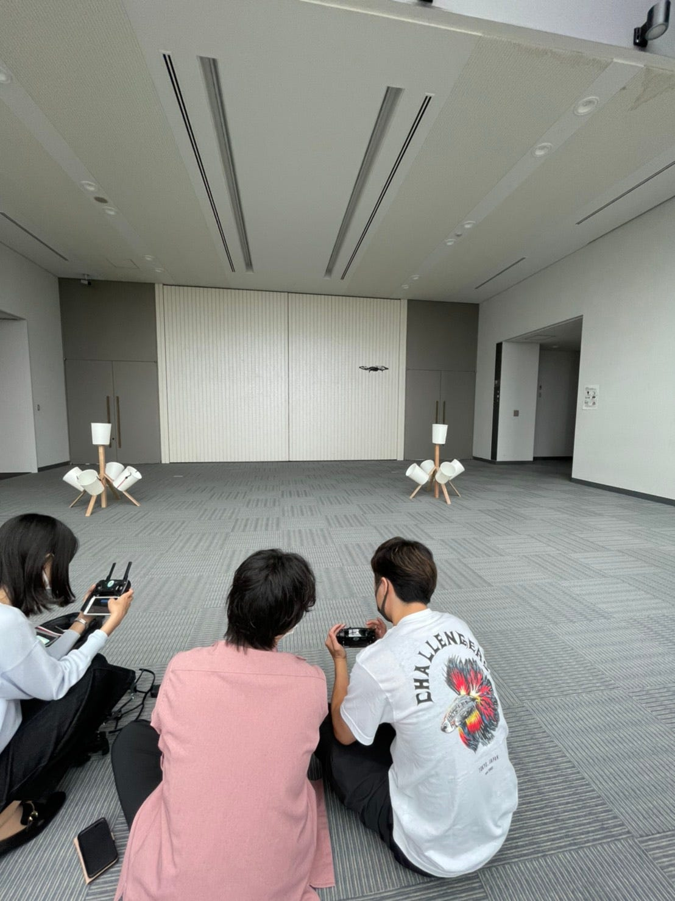
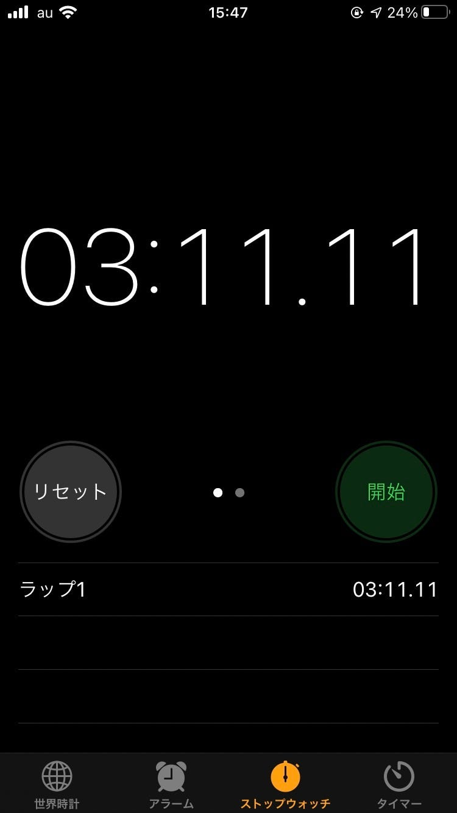
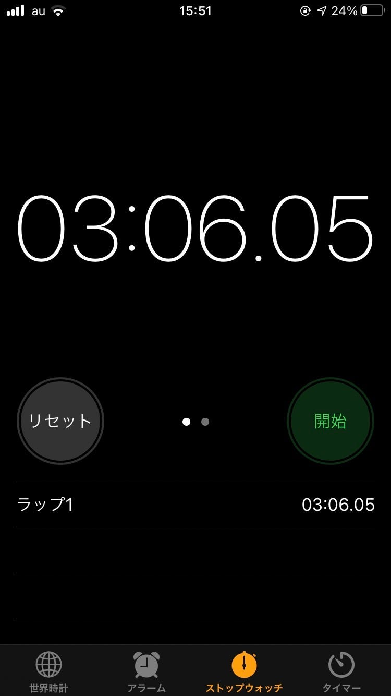
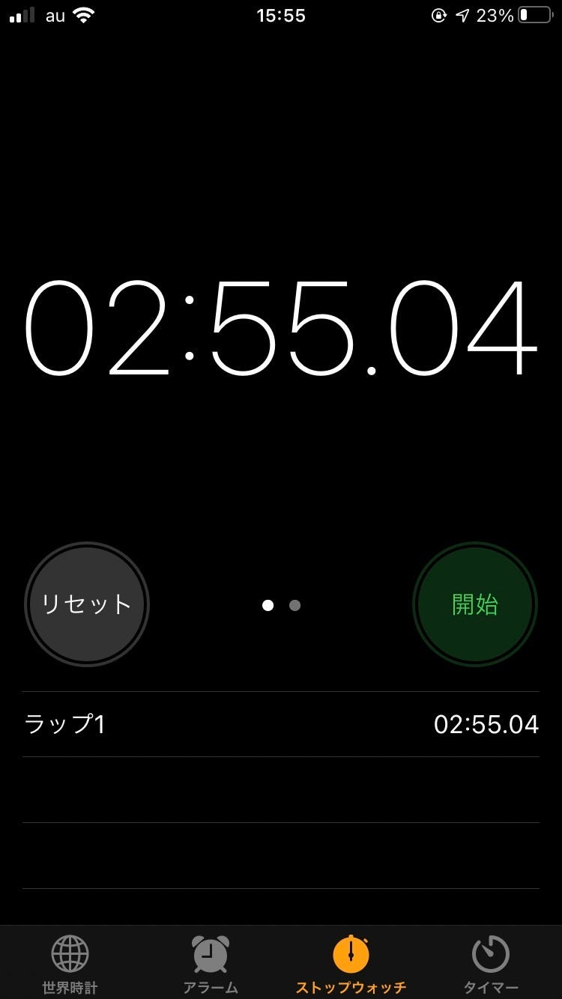
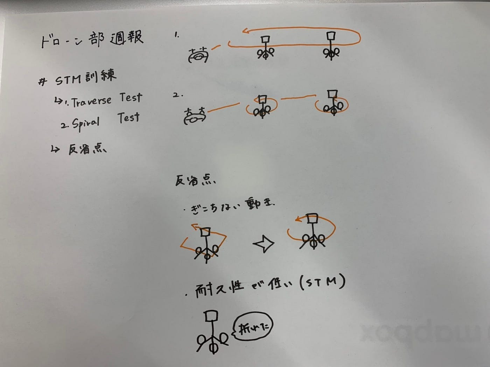

### 第一回STM訓練開催！

今週は研究室に到着したSTMのバケツにAからJまでのアルファベットを書き加え、いよいよSTMを使ったドローン操縦訓練を開催しました。

#### STM準備、使用した機体

二つのSTMの配置については約5mの間隔を空けて配置しました。

今回使用した機体はMavic AirとMavic Miniです。

#### TEST方法

[今回行ったテスト方法](https://www.fdma.go.jp/publication/ugoki/items/rei_0301_23.pdf)は二種類で、Traverse TestとSpiral Testというものです。

このそれぞれの方法で一人一回ずつ行いタイムを計測しました。

#### 反省・課題点

・マニュアルの操縦経験が足りてないので一挙一動に間が空いてぎこちない動きになる →とにかく操縦経験を積んで操作感を体に染み込ませる。

・STM自体の耐久性が低くて脚が一本取れてしまった。 これから毎回補強が必要になりそうか。

FPV

#### タイム結果

[タイム記録管理用スプレッドシート](https://docs.google.com/spreadsheets/d/1FYUftSykl8HZXQFjhm44OMLV1nQfm50GZzKCX6gSjsM/edit?usp=sharing)で記録していきたいと思います。

#### グラレコ

