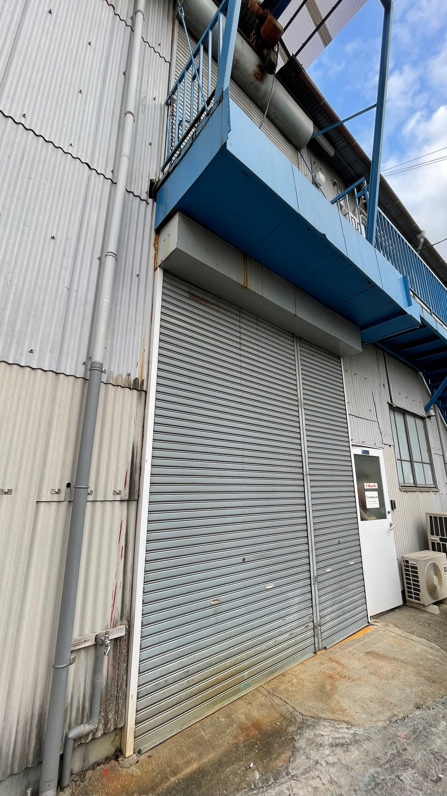
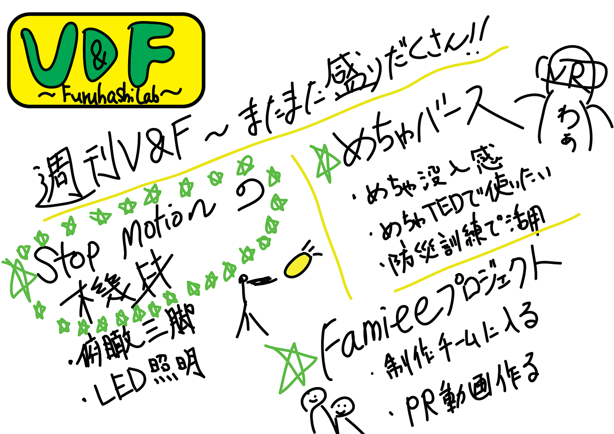

### 週刊V＆F

今回は、まずストップモーションの必要機材を改めて調べ、既に研究室・学内にあるものと新たに購入した方が良いと思うものを簡易的にリスト化した。

**既にあるもの：**

- ステージ

研究室 or 学内スタジオ

- （雲台とカメラスタンド）

- 編集ソフト（Premiere pro, After Effects）

**新たに必要なもの：**

- 俯瞰三脚

[真上から撮れる俯瞰三脚 178cm（〜4Kg）俯瞰／真上/カメラ三脚・ビデオ三脚・ジブ / パンダスタジオ・レンタル公式サイト
真上から撮れる俯瞰三脚 CTRPDVCL 折れ曲がるアーム アングル自在 水平器付 普通の三脚で真下を撮るのって難しいですよね。 三脚が邪魔になって、うまく撮れなかったり、脚が写り込んだり&hel…rental.pandastudio.tv](https://rental.pandastudio.tv/products/detail/1098)

[カメラ スマホ 三脚 リモコン付き ミラーレス 一眼レフ iPhone スマホ三脚 軽量 自撮り棒 コンパクト 折り畳み 伸縮式 スタンド スマートフォン WONDER LABO - 通販 …
WONDER LABO | カメラ スマホ 三脚 リモコン付き ミラーレス 一眼レフ iPhone スマホ三脚 軽量 自撮り棒 コンパクト 折り畳み 伸縮式 スタンド スマートフォンpaypaymall.yahoo.co.jp](https://paypaymall.yahoo.co.jp/store/menstrend/item/01-06-0080/)

- LED照明

[『コマ撮りアニメの照明がチカチカする時の解決策と、暗くするフィルター』
スタジオの窓は全部黒い紙を貼っています。 (ただ、自然光であえて撮って、時間の移り変わりを表現するやり方などもあります。作品作りにおいて、禁止事項などというものはないので。)…ameblo.jp](https://ameblo.jp/acraft/entry-12326964813.html)

[https://www.amazon.co.jp/dp/B077VMSMZS/ref=as_sl_pc_as_ss_li_til?tag=animaandinfor-22&linkCode=w00&linkId=84b0b7b7becdfa817fd1e357c2d9ebde&creativeASIN=B01EO7DQB4&th=1](https://www.amazon.co.jp/dp/B077VMSMZS/ref=as_sl_pc_as_ss_li_til?tag=animaandinfor-22&linkCode=w00&linkId=84b0b7b7becdfa817fd1e357c2d9ebde&creativeASIN=B01EO7DQB4&th=1)

#### ＜めちゃバース＞

_[めちゃバース公式サイト_](https://hashilus.co.jp/products/mechaverse/)

### 感想

- 没入感のある体験

- よりインパクトのあるプレゼンができる

- TEDxでも使えそう

- コロナ禍で集合して訓練のしにくい消防訓練で活用する

- 中学校などの防災訓練で活用

### 仕様

- コントローラーがいらず、手をOculusにかざすだけで反応してアクションを起こせる。

- 「生徒役」と「先生役」があり、役ごとにコントロールできる機能を設定できる

- 極力シンプルにして機能を制限した方が直感的に扱える

- 家の内見やストリートビューを使用した旅ができる

- その場から動かずに360°カメラで撮影した情景を見れる

- 距離感覚が実際の家具と一致していて、VRゴーグルを着けたままソファに座ったら移動できる

- 車などが実際の大きさで目の前に置かれて、瞬間的に色を変えられたり、内装も内側から見学できる

- ソワリンの映像が全部自分を軸に展開される感じ

#### ＜Famiee Project＞

Famieeの制作チームにV＆Fが加入。

今後はPR用の動画制作を担当する予定。

#### ＜グラレコ＞

