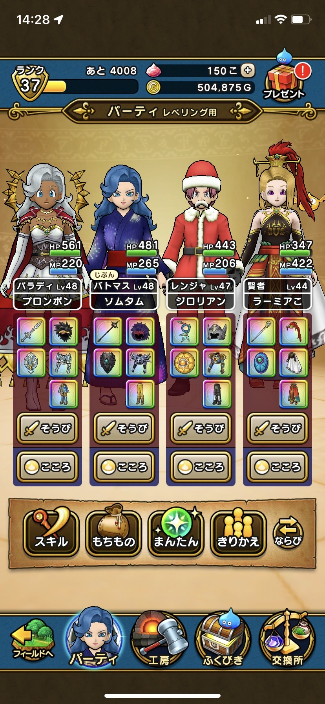
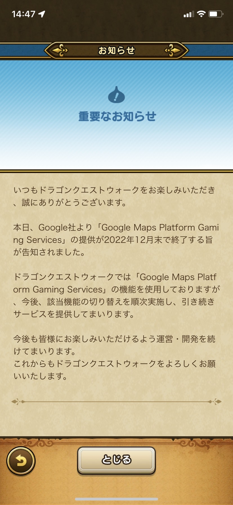
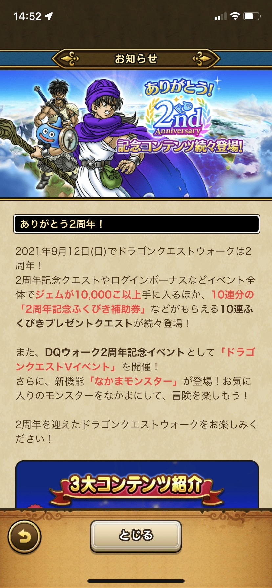
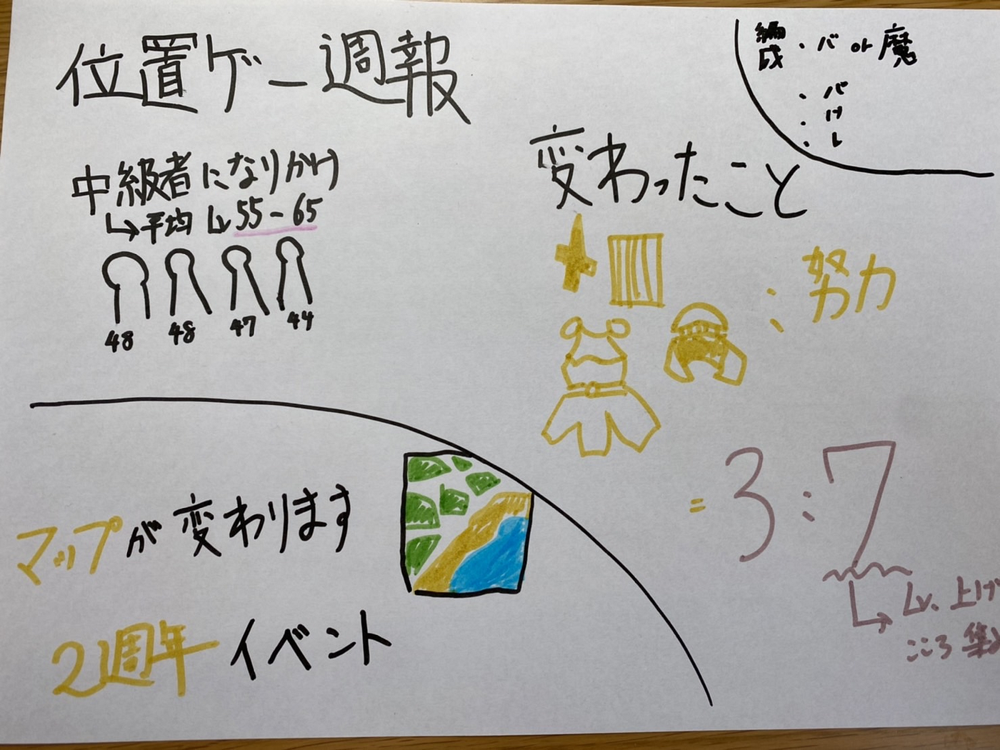

ドラクエウォーク中級者一歩手前になって分かったこと

##今日の週報

今上級職の平均がもうそろそろ50になり、中級者の一歩手前くらいになったので、初心者だった時と比較して変わったことを紹介したいと思います。

##中級者とはいったいどれくらいのLv.

メガモンスター討伐で推奨されているものは上級職のlv.55–65くらいになっており、そのレベルになるとドラクエウォークを最大限楽しむことが出来ます。

上級職になるには、基本職を2回50にしなければならないのでかなりハードルがあります。しかし運営側も初心者の方向けに経験値獲得量を上げることで参入しやすいようにしています。

##初めの時と変わったこと

1. 課金：努力＝3：7に （以前までは9：1くらい）

強い武器を使うことで経験値の効率を良くすることが出来ますが、中級者になるとメガモンスター討伐を目標に周回することが第1になります。なぜならステータスを上げるために強いモンスターのこころが存在するからです。ボスの弱点に沿った、防具や武器を持たないといけないため頭も駆使しなければいけません。

またレベルを上げないと、強いボスに太刀打ちできないため、レベル上げが必須になります。

2. オート機能を有効活用

最初は画面を見ながら移動していましたが、目標の地点を設定して、オートにすることによって見ながら移動することを無くしました。

この機能は本当に便利なのでPokémon GOにも早く追加してほしいです。

3. 無難なパーティ編成が一番

ドラクエウォークでは偏ったパーティよりもバランスの良いパーティのほうが戦いやすく、

・バトルマスター or 魔法戦士

・パラディン

・賢者

・レンジャー

が中級者で一番見かける編成です。

##マップが変わります

ドラクエウォークのマップの変更が決まりました。次のマップは何になるか気になります。

##2周年イベントについて

2021年9月12日より、ドラクエウォーク2周年を記念してドラクエ5とコラボを行い様々なイベントを行っています。

初心者の方もたくさん武器や防具を引き、強力なこころも1つもらえます。

グラレコはこちらです。

