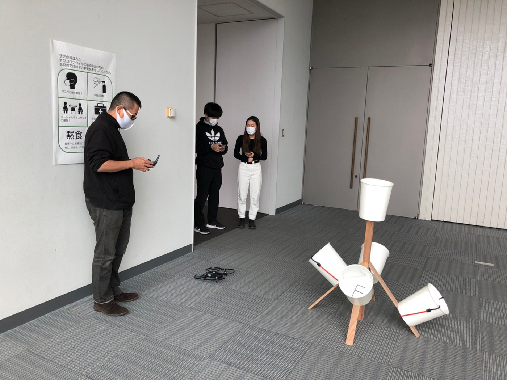
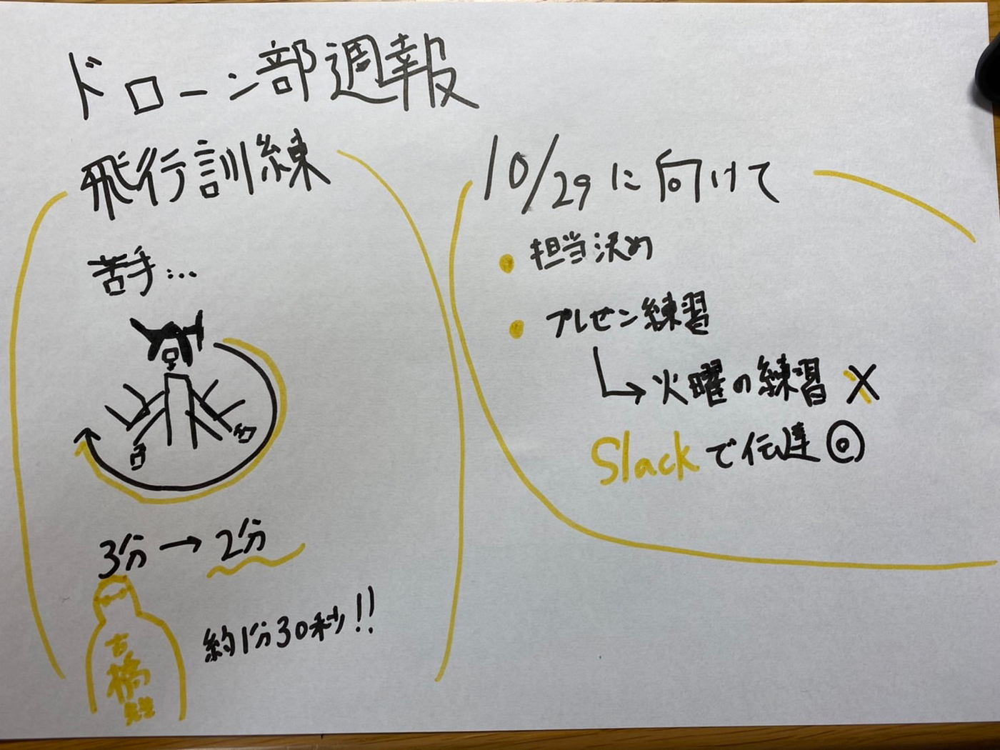

### ドローン部週報

##飛行訓練

前回の反省点を踏まえ、今回はそれぞれが苦手としている分野を練習していきました。

私は視点を変更しながら移動することが苦手だったので、特にそこに重点を置いて練習をしました。

すると前回は平均3分くらいかかっていたのが、２分くらいになりました。

なので次回の飛行訓練からも、前回の反省点を踏まえた部分を練習し、苦手意識を無くした上でタイム計測をしていきたいと思います。

この調子でドローンの操縦に関する技術をさらに高めていきたいと思います。

いつかドローン部内で賞金などを用意してタイムアタックの大会を開きたいなと個人的に考えております。

##古橋先生も来てくれました

古橋先生も今回ドローン部の練習に来てくださいました。

古橋先生も今回タイムを測っていただきました。（練習もなしでそのまま飛ばしてもらいました。一種のハンデ）

古橋先生の記録は2種類とも１分３０秒よりも短かったので、それよりも短いタイムを出せる用ドローン部員で練習していきたいと思います。

古橋先生は上手くなっていけば、1分を切ることも出来るとおっしゃっていたのでいつかきれるように目指していきたいと思います。

##10月29日に向けた準備

10月29日に自治体に向けて4テーマを30分づつ発表するのでそれの準備を現在進めています。

今日のゼミが終わった後、プレゼンの練習を行う予定です。

なので今週のドローン飛行の練習は行わずに練習をします。（Slackで共有済み）

グラレコはこちらです。

