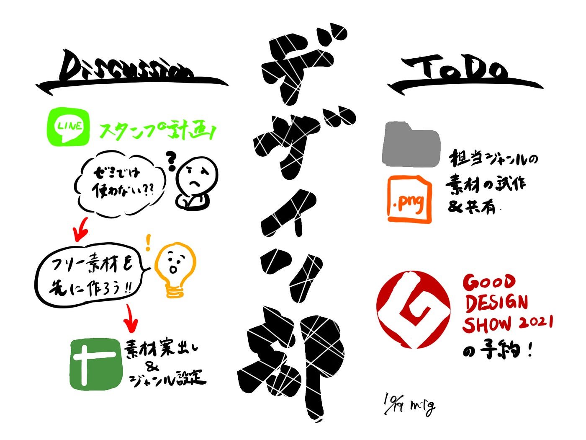

### フリー素材を作ろう

LINEスタンプ作成について話す中で、「古橋ゼミの中で、LINEって主要ツールじゃないよね」という意見が出ました。もし今後LINEスタンプを作ることになっても対応できるように、先にフリー素材作成を行うことにしました！

全員で案出しをし、系統別に並べ、それぞれ数個の素材を作ることが今週の活動に決まりました。

また、以前より企画していたデザイン部遠征の日程が決定しました。今年の「GOOD DESIGN SHOW」は予約制なので、予約も済ませ万全です！

[GOOD DESIGN SHOW 2021 | GOOD DESIGN AWARD
60年以上続く「グッドデザイン賞」、今年も1600点を超えるグッドデザインが選ばれました。90名の審査委員による、半年にわたる審査から見えてきたトピックを語るトークセッション、リアル展示会や皆さんの一票により決まるグッドデザイン大賞投票など…promo.g-mark.org](https://promo.g-mark.org/)

