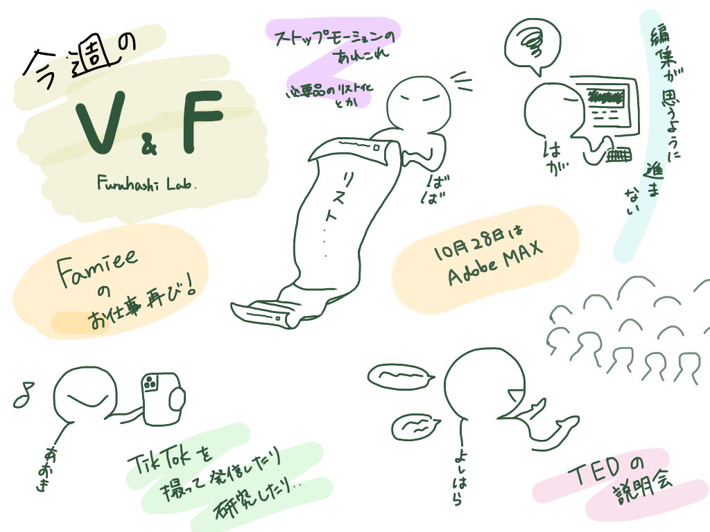

### 古橋研生が意外と知らない動画

### Famiee

Famieeプロジェクトにおいてまた動画制作を担当することになりました。前回のような詳細な説明動画ではなく、操作画面をさくっと紹介するようなよりCMよりの動画になるかと思います。

特にAfter Effectsを使用したアニメーション制作が鍵になってきそう！なので後期V&Fの大きなプロジェクトになりそうです。

これから週報にて随時進捗を報告していきます。

前回制作した動画

[ブロックチェーンの技術を活用した「家族関係証明書」の第1弾、スマホのアプリで完結する、【同性パートナーのための「パートナーシップ証明書」】、民間発行がスタート
■プロジェクトの概要 ...prtimes.jp](https://prtimes.jp/main/html/rd/p/000000009.000047881.html)

### TEDxの説明会

11/24(日)にTEDx新メンバー説明会を行いました。応募者3名のうち1人のみの参加になってしまいましたが、今回ご参加いただいた方は「やってみたい」とのことでした！

4年生が退場していく前になんとかメンバーを集めたいところです。

### 【れんによる厳選推し動画のススメ】

### 藤井 風 — “燃えよ” Official Video

先日リリースされた楽曲のPVで全てGoogle Pixel 6で撮影されています。シンプルに画質が良すぎて本当にスマホかと疑いましたが、このPV通り素晴らしいクオリティです。

カメラだけで言えばiPhone13 pro 以上かもしれません。

### ちなみに

Google Pixelの今回のコラボ企画はかなり気合いが入ってました。局を超えたstep型cmで地上波8→7→6→5→4の順に30秒の映像が流れ、Music Videoのプロローグになるというものでした。ストーリー性×リアルタイムでしか見れない体験型の広告は結構楽しかったです。

普通じゃマネできないやり方ですが、「チャンネル」が切り替わる+リアルタイムで流れる媒体があれば真似できるかもしれないですね。

[「燃えよ」Music Video 公開特別企画 Fujii Kaze ＋Google Pixel #自分らしく燃えよ - TOP
・「STEP CM」は一部エリア（東京、神奈川、千葉、埼玉、栃木、群馬、茨城）のみでの放映想定です。 ・不測の事態（天災など）が発生した際には中止となる可能性がございます。events.withgoogle.com](https://events.withgoogle.com/fujiikaze-googlepixel/)

### Google Presents: Pixel Fall Launch

Google Pixel繋がりで思い出し、調べたのがこちらGoogleも同じく商品発表会をオンラインで行っています。古橋研究室ではAppleイベントばかり話題に上がるので少し拝見。

正直な感想としては、動画のクオリティはAppleイベントが圧倒的勝利で見比べるとかなり臨場感や演出が違いました。

例えていうなら、Appleイベントはガジェット界に「夢」を与えるディズニー的存在。Google Pixelイベントは新しい機能やテクノロジーを「日常」でどう使えるか、こんな所が面白いよということを伝える雰囲気があります。世界観よりも技術を打ち出すような富士急的立ち位置。

やはり、V&FはAppleイベントを目指したいところです。

### TikTok

TikTokをやっているV&Fでこういうのをやってみたいというアイデアを紹介。このような「アクション系」の編集をやっていなかったので挑戦してみたいと思っています。

中々、アクション系の編集や撮影のTipsを発信している人が少ないのでもう少し調べ、近いうちに共有します。

### Adobe Max

10/27, 10/28はAdobeのイベントです！
改めて古橋研究室の国際会議参加ルールを貼っておきます。

[古橋研究室流国際会議の参加ルール v1.4 · Issue #21 · furuhashilab/README
国際会議の参加ルール v1.4 国際会議の定義 最低2名以上の外国人スピーカーが登壇する事。 会議のテーマが古橋研究室の研究に関連している事。 運営・自分が登壇の場合…github.com](https://github.com/furuhashilab/README/issues/21)

### グラレコ

