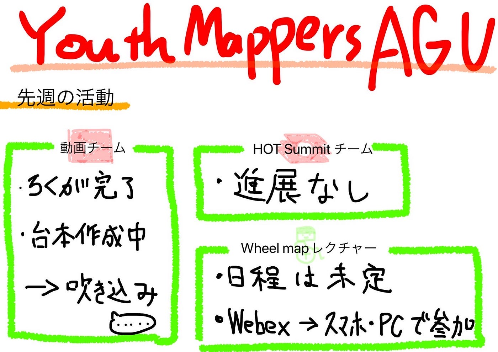

### 伊豆大島でやることを決めよう

先週に引き続き日向野が書きます。

#### 先週の活動

２チームに分かれて活動してきました。動画チームは最後の編集作業に入りました。HotチームはDialogueで出るためスライドを一から作り直しています。

#### Wheelmapレクチャー

Wheelmapのレクチャーを今後更に行って行くことを考えています。現在はLives様に企業と繋いでいただいていますが。今後は自分たちでもPR活動を行っていきたいと考えております。

#### 伊豆大島

今回は伊豆大島でやることを決めると言う事で、様々な案があります。

・古橋ゼミPR用の動画を作る

・伊豆大島のOSM更新

・伊豆大島PR用の動画

など、様々な案がありますが、各々ゼミ論も迫ってきているので半分は個人で使う時間にしたいと思います。自分は伊豆大島という広大な土地を使ってGPS Drawing を行いたいと思います。

