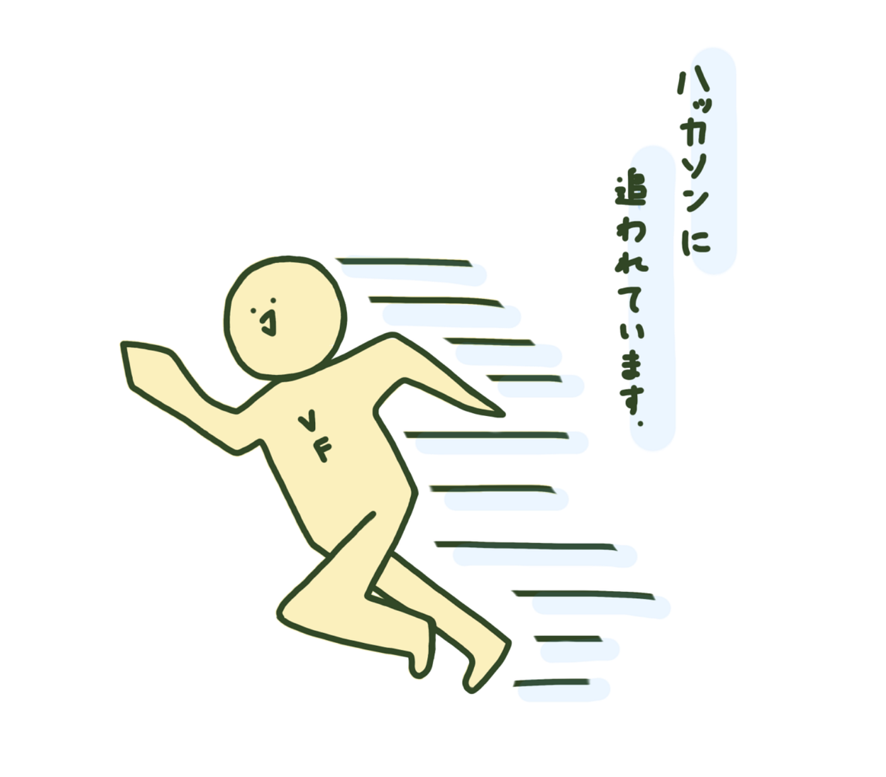
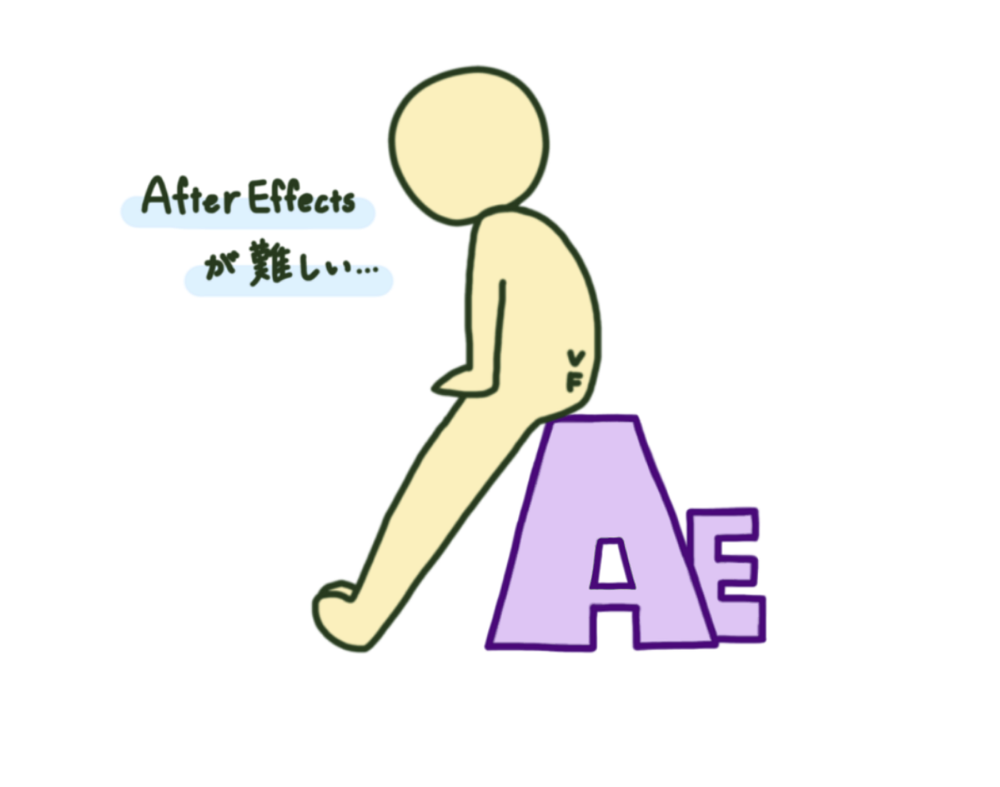
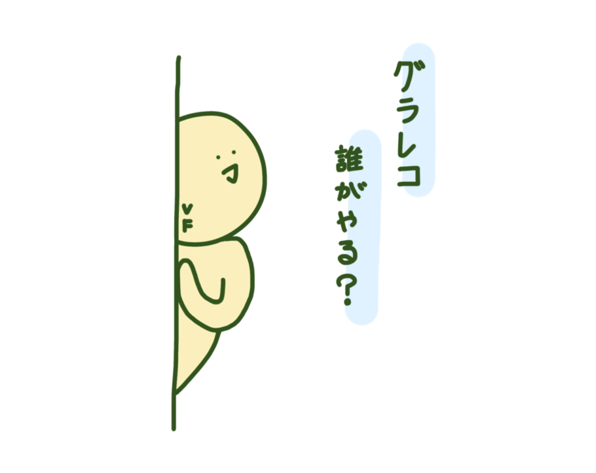
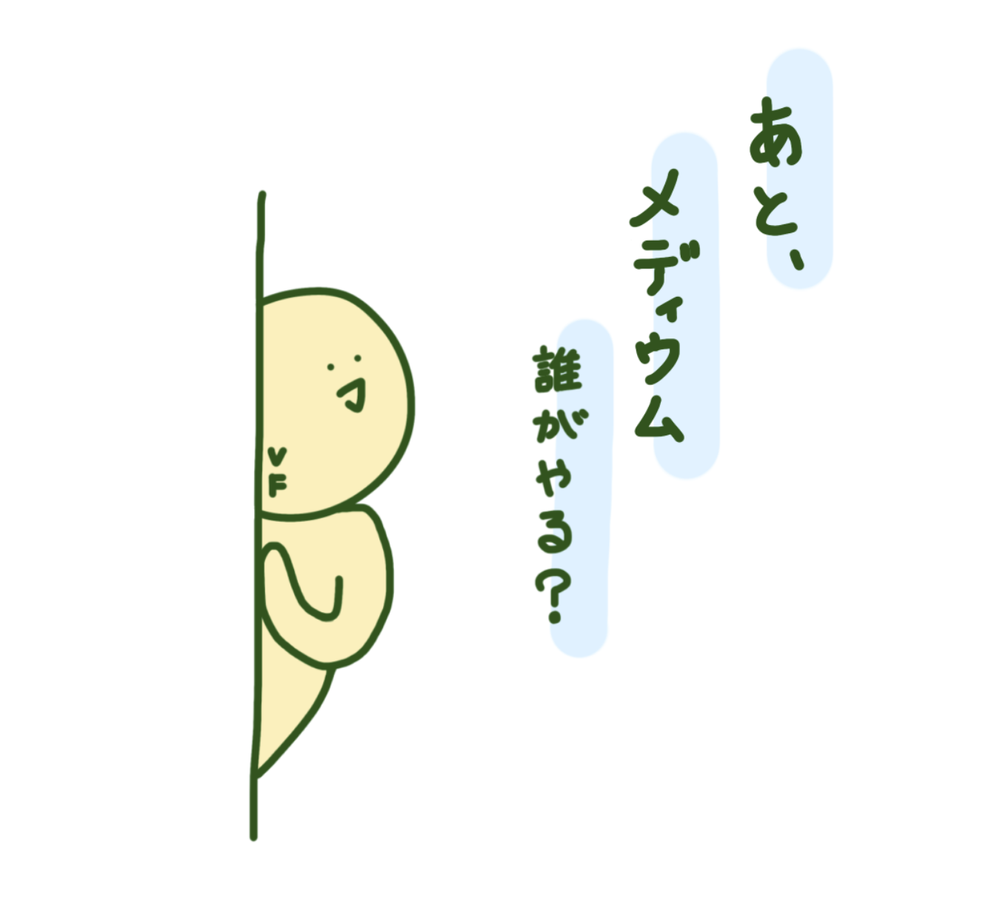
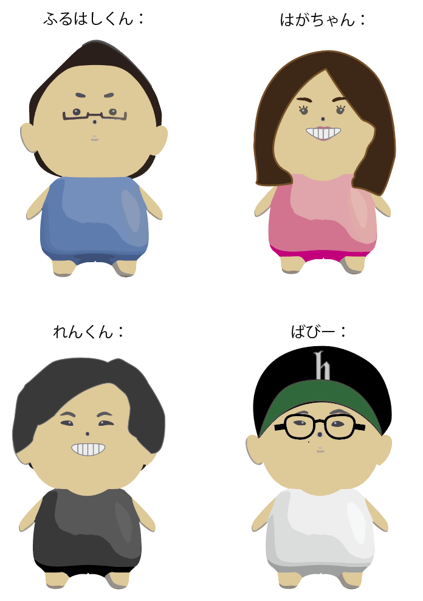
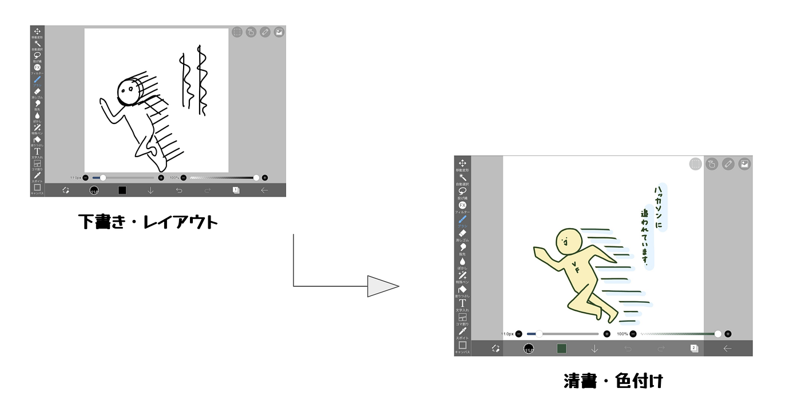
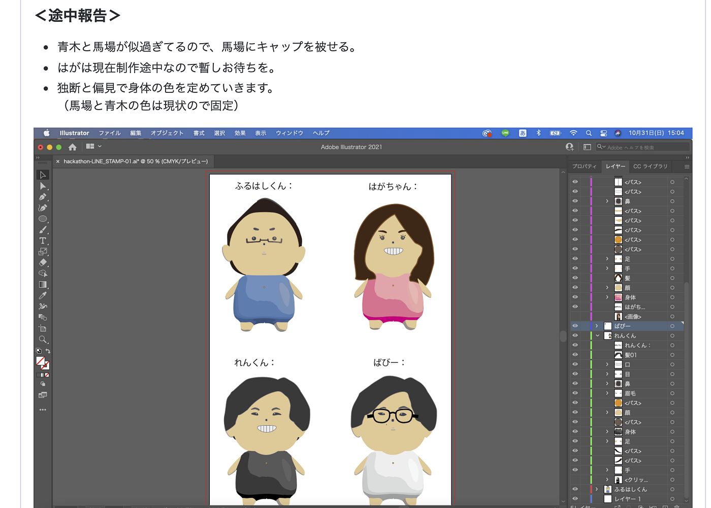
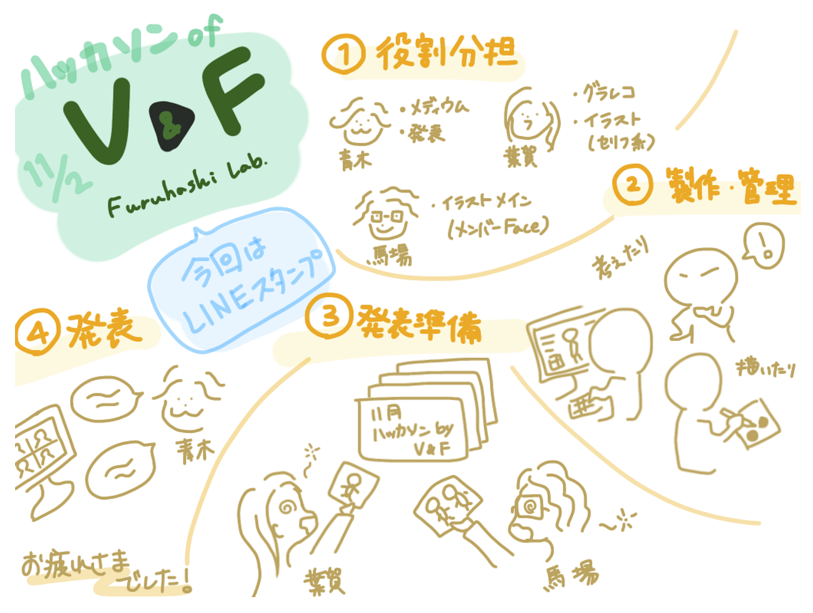

### このスタンプ、今日から使えますよ。

### 今回のハッカソン

11月のハッカソンは「Lineスタンプ」を作る企画！具体的なお題はこちら

それぞれのゼミ内サークルごとに具体的に取り組んでいるプロジェクトで必要とするイラストやLineスタンプ化可能なコンテンツを集中して作成する。

我々、V&F(動画編集チーム)は動画制作がメインの活動なので、色々素材があれば助かりますね。

### 今回でたアイデア集

□チーム内で使える系

> ・「グラレコ誰やる？」スタンプ

> ・「やりたくない」スタンプ

> ・「データ消えた」スタンプ

> ・「AE難しい」スタンプ

□メンバーの顔系

> ・顔 + 文字のスタンプ

> これは返信が簡単ですし、また動画の素材としても使えそう。

□動画制作で使える素材系

> ・擬音系

□”動画部っぽさ”×”日常使い”

### 成果物

### 全部で9つ

はが作

馬場作

擬音系スタンプは作ろうと思っていたが間に合いませんでした。。。

### 制作過程

### V&Fスタンプ

今回のスタンプは”シンプルさ”を大切にしました。完成系はうまくできていますが、実は言葉やセリフに合わせたポーズを絵で表現するのが意外と難しかったです。

うまくなる基本で「プロの絵を見まくる」がありますが、上手い人の絵や資料を参考にしながらスタンプを作成しました。

うまく表現することにこだわってしまい、使用した時の快適さについてあまり考えられていなかったです。例えば、背景色の問題。特にLineはトーク画面の背景を変えることができたりするので、色合いによっては見えづらくなってしまう可能性もあるかもしれません。

### メンバースタンプ

前回のガチャガチャハッカソンにて制作した先生の新キャラ”ふるはしくん”をベースに作成したので既存の作品を元に作るという意味で統一感が出せましたが、その反面、キャラクターごとに差別化するのが難しいという問題もあります。いかに、それぞれの個性を見つけ出すかでうまく違いを出すことができます。

#### メンバーとしては「やだ、やりたくない！」スタンプができてしまったので積極的に使わせていただきます！！byれん

### グラレコ

### Google スライド

### Githubリポジトリ

[GitHub - furuhashilab/V-F_OnlineHackathon_Nov: 11月V&Fオンラインハッカソン用リポジトリ
You can't perform that action at this time. You signed in with another tab or window. You signed out in another tab or…github.com](https://github.com/furuhashilab/V-F_OnlineHackathon_Nov)
