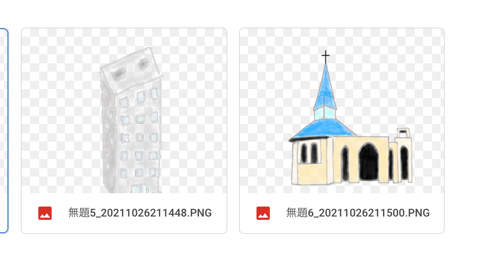
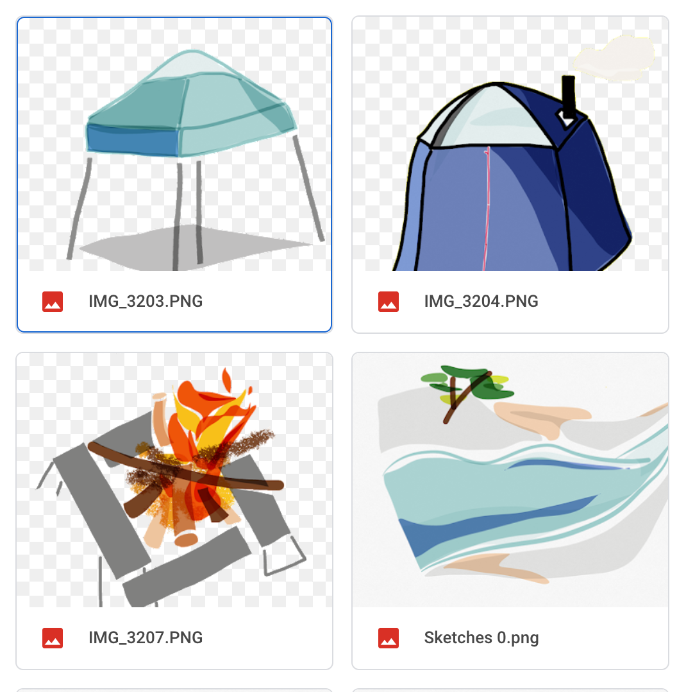
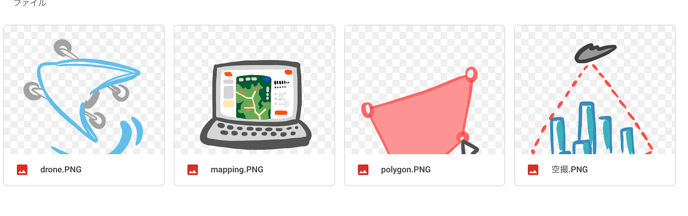
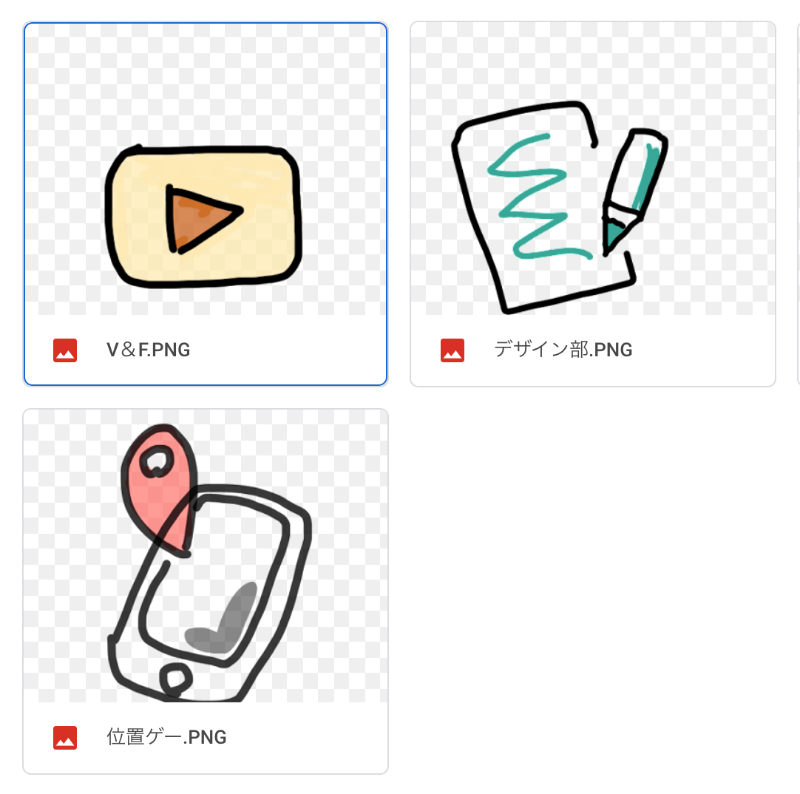
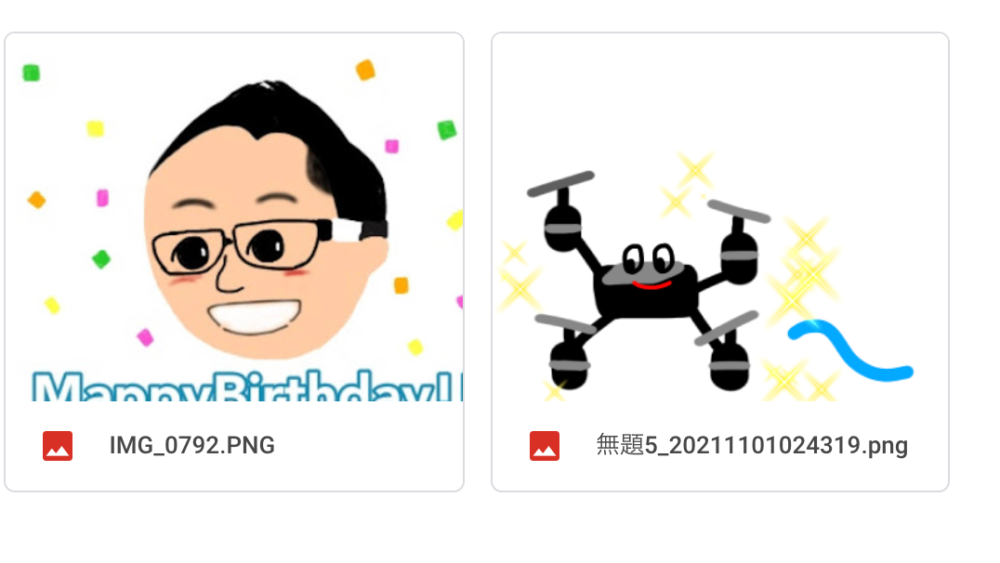
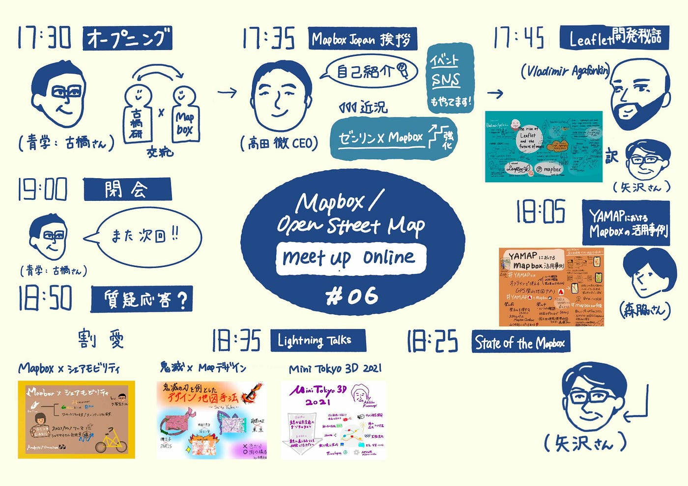
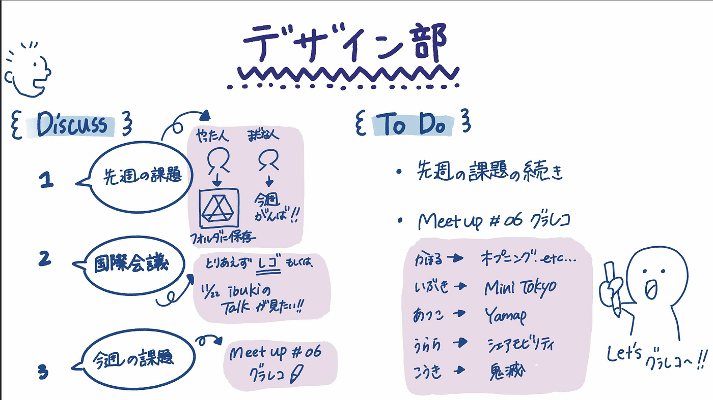

### フリー素材作成！！

こんにちは、デザイン部です。
今週のデザイン部は先週の課題となっていたフリー素材作成の進捗状況の確認、国際会議への参加どうするかについて話しました。

また、meet upグラレコ の割り振りを決め各自担当分を描きました。

#### ＃フリー素材作成の進捗

サガキャン、マッピング、横瀬、古橋研究室各サークルなど大雑把に分類をし、[Googleドライブ](https://drive.google.com/drive/u/0/folders/15FUUgFlWRlpQ5Xl-9wv3nd2gsJcKU5q_)にアップロードしました。

＜さがキャン編＞

横瀬編

マッピング編

研究室部活編

古橋ラボいろいろ編

書いてみると意外と難しいことも多く、次回のハッカソンに向けて良い準備になったと思います！

#### ＃国際会議の参加

レゴ、もしくは11/22のOpenStreetMap Summit 2021に参加しようか〜〜となんとなく話しました！

#### **＃meet up online 06グラレコ**

#### ＃今週のグラレコ

