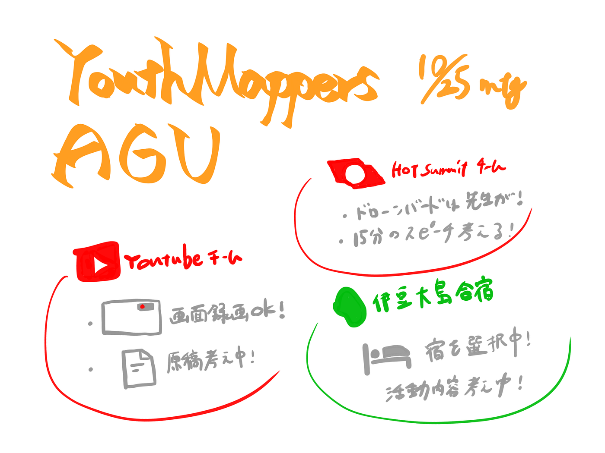

### 動画＆HOT 進捗報告

先週に引き続き、動画チームとHOTチームに分かれそれぞれ進めております！

動画チームは画面録画の準備ができ、現在原稿を作成中です。その作業が終わればついに動画の収録に進んでいきます。

HOTチームは、古橋先生がドローンバードとして参加することを受け、15分という時間をどう使うか再考しています。現在作成中の動画を紹介するなどの案も含めて、検討中です。

伊豆大島合宿の宿泊先などが決定してきました！ 今後は伊豆大島での活動を決めていくことになりそうです。

