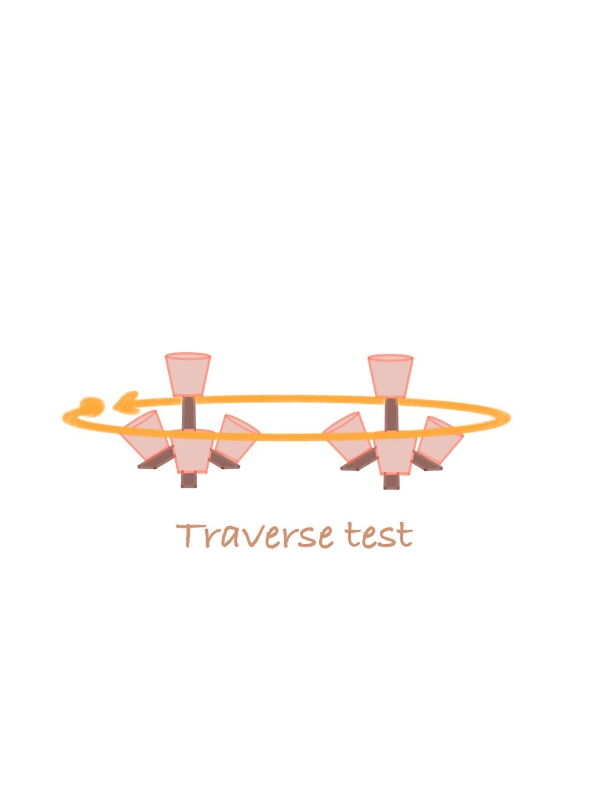
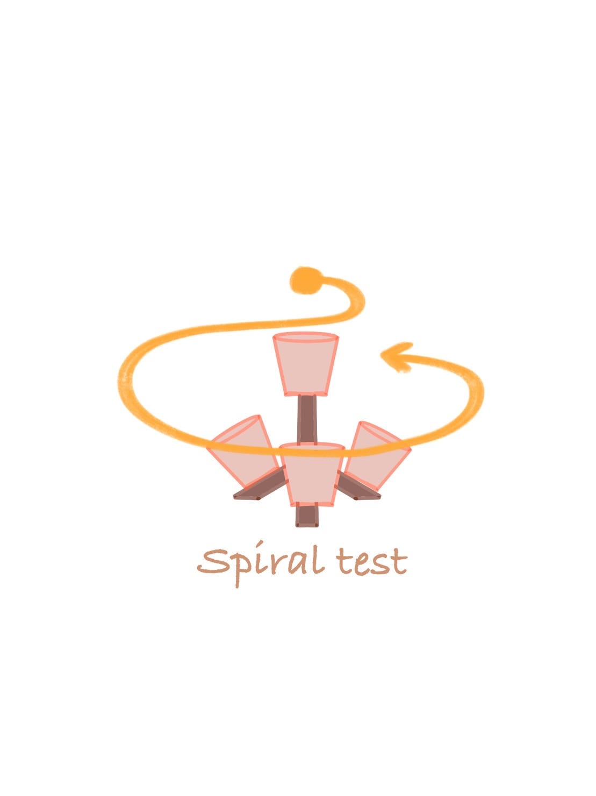
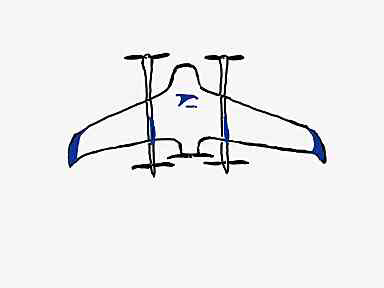
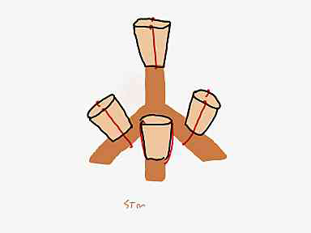
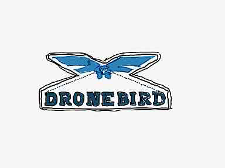
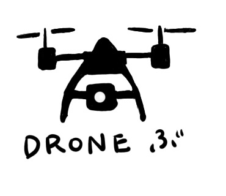
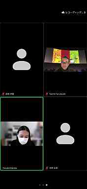
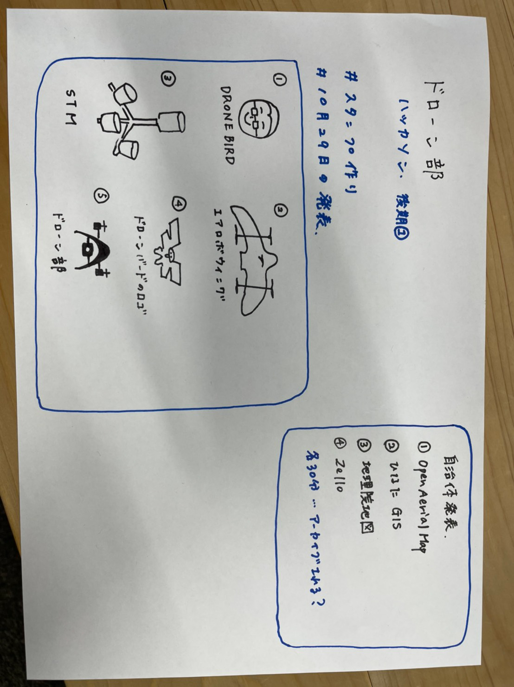

ドローン部：ハッカソンの修正

今回はゼミ内サークルで取り組んでいるプロジェクトのイラストとLINEスタンプ化可能なコンテンツを作成しました。

＃＃ハッカソンへの追加して行ったもの

前回の中間発表よりSTMを利用してドローンを操作している具体的な絵を作ることが決まったのでそちらのイラスト作成を追加で行いました。

松山作

この2枚を追加しました。

特に軌道でどのように飛行していけばよいか視覚的にわかりやすく表現されているので、今後活用していきたいと思います。

＃＃イラストのアイデア出し

ドローン部では最近の活動として、STMを利用した活動をしているのでそちらのイラスト作成を行いました。

LINEスタンプ化可能なコンテンツとして、DRONEBIRDやドローン部どちらも使用できるようなイラストを作成することにしました。

＃＃今回の作品

今回はドローン部4名でそれぞれ作成したので紹介したいと思います。

絵が上手に描くことが出来ないので、「味」を出すことに注力して作成しました。

伊藤作

私は、DRONEBIRD用のLINEスタンプを作成しました。

特に質問が多そうなものは何かを考えた際に、訓練はいつ行われるか聞かれると思ったのでこちらを作成しました。

本間作

本間はエアロボウィングのイラストを作成しました。最近ではエアロボウィングの飛行訓練を行うことも多いので実用性があると思います。

松山作

松山はstmのイラストを作成してもらいました。特にstmを用いて飛行する際に2つのテストがあるのでこちらを用いて説明ができたらと考えております。

神田作

神田はDRONEBIRDのロゴのイラストを作成してもらいました。グラレコを作成する際に、簡単にDRONEBIRDのロゴを引用することが出来ます。

伊藤と松山作

ドローン部員であることを証明するスタンプです。これは古橋研究室の学生で何部か聞いた際に、文章を送らずともドローン部に属していることを伝えることが出来ます。

＃＃10月29日の発表

30分の発表はこれまで行ったことがなく準備万端で挑戦しました。（古橋先生にとても助けていただきました。）

部員全員緊張しましたが、貴重な経験をすることが出来ました。

また今週から9階で練習会を再開します。

翌週ハッカソンの発表で終わった後、急いでイラストを作成しましたが、「味のあるイラスト」を作成することが出来たと思います。

スライドはこちらです。

[https://docs.google.com/presentation/d/1InwziC4Wy4Tjyt5Uc0cWDKEoJCh1kKPBcuBrnRH7_iA/edit#slide=id.gfd2a23a482_0_191](https://docs.google.com/presentation/d/1InwziC4Wy4Tjyt5Uc0cWDKEoJCh1kKPBcuBrnRH7_iA/edit#slide=id.gfd2a23a482_0_191)

Git hubはこちら

[hackathon2021-11_drone/README.md at main · furuhashilab/hackathon2021-11_drone
2021年度11月ドローン部ハッカソン. Contribute to furuhashilab/hackathon2021-11_drone development by creating an account on GitHub.github.com](https://github.com/furuhashilab/hackathon2021-11_drone/blob/main/README.md)

グラレコはこちら

