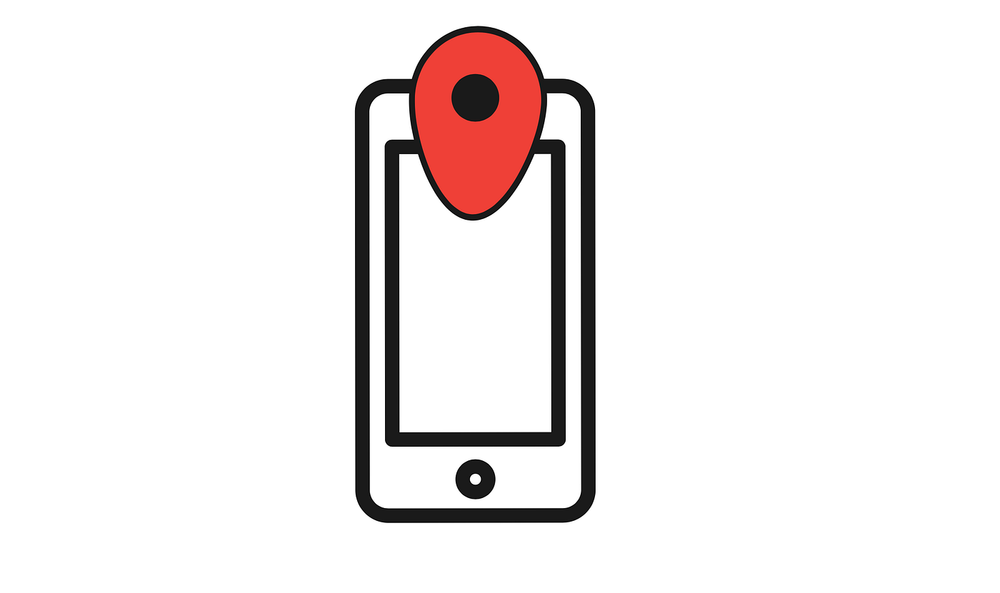
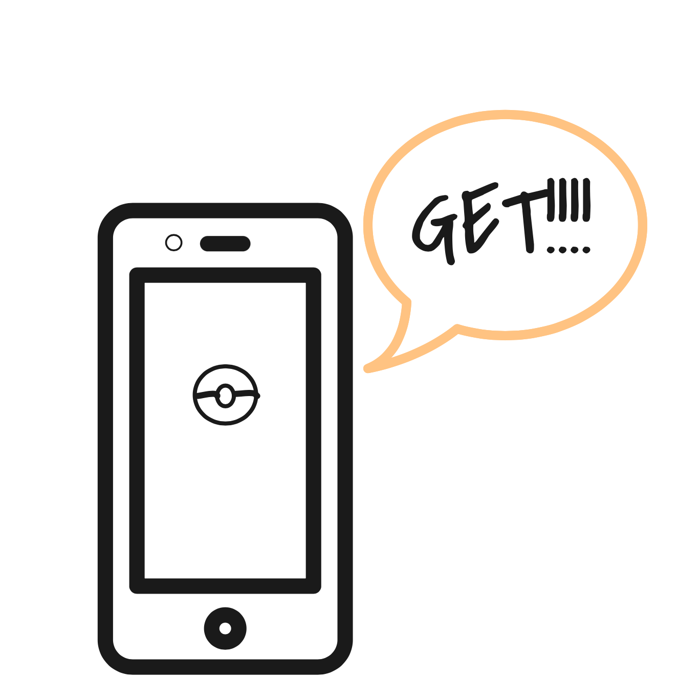
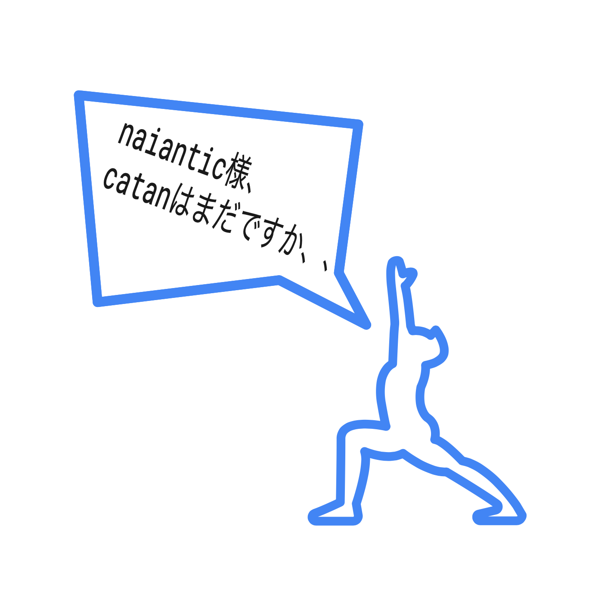
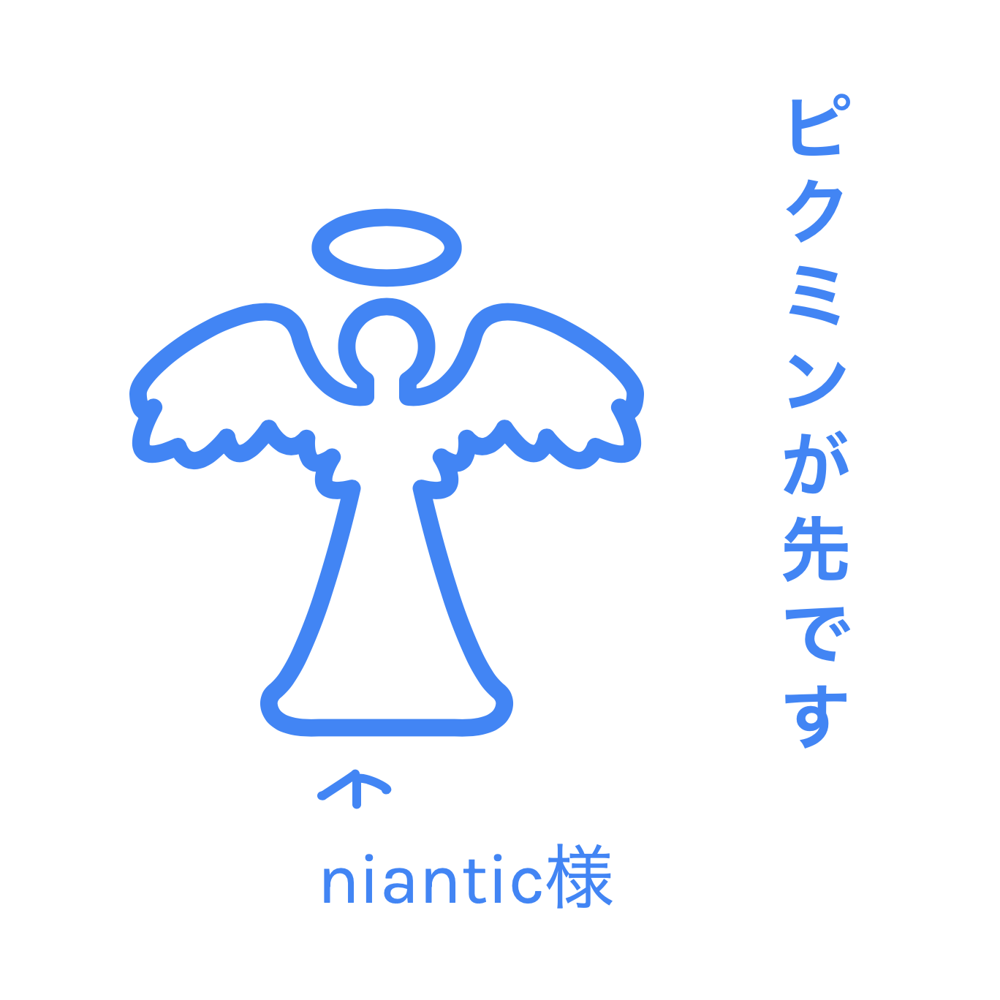
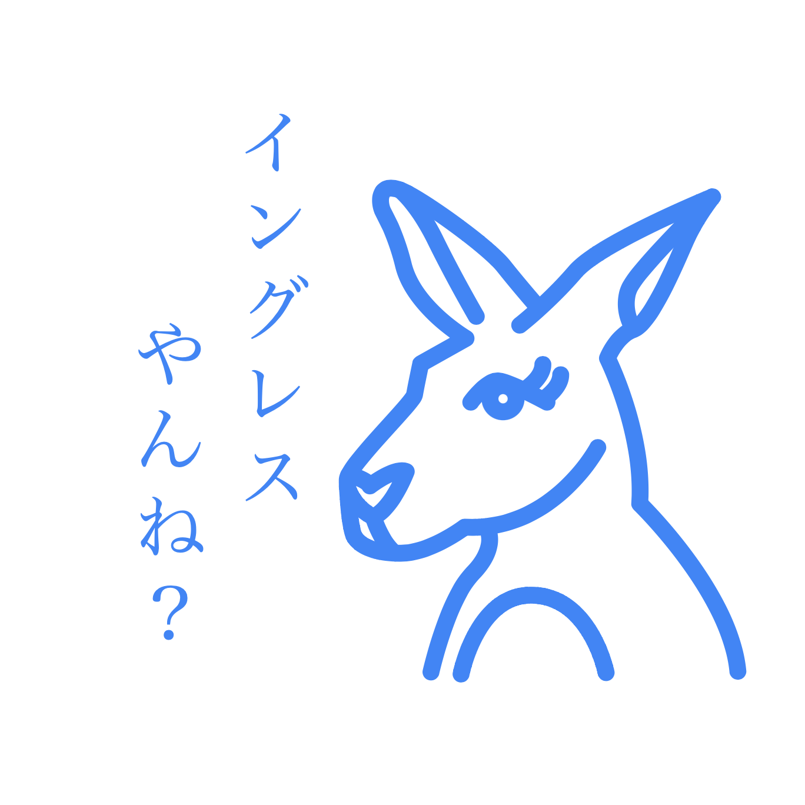
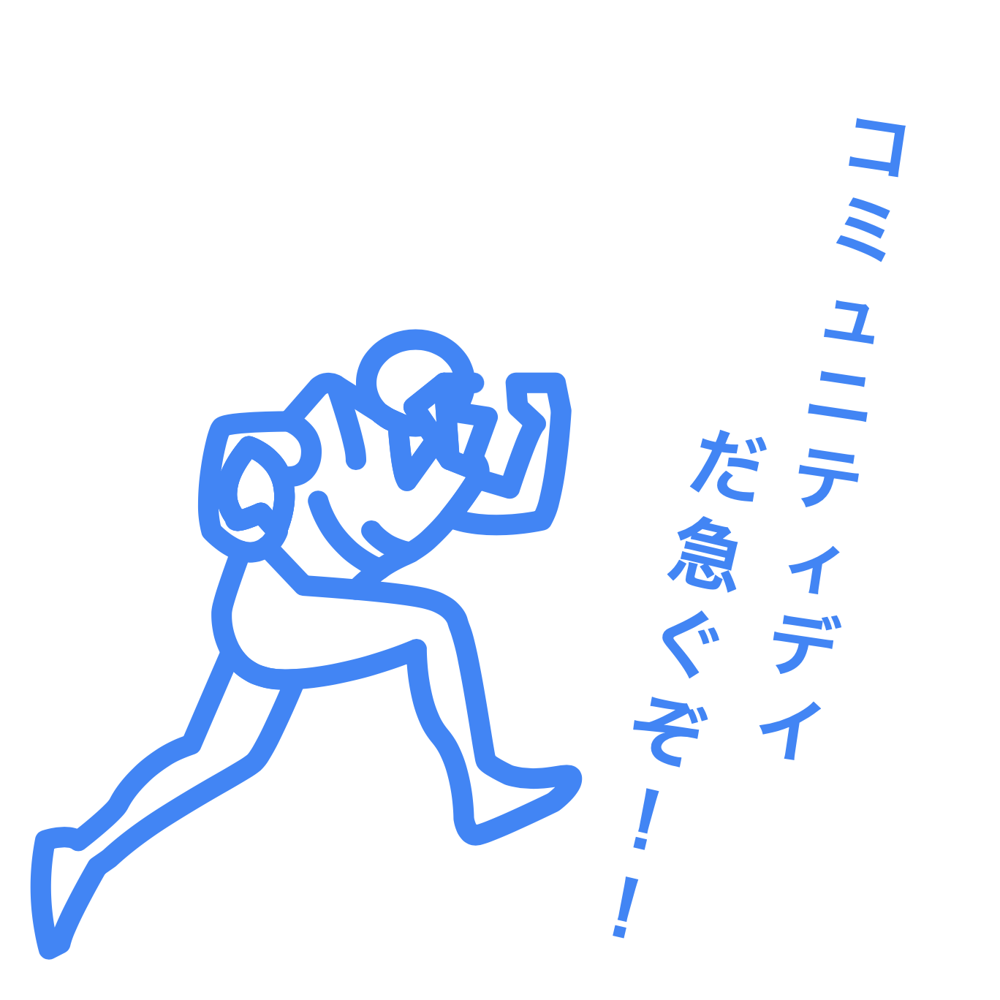
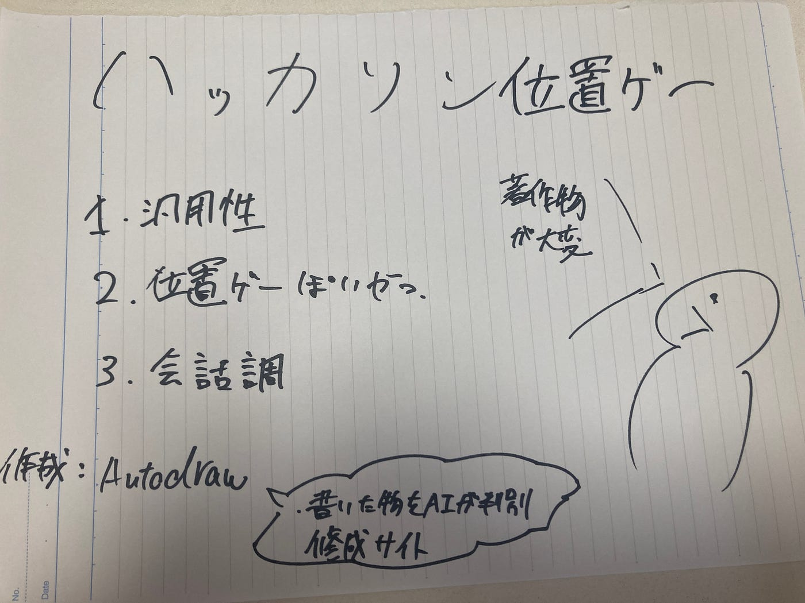

### 位置ゲーハッカソン

今回、それぞれの部ごとの特徴などをイラストで表現するということで、著作権物が多い位置ゲーは非常に難しいお題でした。せっかくピクミンが登場したので、ピクミンを用いたのは意外と簡単に作成できるのですが、（花と妖精だけですので）任天堂を敵に回したらやばいということでゲームの特色は消しています。

とりあえず、作成したのが、こちらの二つですね。位置ゲーにおけるスマホは必需品。そして、ピンをつけて位置情報がわかるようにとボールでモンスターをゲットした様子です。

これは、僕の気持ちですね。catanは2019年のドイツのゲーム発表会でお披露目されてまだです、、、b版は終わったはずなのに、、ピクミンの方が先に出てきました。ピクミンについては来週の週報で解説します！

今回のハッカソンのなかで、一番のお気に入りは左のカンガルーですね。ひじょーにセリフがマッチしています。皆さん、イングレスやりましょう。右のアメフトランナーはポケモンgoのコミュニティデイにやる気ある方です。

イラストを作成するにあたって、googleのautodrawを使ったのですが、かなり便利でした。AIの力恐るべし。

不満点を挙げるならば、画像の挿入が不可なこと、イラスト本体ではダウンロードできないこと、3Dを表現するのには難しいことですね。まあ、お絵描きツールとしてであり、AIの成長を促すためっていう噂もありますから。

グラレコ

