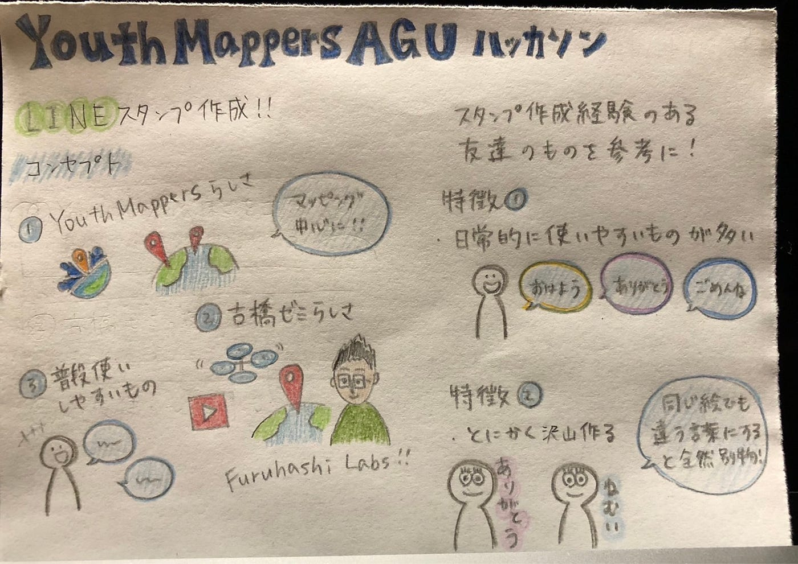

### 古橋ゼミあるある

4年の日向野邦春です。今回は10月のハッカソンとなります。今回のお題は**「古橋ゼミ公式LINEスタンプを作ろう」**です。

今回大事にしたこと

・古橋ゼミっぽさを全開にしたい

・古橋ゼミということでグラレコベースのスタンプ

・日常でも使えるように！

まずはこちらのYouthMappersスタンプです。これはとりあえず作っておこうということで作りました。

こちら、OSMを初めて使った人はみんな聞くセリフだと思います。自分も１年生の時はたくさん言われました。

こんな感じで５つのスタンプを今回は作りました。みなさん使ってください！！！

[10月 ハッカソン · furuhashilab/youthmappers4agu
You can't perform that action at this time. You signed in with another tab or window. You signed out in another tab or…github.com](https://github.com/furuhashilab/youthmappers4agu/projects/7)

