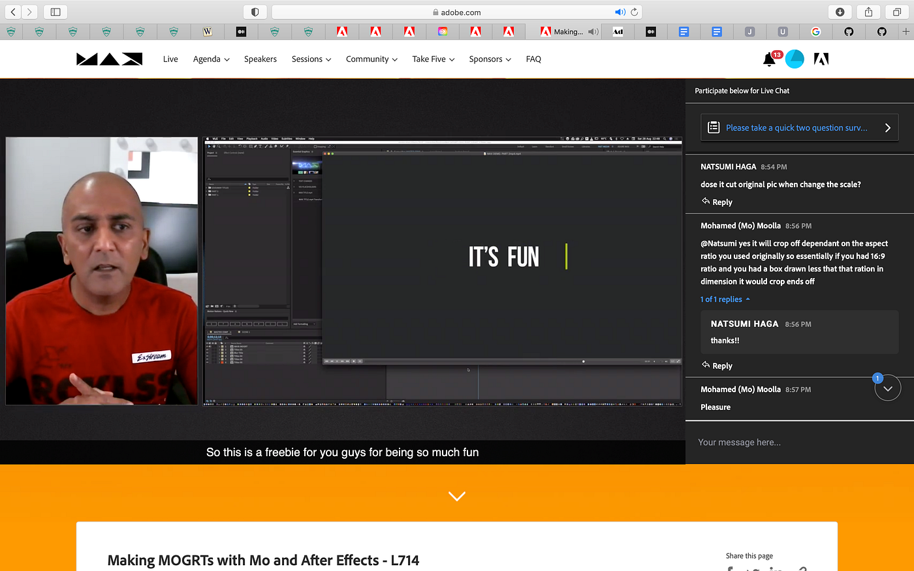
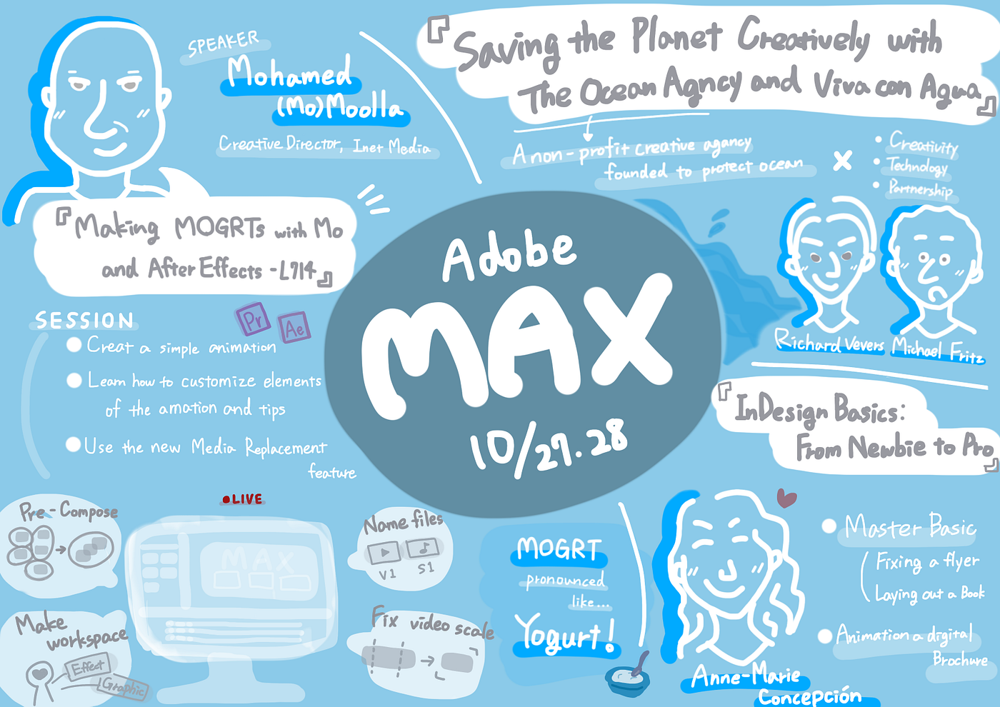

### Adobe MAX 2021 参加レポート

10月28日・29日に**Adobe MAX 2021**がオンラインで開催されました。私たち V&F も国際会議として参加し、スキルアップに努めました。

今回の記事では、私が複数参加したセッションの中から３つを取り上げてまとめます。

#### １つ目は、

Richard Vevers と Michael Fritz の**「The Ocean Agency および Viva con Agua と共にクリエイティブに地球を救う」**というセッション。

主な内容は、スピーカー２人が創設したそれぞれのNGOを通じて、どのようにきれいな水を保つ活動をしているかということでした。

まずは、２つのNGOについて。

### The Ocean Agency

2010年に海洋保護を目的として設立されました。クリエイティビティとテクノロジー、そしてパートナーシップを駆使しながら海洋保全活動を促進する作品を制作し、必要性を人々に視覚的に訴える活動をしています。創設者の Richard Vevers は、もともとはロンドンでトップの広告代理店に勤務していた経歴を持っています。

The Ocean Agency HP ([https://www.theoceanagency.org/about](https://www.theoceanagency.org/about))

ちなみにこの団体のホームページの造りとモーショングラフィックがとても素敵で、V&Fメンバーとしてはそっちの方も良い勉強になりました。

### Viva con Agua

清潔な飲料水の入手、公衆衛生、衛生的な環境を推進する団体です。現在ドイツに拠点を置き、世界中に事務所（および人々や組織のネットワーク）を持っています。クリエイティブで楽しい活動を活用することで、水や公衆衛生、衛生的な環境（これらを総称してWASH）に関連する世界的な問題の認識を促し、全世界にわたる水プログラムのための資金を生み出しています。

Viva con Agua HP ([https://www.vivaconagua.org](https://www.vivaconagua.org))

The Ocean Agency と Viva con Agua はどちらも水の保全に関わる団体です。

スピーカーたちは水資源の大切さを訴え、インスタグラムやTik Tok 等のSNSを利用したコンテンツの発信や施設を生かした水の循環システムを紹介していました。

セッションは、多くの人に興味を持ってもらえる親しみやすいものやアーティストや専門家が利用する大量の水についても触れられていて多角的な内容でした。

彼らの活動は現代の人々の生活に沿うようにマッチしていて、個々が気軽に協力できそうなので、今後 The Ocean Agency と Viva con Agua の活動がもっと広く知られるようになってほしいです。

#### ２つ目は、

Anne-Marie Concepcion による**「InDesign Basics: From Newbie to Pro」**。

Adobe In-Design のエキスパートで Adobe MAX Mater に６度も選ばれたスピーカーが行う基礎的な Adobe In-Design のレクチャーでした。

### Adobe In-Design

印刷用やメディアのレイアウトやページをデザインするソフトウェアで、PDFで簡単に作品の共有できる機能も搭載しています。

セッションでは、以下の技術が紹介されました。

> ・ワークスペースのカスタマイズ

> ・画像のインポートと拡大縮小

> ・ショートカット機能

> ・作品の迅速なシェアの方法

> ・パブリッシュオンラインでのプリント etc.

最初のカスタマイズから説明があったので、Adobe In-Design 初心者の私でも十分に理解できました。

#### ３つ目は、

クリエイティブディレクターのMohamed (Mo) Moolla による**「Making MOGRTs with Mo and After Effects」**です。

スピーカーの Mohamed(通称Mo) がAfter Effectsを実践的にレクチャーし、MOGRTs を作成しました。

### MOGRTs

After Effects や Premiere Proで使えるモーショングラフィックテンプレートのファイルのこと。MOGRTsを活用することで、作業をショートカットできたり、豊かな表現を取り入れることができるため非常に便利です。

> 「MOGRTs」 の 発音は「Yogurt」を参考に！

> MOGRTs ( pronounced like yogurt )

私はこの MOGRTs という単語は今回初めて知りましたが、セッションの説明欄には発音に関する言葉(↑)があり、

個人的にはこの部分がとても可愛らしく感じられたため、参加を決めたといっても過言ではありません。

セッションでは、主に以下の技術の紹介がされました。

> ・簡単なアニメーションの作成

> 使いやすいワークスペースの変更

> ファイルの名前付け

> 素材の細かな調節

> Pre-Compose etc.

> ・アニメーションの素材のカスタマイズとテクニック

> ・新しいメディア交換機能の利用

> (ソフトウェア間の移行)

スピーカーの説明は丁寧で理解しやすく、重要な基本操作から短い時間の中で幅広く紹介されていました。

またレクチャーの中では、単純なショートカットキーだけではなく、機能や制作の進め方を通していかに効率的に作品を制作できるかという視点もあり、面白かったです。

今回の Adobe MAX では、Premiere Pro や After Effects などソフトを使ったハウツー動画が豊富にあったと同時に、

実際にクリエイティブさとエコや社会問題を掛け合わせて解決へアプローチしている事例の配信がいくつもあり、大きな刺激を受けました。

参加できて有意義でした。

まだ、Adobe MAX のサイトにはオンデマンドで見ることのできる動画があるので、今後も少しずつ技術や知識をインプットして自分やV&Fの作品制作に取り組んでいきたいと思います。

Adobe MAX HP ([https://www.adobe.com/jp/max.html](https://www.adobe.com/jp/max.html))

#### ＜会議スクショ＞

#### ＜グラレコ＞

