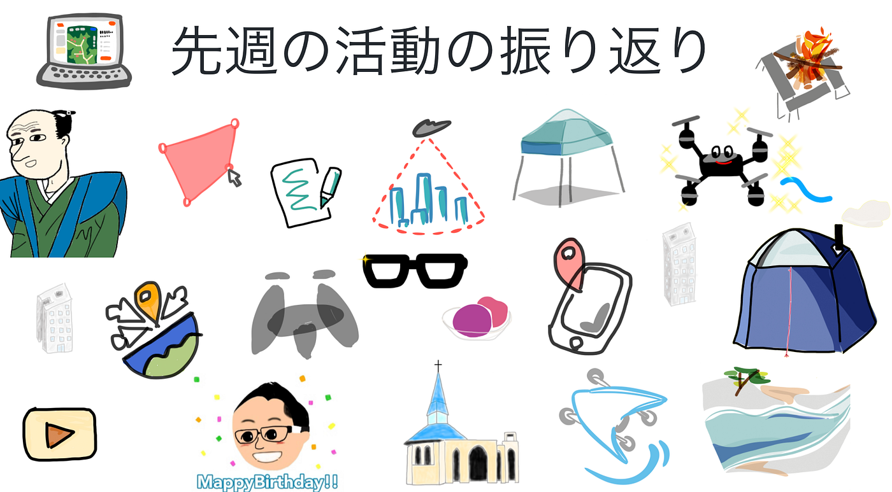
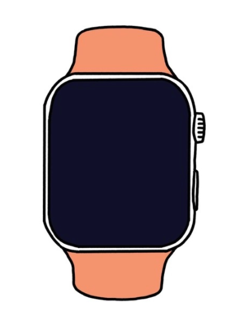
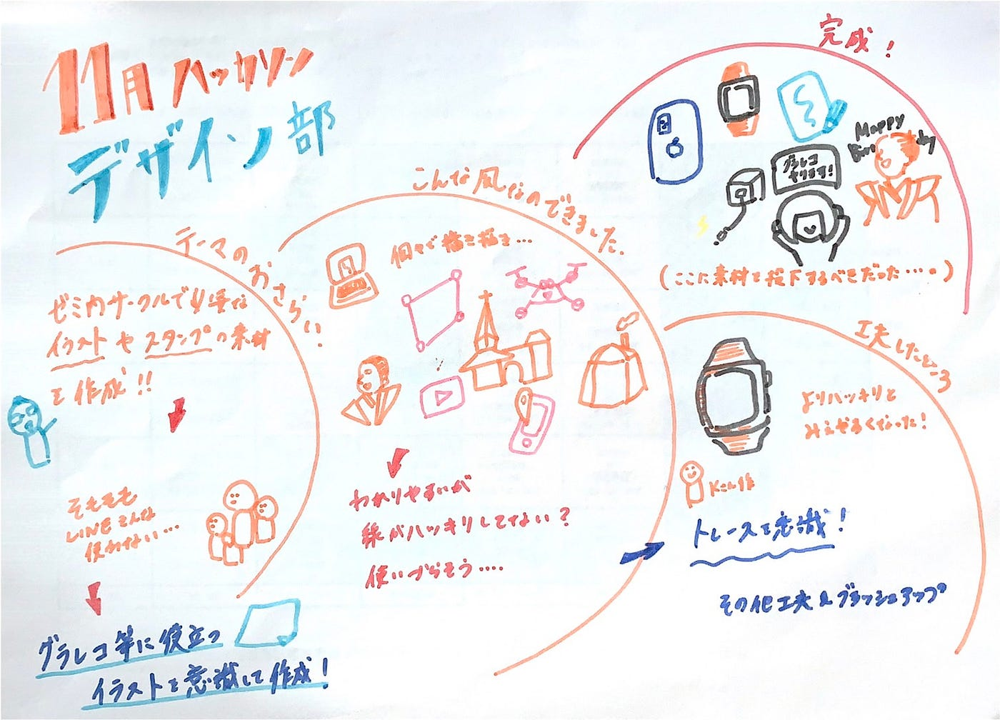

### デザイン部お役立ちイラスト

今日は！

四年の佐藤かほるです。

今回のハッカソンでは、デザイン部ならではのお役立ちイラストを作成しました！

ラインスタンプももちろん作りたいけど、、、、

古橋研の人たちと、

### LINE使わない気がするーーー😭

ということに気づきました。。。

なので、デザイン部では

グラレコ等に役立つイラストを意識して作成しました！

先週のイラストを見てもらい、

とてもわかりやすいけれども、

線などはっきりしていなかったり。。。

なので私は個人的にイラスト屋などを参考に、トレースを意識してみました。

こんな感じ、、、。

まだまだ作りたいイラストアイディアがあるので

部を上げてクオリティーを高めていきたいです★

[発表スライド](https://docs.google.com/presentation/d/1q3J5mj0Rh1TgD4A6RQe-qrL60aXOG8Qc-2FNeV6j0bs/edit#slide=id.p)

[githubプロジェクト](https://github.com/furuhashilab/fc_Design/projects/5)

[成果物Googleドライブフォルダ](https://drive.google.com/drive/u/0/folders/15FUUgFlWRlpQ5Xl-9wv3nd2gsJcKU5q_)

グラレコはこちら！

以上！
