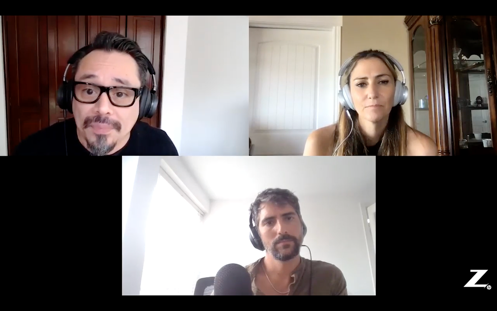
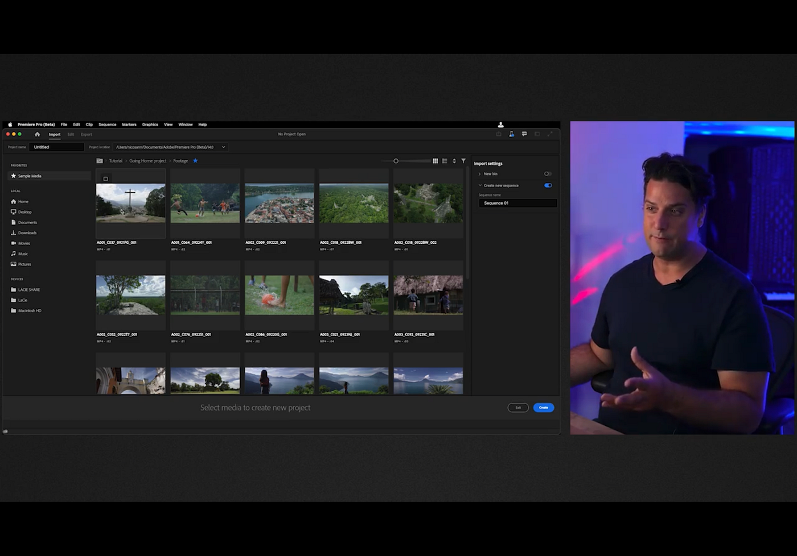
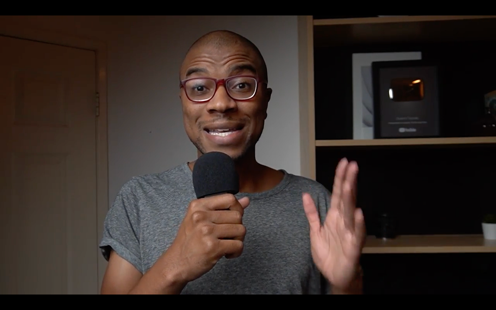
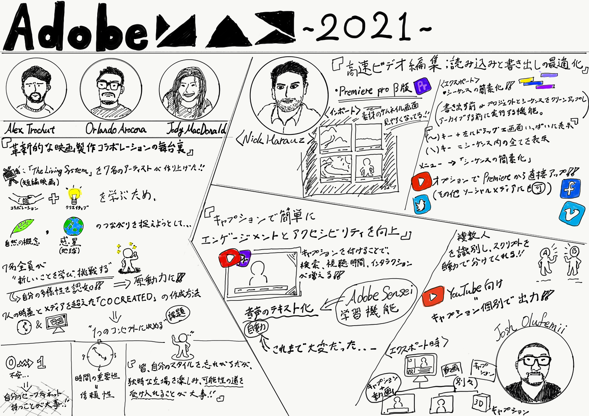

### Adobe MAXに参加して。

最近、Adobeのサービスを使用させて頂いている。その上で今回AdobeMAXがオンラインで開催されたので、いくつかのセクションに参加し視聴したものをここで共有したいと思う。

そもそもAdobe MAXは、「多くのことを学び、体験出来る機会」として開催されている無料のオンラインイベントだ。全国各地の様々なクリエイターやスピーカーが登場し、その方ならではの様々な側面からお話をして頂けるといったものになっている。

今回は、３つのセクションに参加し視聴した。

#### **・「革新的な映画製作コラボレーションの舞台裏」**

**登壇者：**
**Alex Trochutさん**（アーティスト、グラフィックデザイナー、イラストレーター、タイポグラファー）：スペイン出身
**Orlando Arocenaさん**（ベクターアーティスト、クリエイティブストラテジスト、Z by HP アンバサダー）：アメリカ出身
**Jody MacDonaldさん **（フォトグラファー）：サウジアラビア

**内容：**
エネルギー、創造、適応的な環境について取り上げた短編映画『_The Living System_』のために集まった7人のアーティストについて、そのコラボレーションの舞台裏を紹介した。

Z by HPのハイパフォーマンステクノロジー、NVIDIA GPUアクセラレーション性能、そしてCreative Cloudの力を活用したコラボレーションで、クリエイティブの新たな可能性を拓く大きな成果を上げた。

コラボレーション、クリエイティブなプロセスについて学ぶため、自然の概念と惑星（地球）との繋がりを捉えようとしたものとして、短編映画という形に落とし込んだ。

７人の時差、メディアを超えた協力が「CO CREATED」というエキサイティングな映画の作成方法に挑戦したのだ。

７人全員が完全に新しいことを学び挑戦することにフォーカスを置くことによって、自分たちがどれだけ多様なのかを認知できる。そしてそれは原動力にも繋がる。しかし、メンバーそれぞれが慣れない新しいことに挑戦するこのプロジェクトでは、一つのコンセプトにどう収めるかが課題としてあった。

写真家のJodyさんの活動例で言えば、パンデミックにより海外出張の考えを捨てて、地元で働かなくてはいけなくなってしまった状況になった。しかしこれにより、身近な場所で今まで気付かなかったものが見えて来るようになったり、プロジェクト用の素材として人に触れられていないような場所を考えるようになった。そこで、南西部の砂漠エリアがメンバーのRikのパレットとよく合うのではないかと思い、撮影に行った。

そこで撮影した素材を各メンバーがそれぞれエフェクトを入れたりするコラボレーションが生まれてくる。

他にもそれぞれ自分のコンフォートゾーンから外に出て挑戦に力を注いでいた。

最終的にこのプロジェクトを通して、コラボレーションの力を理解し実感してもらいたいと言う。様々なメディアを使用する人たちがコラボして作成することは、とても素晴らしいことであり、同時に可能なことなのだ。そして、創造的な障壁を押し上げてくれる。

プロジェクトを終えて、振り返ってみるとそれぞれ感じたものがあった。

**Jodyさん：**

映画制作の経験も無く、全体的に新しいものであった。

写真家は基本ひとりなので、コラボはとても新しいことだった。

今回は、ドローンやPremiere等の普段使用しないものを積極的に取り入れ、自分自身を向上させ、プロセスの改善させられた。

時間は重要であり、信頼出来るかどうかにも繋がる。

創造的なプロセスの改善に長期的に役立つ経験であった。

**Orlando さん：**

プロジェクト内では動画メディアでの仕事であり、本質的にコラボレーション的ではなかった。

インプットを表現することに集中＋動画制作に手を出す必要があった。

普段、ベクターで遊んでいただけの自分が動画をやらなければいけなくなり、とても怯えていた。他メンバーの皆のグループにもたらす力とエネルギーに感銘を受けていたということもあり尚更怯えていたのだ。

簡単ではなかったが、やはり楽しかった。

新しいソフトウェアにアプローチし、新しいスキルを採用 or 学習することについてクリエイターたちに何を伝えたいか？？

＝ オープンでいること

皆、自分のスタイルを忘れがちでだが、

独特な立場を楽しみ、可能性の道を受け入れることが大事なのである。

**Alexさん：**

何かを学び、繰り返して習得することは簡単である。

しかし、ゼロから学ばなきゃいけない時は不安が大きい。

そのような時、自分のセーフティーネットを持っていることが非常に大きい自信を持つことができるのだ。

#### ＜スクショ＞

#### **・「高速ビデオ編集：読み込みと書き出しの最適化」**

**登壇者：**
**Nick Harauz**（ビデオ編集とモーショングラフィックのAdobe Certified Expert）カナダ出身

**内容：**

- Premiere Proのワークフローを効率化する

- 読み込みプロセスを強化し、すばやく組み立てに移行する

- ツールとワークスペースを活用して編集の効率を高める

- 書き出し操作をスピードアップする

**＜インポート（読み込み）＞**

**Premiereのβ版**
新規プロジェクトを立ち上げ
読み込みモードで使用する素材を選択時、サムネイル画面が表示される様になっているので見やすくなっている。
（元々は、ビデオクリップの小さなサムネイルだけが表示）
ホバーすればコンテンツの確認可

⭐️マークを押しておけば後にすぐそこの画面に戻ることが出来る。
簡単にメディアフォルダに移動可能

リスト表示で、
名前、長さ、フレームサイズ、レートなどのクリップに関する情報が確認可

並び替えで好きなように表示

- プロジェクトパネルに移行。

- 選択

- 左下に小さくサムネイルが表示
（これが実際のシーケンスの反映）

- Premiereでの見え方となる

編集画面では、ワークスペース画面の配置をカスタマイズ可能。
右上のワークスペースアイコンから色々選べる。
自分でカスタマイズしたものを保存出来る。

リセットもワークスペースアイコンから可能！

**＜エクスポート（書き出し）＞**

_**シーケンスの簡素化_**
**ビデオを書き出す前 or プロジェクトとシーケンスをクリーンアップしアーカイブする前に実行する機能**

ふたつプロジェクト開いている状態から、
最後にこのプロジェクトを開いた時のシーケンスはタイムライン内に表示され、さっき作ったシーケンスはの後ろに表示される。

- 現在のタイムラインを選択し、チルダキー（~）を押しながら左の方へ移動させると画面いっぱいに表示される。

- バックスラッシュボタン（＼）を押し、
シーケンス内にある全てをウィンドウに引き出せばかなり散らかってる。

- 不要なビデオトラックや別の不要なトラックがあるクリップや使用していないテスト用のクリップなどがシーケンス内にたくさんある.。

- 不要なクリップは、右クリックで無効化したり有効化したりできる。

- ブレードツールで行った編集
タイムラインの表示設定からスルー編集を表示を選択するとアイコンを確認可能

- 綺麗にしてシーケンスメニューから**「シーケンスの簡素化」**を選択。

- ダイアログボックスでは、
_**「このシーケンスが複製され、簡素化されたものが表示される。」_**という旨が伝えられる。

- 名前を変更する。
ここで、不要なものを選択したり、タイムライン内の隙間を埋める
簡素化を選択すれば、簡素化されたバージョンのシーケンスが追加される。

- 書き出し。
非常に素早く可能！！

- **クイック書き出し機能**
これでビデオの一つのバージョンを書き出し可能
リストから多くのプリセットが選択可
その他のプリセットを押せば、**プリセットメニューダイアログボックス**へと移動できる。

- **Mac用の_「ProRes形式」_**だけに絞り検索する。
今回は、_**「Apple ProRes 422」_**を選択

- _**「OK」_**

- シーケンス上の現在のフレームレートとフレームサイズとが一致を確認
書き出しを選択し、書き出し先を選択

このプロジェクトに対して複数バージョンを作成したい場合、
異なる３つの場所を指定したい場合

- **書き出しモードに移動**
複数バージョンをを描き出せる
ダイアログボックスを開いて、何度も開いたり閉じたりする必要はない！

- オプションとして、「_**メディアファイル」_**を選択、
H264形式 高画質720HD プリセットを使ったシーケンスの設定と一致していることを確認

- 書き出し先を選択
複製の名前を変更

- チェックされている他のセクションエフェクトを開くとそこで様々なエフェクトを有効にすることも可能

ここでは必要な項目だけチェックを入れる（VIDEO, AUDIOとか）

YouTubeのオプションを選択し有効 =
**YouTube用にも新たに書き出しされ、直接アップロード可能に！！**
（その他複数のソーシャルメディアに投稿可能 Twitter、Vimeo、Facebook等）
YouTubeの公開設定もここで設定可能。

**カスタムサムネイルを追加することも可能！！**
ショットの場所を移動させ、_**「現在のフレームを使用する」_**を選択すればそこのショットがサムネイルになる。

YouTubeにアップ後、必要に応じてファイルを削除も可能

#### ＜スクショ＞

#### **・「キャプションで簡単にエンゲージメントとアクセシビリティを向上」**

**登壇者：**
**Josh Olufemii**（YouTubeクリエイター、Premiere Proトレイナー）アメリカ出身

**内容：**

**動画の作成と視聴が急増する中、どうすれば動画を目立たせることができるのか。**
**キャプションを付けることで、検索、視聴時間、インタラクションが増え、動画のエンゲージメントとアクセシビリティが高まる。**

**Premiere Proの音声のテキスト化機能の紹介。**
放送局をはじめ、YouTube、Instagram、Facebookなどのソーシャルサイトへの配信にもキャプションは欠かせない要素である。

Premiereの音声テキスト変換機能で、動画のタイトルを直接自動化
**Adobe Senseiの機械学習を利用**
**動画のエンゲージメントを上げるのに役立つ＝視聴者が様々な環境で動画を見るようになった。
今までは字幕を入れる作業が大変だった。。**

**＜作業工程＞**

- シーケンス内で編集
（フロントエンド タイムコード0から始める）

（シーケンスの最初から始めることが大事）

- テキストウィンドウを表示

- _**「トランスクリプトシーケンス」、「新しいキャプショントラックの作成」、「外部ファイルからキャプションをインポート」_**

**「シーケンス全体のトランスクリプション」を選択**

使用するオーディオの選択
言語の選択
インポイントからアウトポイントまでのみをトランスクリプションする オプションあり
その間の全てのクリップのみをトランスクリプトしたい
（タイムラインが非常に乱雑でランダムなクリップが散りばめられてる時には役立つ）

- トランスクリプトされたものが、テキストウィンドウのトランスクリプトタブに表示される

- リアルタイムで単語をトランスクリプトされる

- いくつか間違いがあるので、その都度変更

unknownと書かれたところでは、
**複数のスピーカーのいる場合、Premiereが声の違いを認識して分けてくれるので、名前を編集することもできる。**

- **キャプションを作成**
（トランスクリプトした文章を字幕として表示可能）

_**「シーケンストランスクリプトから作成」_** をクリック！
空白のトラックから作成

- トラックが挿入され、シーケンス内に字幕トラックが入る。
キャプションを見ながら、自分の好きなように編集していく。

シーケンス内の動画クリップと同じように編集が可能

リアルタイムで反映される

**以前までは、
動画トラック自体にテキストとして入力しないといけなかった。。。**

- **エクスポート**
ファイル エクスポート メディア フォーマット＝H.264

- **保存先を指定**
ソースと一致させる 全てのクリップ設定と一致するはずのシーケンス設定、全てのエクスポート設定が一致していることを確認

- **キャプション設定**
**キャプションを動画に直接書き込むオプション**
 出力された動画に直接字幕が入るようになる。

**サイドカーファイルを作成するオプション**
 動画なしでキャプションを個別で出力できる。

**キャプションを個別出力したい場合**

**＝YouTubeにコンテンツをアップロードしたい場合、別々でアップできる！**

**＝YouTubeが動画にキャプションを単独で配置するようになる**

**＝視聴者がキャプションのオンオフを切り替えられるようになる！**

- **サイドカーファイルAKA作成**

キャプションを直接動画に書き込む を選択しエクスポート

キャプションと別で出力する
_**「サイドカーファイルを作成する」_** を選択
YouTubeにアクセスし、キャプションなしの動画をアップ
３Dオブジェクトとして出力されたキャプションを追加し、字幕を入れる。

#### ＜スクショ＞

#### ＜グラレコ＞

