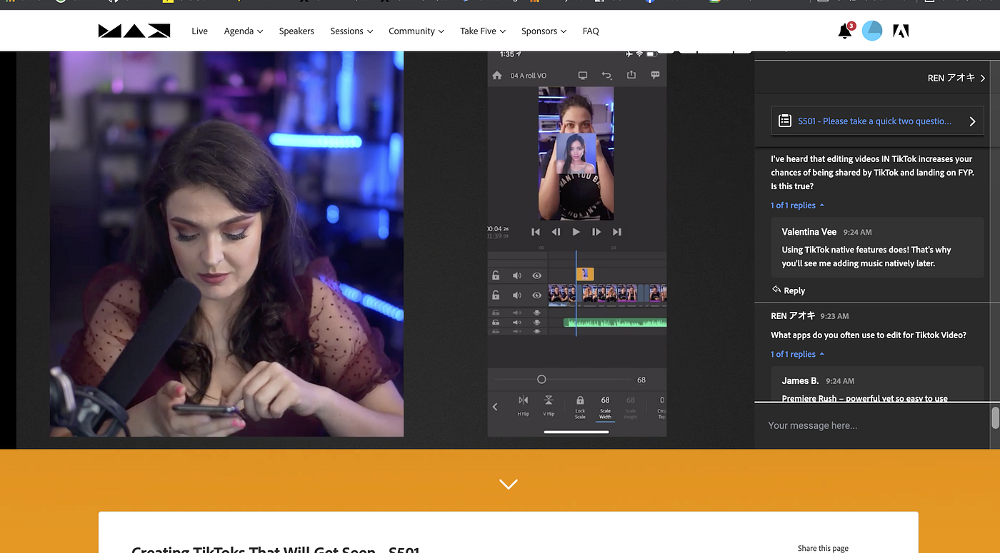
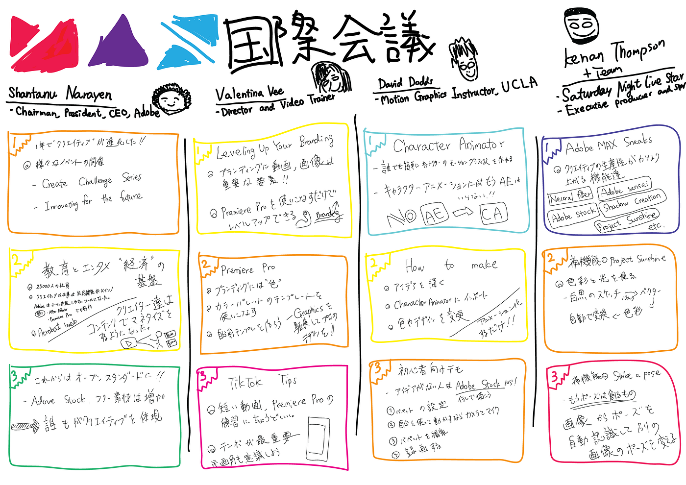

### Adobeの進化は頭が追いつかない。

Adobe Maxが今年も開催されて、Adobe製品の進化が見れました。V&Fは動画制作がメインの活動ですが、それ以外にもイラストや画像等の編集も重要なスキルとなっているので、今回紹介された機能でも”動画”に絞らず総合的に学ぼうという意識で参加しました。

今回拝見したセッションは全部で4つ

> Shantanu Narayen(Chairman, President, CEO, Adobe)
“**Adobe MAX Keynote: Create Tomorrow Together”**

> Valentina Vee(Director, Director & Video Trainer)
“**Leveling Up Your Branding with Premiere Pro”**

> David Dodds(Motion Graphics Instructor, UCLA)
“**Create Explainer Videos with Character Animator”**

> Kenan Thompson(Saturday Night Live star, Executive Producer and Star, Kenan)
“**Adobe MAX Sneaks”**

### “**Adobe MAX Keynote: Create Tomorrow Together”**

AdobeのCEOであるShantanu Narayenさんは「これからクリエイターはどうなっていくのか」「人々がクリエイティブな力を持ったらどういう社会になっていくのか」を語られた。

コロナ禍を迎えた 2020年,2021年でも、”Create Challenge Series”や”Innovating for the future”といったクリエイターが集まるイベントをオンラインで開催し、Adobeを使った制作を盛り上げてきた。

そして、この一年でかなりクリエイターに影響を与える変化があった。コロナ禍でYouTubeやTiktokなどSNSでの発信者が急激に増加し、その流れに従い、クリエイターを取り巻くAdobeツールやガジェットも同時に使いやすくなった。クラウドでのデータ管理が容易になったり、素人でもプロ並みの制作ができるApple Pensil, iPad Pro の強化。

このようなガジェットの進化と時代の流れは「教育とエンタメの基盤」を作り替えようとしている。オンライン授業ではタブレットやパソコンを当たり前に使うようになるし、子供たちが本当の意味でデジタルネイティブになっていく。

そして、クリエイターが増加し、ファンがついて、支援する。この流れもコロナ禍で大きく伸びた市場であり、デジタル上の経済活動は「クリエイティブ」が最も大きな影響を与えている。個人だけでなく企業が自ら制作をしプロモーションを行うのも珍しくない。これまで以上にチームでの共同作業がしやすくなりました。そして、オープンスタンダードな時代で誰もがクリエイティブを体現できるように素材を提供するという試みもしている。

### “**Leveling Up Your Branding with Premiere Pro”**

次に参加させていただいたセッションはValentina Veeさん。Premiere Proを活用して発信しているクリエイターさんです。

Premiere Proを使って動画発信をしている人、特に自分や企業においてブランディングを確立したい場合は必ず「自分色」を作って、それを貫き通すことが重要であると言います。

結局のところ、視覚的なブランディングで最も影響するのは「カラー」なので、Premiere Proを使う際に最初にこだわるべきは色合い。カラーパレットやアセットを最初に選び、自分用のテンプレートをいくつか作っておきましょう。

特に他のアプリではできない、高精度のグラフィックスのテンプレートを保存しておくと作業効率を上げてクオリティの高い制作ができます。

### “**Create Explainer Videos with Character Animator”**

次はモーショングラフィックスを専門に扱っているDavid Doddsさん。

実はモーショングラフィックスを作るのにはAfter Effectsは必要ありません。今回紹介されていたのは”Character Animator”です。

Character Animatorでは手書きで書いた絵をPhotoshopやIllustratorで読み込み、そこからCAを使って自動でアニメーションを作成することができます。

### “**Adobe MAX Sneaks”**

最後は新しいAdobeの驚異的な進化をKenan Thompsonさんが紹介してくれました。

#### Neural Video Stylization

これは撮影した動画を一瞬でイラスト風にできるというフィルター機能です。これまで画像編集においてイラスト化するのは当たり前にできましたが動画を変換するのは容易ではありませんでした。

#### Project In-Between

これはワンクリックで2枚の画像をライブフォトにできるというものです。動きのある画像を自由にカスタマイズできます。

#### Project Sunshine

スケッチを一瞬で色塗り、影をつけるなどができます。型さえ作ってしまえばもう色を塗る必要もありません。これで素材を作っておけばグラレコも一瞬でできそうです。

#### Strike a Pose

2枚の画像からポーズを読み取って別の画像の人のポーズを変えることができるという機能です。なぜこんなことができるんだ。頭が追いつきませんでしたが、１枚だけ写真を撮っておけば、あとはネットに落ちているポーズをしている人の画像を使って被写体をいじることができるわけです。

本当に未来のクリエイティブという感じがして面白かったです。

### スクリーンショット

### グラレコ

