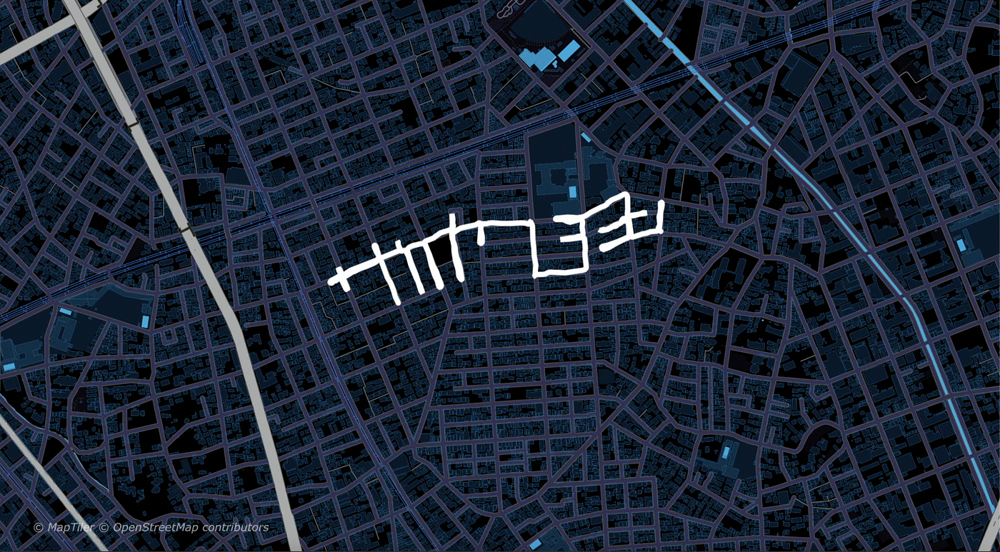
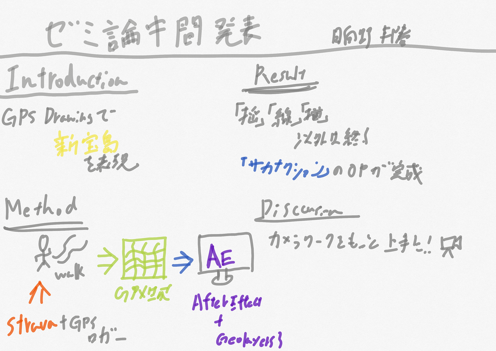

### GPXデータ採取もあと僅か

4年の日向野邦春です。私のゼミ論は去年に引き続き、GPS DrawingでサカナクションのMVを作るです。

ですが昨年から一点だけ変更点があります。それはアルクアラウンドから新宝島に曲が変更になったことです。アルクアラウンドは漢字が非常に多いため少し簡単な新宝島に変更です。

ひらがなはアルクアラウンドから引き継ぎ出来ました。

#### Introduction

GPS Drawingでサカナクションの新宝島を表現する

#### Method

Stravaを使ってGPXデータを生成する。その後データをAfterEffectのプラグインであるGeolayers3を使って動画化する。

具体的には、Google Mapを使い文字が描けそうな場所を見つけMyMap機能でルートを策定していく。それをアプリで確認しながら歩いていく。

Geolayers3ではMapcompでベースとなる地図を作りそこにGPXファイルを挿入する。ここで文字が浮かび上がる秒数などを決めて動画を作成する

**昨年からの改善点**

今年からはGPS Drawing界で知らない人はいないYassanに協力していただいております。Yassanには難しい漢字のプランニングを行っていただいていて、

#### Result

漢字残り4字まで終わらせました。また、オープニング用の「サカナクション」のデモを完成させました。

#### Discussion

今後の課題としては、Geolayers３の使い方に課題があると考えています。もっと立体的に作品を見せていくためにはカメラワークを追加しなければならないと考えています。

残りの文字表現に関しては伊豆大島の裏砂漠で描くのと、Yassanやサカナクションのファンに協力してもらいながら進めたいと考えています。

[GitHub - furuhashilab/2021gsc_KuniharuHigano: 2021年度ゼミ論
2021年度 卒業論文/ゼミ論文 ２０２１年１月２５日 青山学院大学 地球社会共生学部 地球社会共生学科 日向野邦春/KUNIHARU HIGANO 学生番号 1A118128 指導教員 古橋 大地 教授 © Furuhashi…github.com](https://github.com/furuhashilab/2021gsc_KuniharuHigano)

