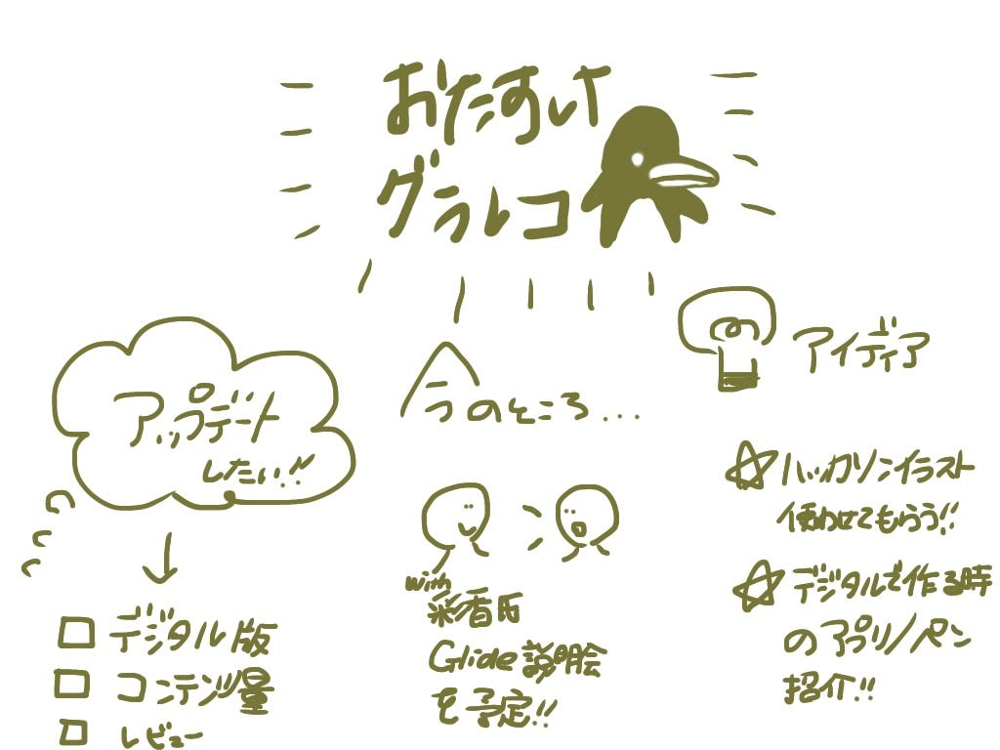

### おたすけグラレコアップデート

4年の佐藤かほるです。

もう11月中旬！！！！？？？？

時の流れの速さを中間発表で気付きます。

さてゼミ論ですが、構想発表時から変わらず、グラレコアプリの開発を続けようと考えます。

あまり進んではいないのですが、、汗

川嶋の協力を仰ぎ、、

・[旧アプリGlideをコピー](https://go.glideapps.com/o/0)

・[Googleスプレッドシート共有](https://docs.google.com/spreadsheets/d/1LnEmHl9IM6kedw12KFqJvQC5k6oSyGxur40ATxVma04/edit?usp=sharing)

・大凡の構想づくり

> ★デジタル版How To

> ★コンテンツを充実させる

> ★実際にPublishまで完了させる
→レビューもらいまたアップデート

まではなんとか進みました。

また、Glideで作業を進める前に

今週〜来週で川嶋とGlideの説明や、引き継ぎMTGを行います。

以上

発表資料

リポジトリ

[GitHub - furuhashilab/2021gsc_Kahoru-Sato: 2021年度 ゼミ論用レポジトリ
2021年度 ゼミ論用レポジトリ 地球社会共生学部 地球社会共生学科 4年 学籍番号：1A118082 氏名：佐藤かほる 指導教員：古橋 大地教授 © Furuhashi Laboratory/kahoru sato, CC BY…github.com](https://github.com/furuhashilab/2021gsc_Kahoru-Sato)

グラレコ

