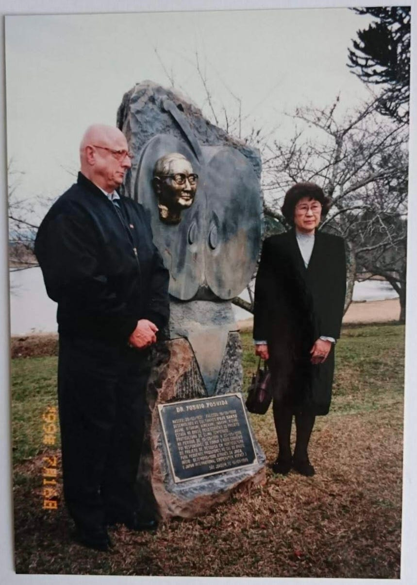
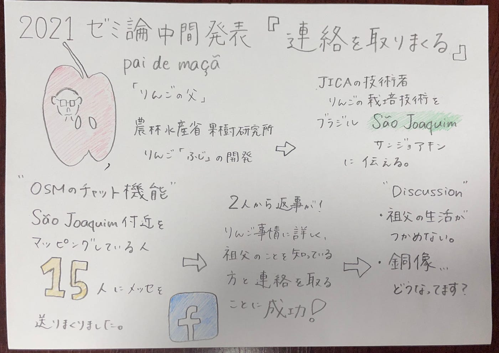

### ついに祖父を知っている人に出会えた…？

> Introduction

１年間探し続けている祖父の偉業の実態をを新たな方法で見つけていきたいと思います！！！

私が生まれる１年前に亡くなった祖父。父が看取ったようですが、実際に研究員としてブラジルで活動している姿はあまり記憶にないそうです。祖父の功績が載っている記事があまりにも少なすぎる！

去年、祖父のことについて調べ、どんな活動をしたのか文面上で把握できましたが、実際に生で見た人に話を聞くことができるのであれば思う存分聞きたいと思います。

そして何より胸像の安否がわかっていないのが大問題です。探します！

> Methods

OSM上でサンジョアキンを訪れ、そこでマッピング活動しているマッパーに片っ端からメッセージを送ってみました。

祖父のことを知っているか、そもそもブラジルにリンゴの栽培技術を伝えたのは日本人なのを知っているかなど、たくさんの質問をしました💦

[ブラジル界隈でマッピングする人たちに徹底的にメッセージを送る · Issue #3 · furuhashilab/2021gsc_Suzuka-Yoshida
You can't perform that action at this time. You signed in with another tab or window. You signed out in another tab or…github.com](https://github.com/furuhashilab/2021gsc_Suzuka-Yoshida/issues/3)

> Result

15人中二人から返事をいただくことができました！

そのうちの一人はサンジョアキンのリンゴ事情に詳しい２名の方のFacebookアカウントを教えてくださいました！

今はその２名の方にメッセージを送り、やりとりをしている最中です！

> Discussion

祖父の当時の暮らしが見えてこない…

肺炎は治らない病気…？早めに日本に帰ってこれば治っていたのでは？

銅像、今どうなってる？？ちゃんと今でも大切にしてもらっているのか…

