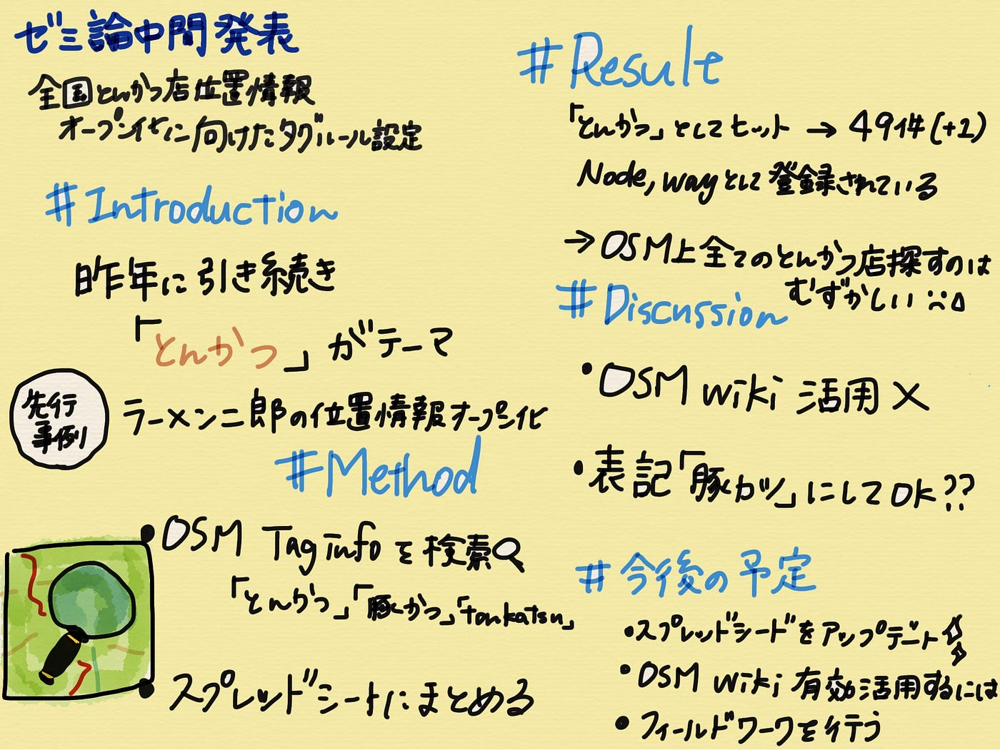

### とんかつ？豚カツ？トンカツ？

４年の若松です。

ゼミ論中間発表で2021年が残りわずかであることを実感しています。

#### ＃Introduction

私は昨年に引き続き、日本全国とんかつ店の位置情報オープン化に向けたタギングルールの統一、情報の更新をテーマに進めています。
昨年はタグルールの提案だったので、集めた情報をベースに入力履歴の変化やOSM Wikiの「とんかつ屋」ページの改変などを行い、もう何歩か前進したゼミ論になることを願います、、！

渡辺結南さんの「日本全国のラーメン二郎店舗位置情報オープン化の実践」を先行事例として進めていきます。

#### ＃Method

OSMTag info内で「とんかつ」の表記を変えながら検索を行う

スプレッドシート にまとめ、OSM上のとんかつ店の情報の整理する

#### ＃Result

- OSM Taginfo内で“とんかつ”としてヒットするnameタグ 49件(＋1)

- 店舗情報（Node）として記録されていた46件

- 既存の“とんかつ”POIデータのamenityタグの種類について

- amenity=fast_foodとして登録されていた店舗 14件

- amenity＝restaurantとして登録されていた店舗 33件

- 未記入 2店舗

- OSM Taginfo内で“豚カツ”としてヒットする2件のうち1件が“とんかつ”でヒットしたもの

- OSM Taginfo内で“トンカツ”としてヒットする4件 （＋4件）

- OSM Taginfo内で“Tonkatsu”としてヒットする26件 (＋2件)

- OSM Taginfo内で“豚かつ”としてヒットする0件

- 依然として建物(Node)ではなく、道路(way)として登録されているものも存在した。

昨年と変化はほとんどないが、あたらに登録されたとんかつ店もある。しかし表記の仕方、使用するタグが統一されていないこと、タグが重複していることもありOSM上全てのとんかつ店を探すことが難しい状況は昨年と変化していなかったと言える。

#### #Discussion

OSM wikiのとんかつ店のページが閲覧されている気配がない。最終更新したのは自分だった。

昨年の最終発表後に日本語表記として正しいのは「豚カツ」となったが、統一をしていって大丈夫なのか？
 店名が「とんかつ 〇〇」の場合があり、記入者が店名に引っ張られている場合が多いように感じられた。

#### #最終発表に向けて

スプレッドシート の情報をアップデートしていくこと
OSM Wikiたどりついてもらうにはどうしたらいいのかを考える
実際にフィールドワークをして自分で入力を行う

以上の３点を注力して行っていきたいと考えている。

#### ＃発表資料

[https://speakerdeck.com/atsukowakamatsu/semilun-zhong-jian-fa-biao-2021](https://speakerdeck.com/atsukowakamatsu/semilun-zhong-jian-fa-biao-2021)

#### ＃リポジトリ

[https://github.com/furuhashilab/2021gsc_AtsukoWakamatsu](https://github.com/furuhashilab/2021gsc_AtsukoWakamatsu)

#### ＃グラレコ

