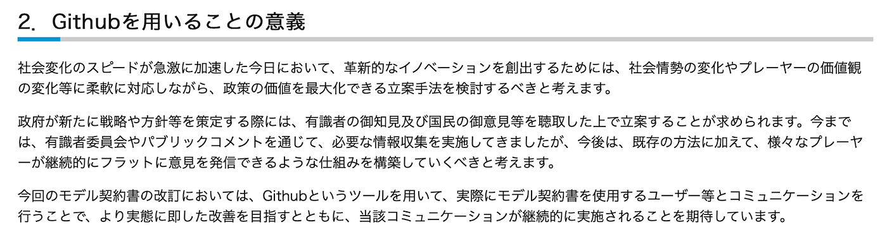
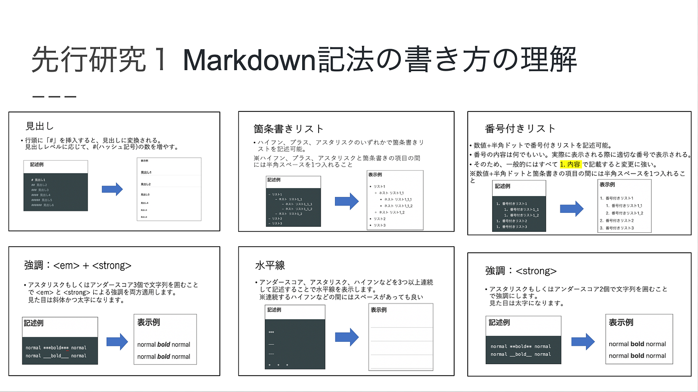
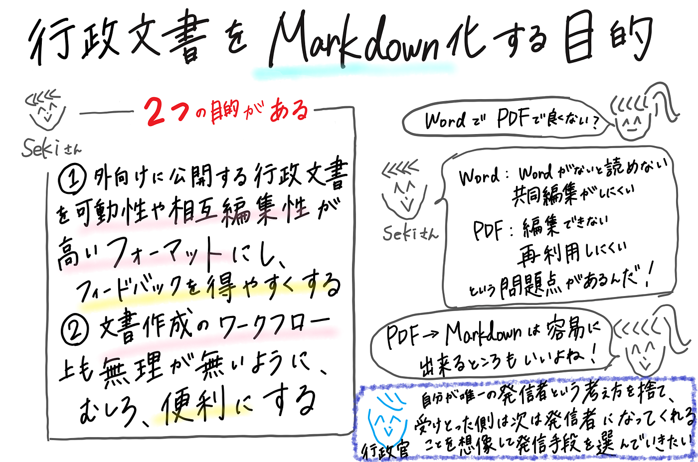
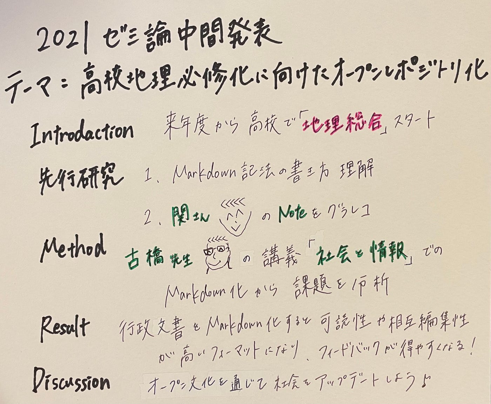

### オープンレポジトリ化に向けてMarkdown記法を習得

2021ゼミ論中間発表

_**私のゼミ論テーマは_**

_**「高校地理必修化に向けた学習指導要領のオープンリポジトリ化」です。_**

本研究では、行政文書をマークダウン記法で管理する意義と、管理を可能とするために克服すべき課題を取り上げます。

この2点を明確にすることで、
オープンな文化を通じて社会をアップデートすることを目指しています。

> Introdaction

なぜ、このテーマを取り上げたかと言うと、来年度からはじまる必修科目「地理総合」スタートに向けて、文部科学省から​​2022年度スタート予定の高等学校新学習指導要領が PDF で公開されました。しかし、PDFで公開された行政文書は、編集が不可能であるため再利用しにくいという問題があります。 
以下は経済産業省のHPに掲載されている「GitHubを用いることの意義」です。

ここに書かれていることから、経済産業省はGitHubやMarkdown化に本腰を入れていることが分かります。 当の行政官は行政の情報を受け取った側は次の発信者になってくれることを想像して発信手段を選びたいと主張しています。

そこで、共同編集可能で誰もが再利用しやすいフォーマットとして置き換えたいと考えました。文部科学省から公開された PDF を Markdown記法 に変換し、誰もが使いやすいオープンデータに整理する作業を可能な限り行いたいと考えています。

> 先行研究

①Markdown記法の書き方を理解するために、まとめました。

文字で説明を書いてGitHubに載せると、適用されてしまうため、画像で貼り付けることにしました。この際にMarkdown記法での画像のサイズを変更の仕方を学びました。

②デジタル庁PM（プロジェクトマネージャー）の関治之さんのNoteを読み、グラレコを作成しました。

> Method

1.行政文書をMarkdown記法で管理する意義は、先行研究で取り上げた関さんのNoteと関連する Twitterでの議論を読んで、整理する。
 2.青山学院大学の講義「社会と情報」で行った150名のMarkdown化の成果をチェックし、修正箇所を見つける。
 3.修正とマージ作業を行い、管理可能とするために克服すべき課題を分析する。

> Result

**Markdown記法で行政文書を管理する意義が以下の２点だと分かりました。**

**・外向けに公開する行政文書を可読性や相互編集性が高いフォーマットにし、フィードバックを得やすくしたい**

**・文書作成のワークフロー上も無理が無いようにしたい、むしろ、今よりも便利にしたい**

> Discussion

これからやるべきこととして、2番の成果チェックから課題分析までを行おうと考えています。 そして、オープンな文化を通して社会をアップデートしていけるようにMarkdown化に尽力します。

> グラレコ

> 参考文献リスト

[docs.google.com/spreadsheets/d/1-Szgzto-OSchk3K4–7QGuvwWY_zkJWc150O0qoTAhrg/edit#gid=0](https://docs.google.com/spreadsheets/d/1-Szgzto-OSchk3K4-7QGuvwWY_zkJWc150O0qoTAhrg/edit#gid=0)

> GitHubのプロジェクト

[2021gsc_ShioriOnoプロジェクト](https://github.com/furuhashilab/sotsuron2021/projects/25)

> スライド
