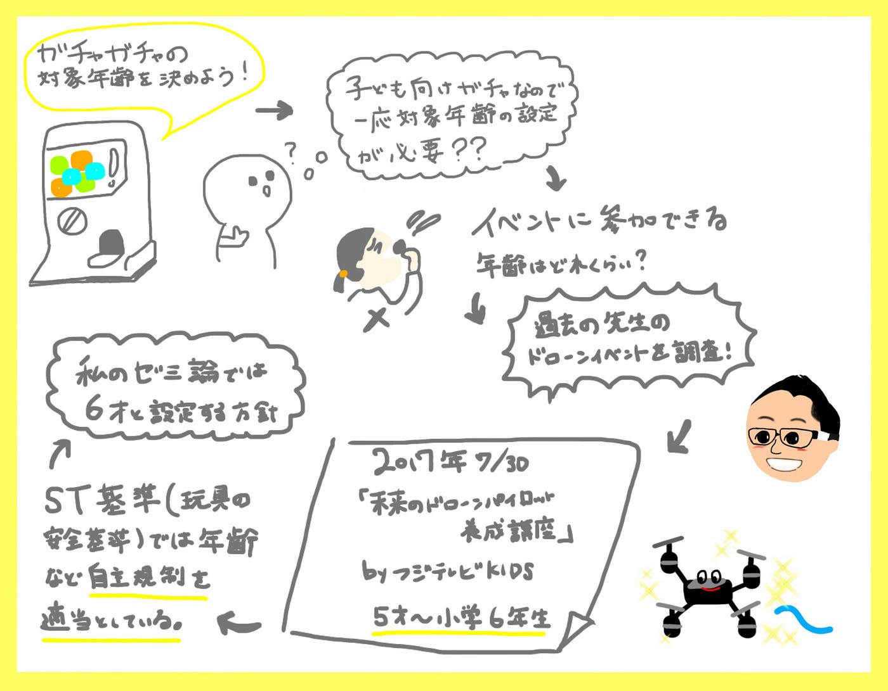
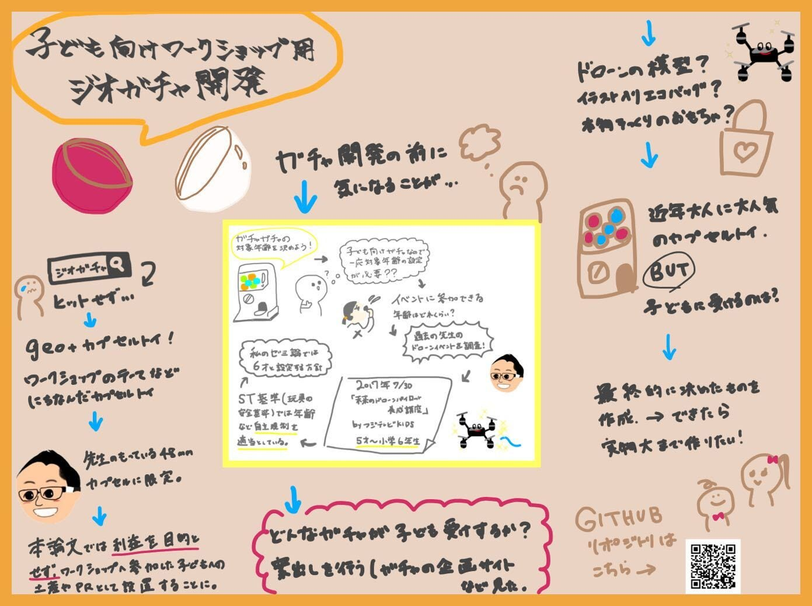

### ジオガチャ開発開始

こんにちは、長島うららです。

私のゼミ論のテーマは**「子供向けワークショップ用にジオガチャ開発」**です。

皆さんはジオガチャと言ってどんなものが思いつくでしょうか。

私はジオガチャがどんなものか想像はできるのですが、定義がなく、ガチャガチャについての先行研究やコラムが見つからず中間発表まで苦労したのが率直な感想です…

そのため、まずジオガチャの定義を決めました。

本論文では、土地の名産・名所など限定されたテーマにちなんだカプセル自動販売機によるミニ玩具のことを「ジオガチャ」と定義することとします。また、カプセル本体のサイズには販売機により種類がありますが、本論文では古橋先生が所持する48mmのカプセルに限定して開発することとします。

皆さんもご存じの通り、カプセルトイは多くの企業から事業展開されており一般的に客寄せや収益を生み出すための商業です。

しかし、**本論文では利益を生むことを目的とせず**、ワークショップに参加した子どもへのお土産やワークショップのPRなどを目的として設置します。 ワークショップのテーマは古橋ゼミに関係するものに限ることと決定しました。

おもちゃというのは安全面も考慮していなければなりません。

あくまでも利益を目的としない個人的なカプセルトイの開発ではありますが、幼児がトイを誤飲することによって発生する気道閉塞事故防止のため対象年齢の記載を行うこととしました。

対象年齢の設定は一般社団法人日本玩具協会による[「子どもの発育段階において与えるに相応しいとされる玩具の年齢別、種類別対応表 、種類別対応表 」](https://www.toys.or.jp/st/pdf/st_kodomo_hatsuiku_nenrei_toy.pdf)を参考にいたしました。

一つは作成するであろう組み立て遊びに属する模型やプラスチックモデル、さらには理化学玩具に属する乗り物や機械系の玩具が6歳から対象とすることが適切であるといわれていることから、対象年齢を6才以上にすることと決定しました。

また、これには古橋先生が過去に主催した[ドローンのワークショップ](http://www.kids-event.jp/event/10291/)の年齢指定も参考にさせていただきました。

近年、ガチャガチャのブームにより多数のショッピングパークでガチャガチャ専用エリアができたりと人気を博しています。

> 最近本物そっくりのカプセルトイが話題
ITmedia（2021年07月17日）

> [売上が9年で20倍に！ 本物そっくりのカプセルトイが売れている背景に、2つのキーワード：週末に「へえ」な話（1/4 ページ） — ITmedia ビジネスオンライン](https://www.itmedia.co.jp/business/articles/2107/17/news010.html)

> 土居新平（2021年3月3日）朝日新聞DIGITAL

> [ガチャガチャ活況 「フチ子」が切り開いた大人への道：朝日新聞デジタル (asahi.com)](https://www.asahi.com/articles/ASP325PXNP32ULFA00P.html)

その中には大人向けガチャも多くありますが、今回私が開発するトイは子ども向けなのでいかに子ども受けする（ワークショップと関連した）ものを作れるかが肝になってきます。

案だしが進んでいるので今月中には決定し、デザインの準備に入っていこうと考えています。

### 先行研究

ガチャガチャはノベルティグッズの魅力を進化させる！日本ガチャガチャ協会所長 小野尾さん【ノベルティトップランナー】（2020）

[https://novezo.jp/feature/913/](https://novezo.jp/feature/913/)

濱岡奈々. (2013). 高知県観光情報ツールとしての 「カプセルトイ」 の可能性.

[https://www.kochi-tech.ac.jp/library/ron/pdf/2013/03/14/a1140461.pdf](https://www.kochi-tech.ac.jp/library/ron/pdf/2013/03/14/a1140461.pdf)

下八重順子.(2020).こんなものまでガチャガチャに！？」トイメーカーに聞いたヒット作と失敗作

[https://www.walkerplus.com/article/1007300/](https://www.walkerplus.com/article/1007300/)

### 参考文献・参考資料リスト

[Google Sheets - create and edit spreadsheets online, for free.
Create a new spreadsheet and edit with others at the same time -- from your computer, phone or tablet. Get stuff done…docs.google.com](https://docs.google.com/spreadsheets/d/1eERcJoA46zhxX6ZHBOXZkkfA8NIYnEtLiJvolGrFSmw/edit?usp=sharing)

Githubゼミ論用リポジトリ

[furuhashilab/2021gsc_UraraNagashima: 2021年度ゼミ論 (github.com)](https://github.com/furuhashilab/2021gsc_UraraNagashima)

Githubプロジェクト管理

[UraraNagashima (github.com)](https://github.com/furuhashilab/sotsuron2021/projects/23)

#### グラレコ

