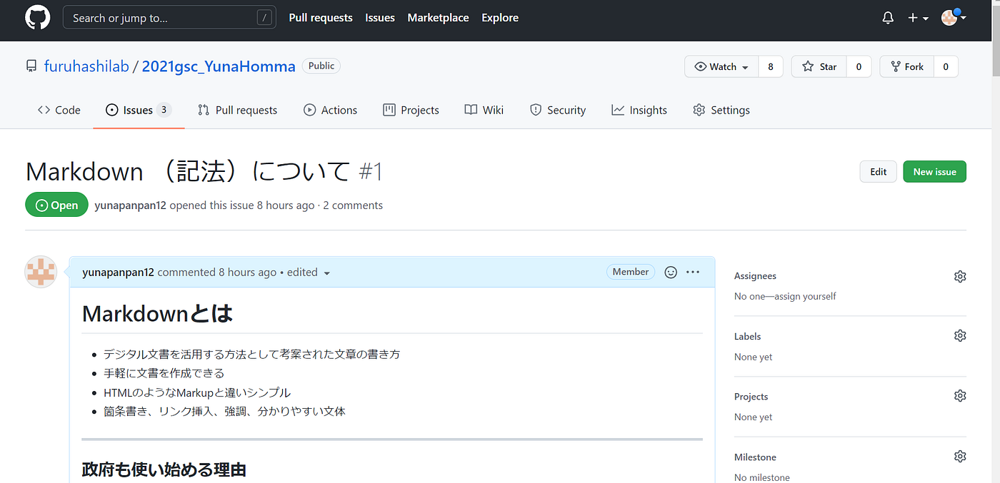
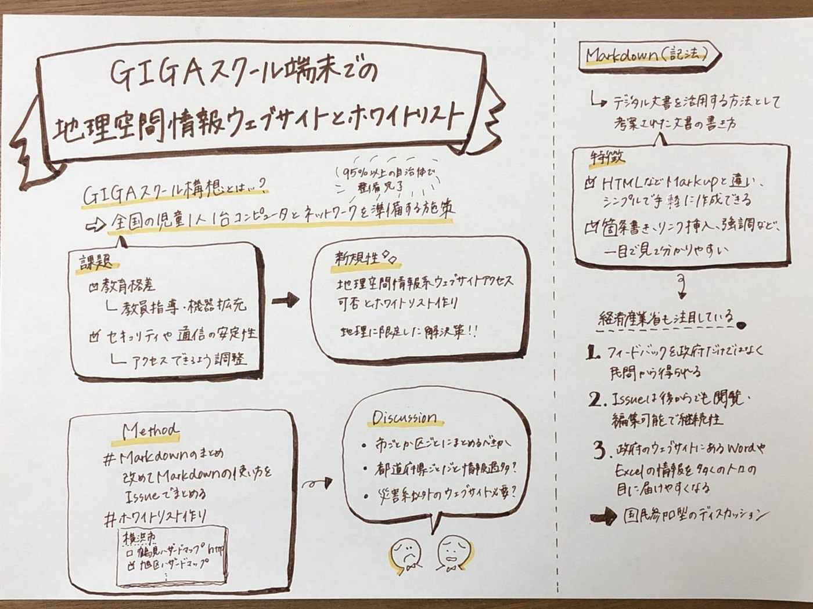

### ゼミ論中間発表

### # Introduce

### ## 概要

#### ### 本研究の内容

本研究ではGIGAスクール端末での地理空間情報系ウェブサイトアクセス可否とホワイトリスト作りを行います。

GIGAスクール構想とは全国の児童1人に1台のコンピュータと高速ネットワークを準備する文部科学省の取り組みです。ICT技術の進歩による社会変化の流れに合わせて、小中高等学校などの教育現場で生徒がタブレット端末やパソコンを活用できるようにすることが目的です。

#### ### GIGAスクール構想の課題と先行事例

構想当初は、2019年度から5年間かけて整備していく予定でしたが、新型コロナウイルスの感染拡大でオンライン授業や自宅でのICT教材の学習の必要性が高まり、文部科学省の調査によると2021年7月時点で全国の自治体の約95％以上が端末の整備が完了している状況です。

しかし、ICT教育の実践の中で新たな課題も発見されています。

例えば、先行事例の中では教育格差が生まれることを指摘しています。

「ここでの格差とは，オンライン教育を行う際のデジタル端末等の機器整備やそれを実施する教員の指導力，またオンライン教育のコンテンツ等を示し」（田中真秀・佐久間邦友・山中信幸、2021、18）

「しかし，授業において ICT 機器を十分に使いこなせていないこと，授業における ICT の効果的な活用方法を理解できていなことが課題となり，ICT 機器を活用している授業場面・学習場面が少ない状況であることが明らかになった。」（日髙 純司・小林 博典、2021、５）

これらのことから、ICT端末による授業は教員の指導や機器整備によって異なるため、学校によって教育格差が生まれる懸念があり、教員への指導が求められることが分かります。

また、他の先行事例では、各自治体によるセキュリティやインターネットの容量と速度等の通信の安定性への課題についても指摘しています。2つの小学校でSkypeを通して授業を行う際、「接続トライアルの結果，一方の学校では，メインとなるコンピュータを校内LAN及びインターネットに接続して，Skypeで通信をおこなうことができず，両自治体に設定されるセキュリティの問題から，新たなアプリケーションソフトウェアの導入もできなかった。」「配備されたコンピュータの性能が現行のソフトウェアやクラウドサービスの要件を満たさないことによる各種不具合が発生した。」（清 水 将・熊 谷 真 倫・小野寺 峻 一・塚 田 哲 也、2021、118）

つまり、セキュリティ、インターネット通信の不具合によって整備されたコンピュータが使用予定のウェブサイトやアプリケーションへのアクセスが出来ない場合があることも読み取れます。

#### ### 本研究の背景と新規性

上記のような課題がGIGAスクール構想にあることを背景として、本研究ではICT端末の格差について行うことにしました。

新規性としては、地理空間情報系ウェブサイトアクセス可否とホワイトリスト作りが挙げられると考えます。なぜなら、先行事例では、機器の整備の拡充、負担を軽減しながら教員の指導力向上、柔軟なセキュリティの構築などを結論としており、本研究では、地理空間情報系のウェブサイトに限定し、アクセス可能であるべきものをまとめることが目的になっているからです。

#### ## Markdown（記法）について

本研究のホワイトリスト作りにはGitHubを用い、その中ではMarkdown（記法）を使用します。

Markdownとはデジタル文書を活用する方法として考案された文書の書き方で、ウェブサイトを作るHTMLのようなMarkupと違い、シンプルで手軽に作成できるものです。また、箇条書き、リンク挿入、強調など、一目で見て分かりやすい文体が特徴です。

今年、経済産業省では「研究開発型スタートアップと事業会社のオープンイノベーション促進のためのモデル契約書ver1.0」の改訂に向けて、Github（ギットハブ）を用いた意見募集をトライアル実施しますという施策を行い、Markdownを使用するGitHubに注目をしています。

その注目の理由としては、GitHubというオープンデータにすることで、改善に向けたフィードバックを政府内だけでなく民間からの意見募集ができ、Issueという課題の機能により、後からでも閲覧・編集可能になり、継続性が見込めることがあります。さらに、人びとに届けたい情報が書き込まれたWordやExcelは政府のウェブサイトにひっそりと載っているだけだったので、見た目が分かりやすいMarkdownは、多くの人の目に届けやすくなり、国民参加型のディスカッションが可能になるになることも理由の一つとして挙げられます。

### # Method

#### ## Markdown(記法)についてまとめる

ホワイトリストをGitHubで作成するので、改めてMarkdownの使い方を確認するため、Issueでまとめる

#### ## ホワイトリスト作り

どのような形式で今後まとめていくか方針を定めながらGitHubで地理空間情報系ウェブサイトアクセスのホワイトリストを作成してみる。

### # Result

#### ## Markdownについて

[まとめたGitHub](https://github.com/furuhashilab/2021gsc_YunaHomma/issues/1)

#### ## ホワイトリスト作り

[地理空間情報系ウェブサイトアクセス可否とホワイトリスト](https://github.com/furuhashilab/2021gsc_YunaHomma/issues)

### # Discussion

Markdownで表記することで分かりやすくリスト作りすることが可能になる一方で、神奈川県のリスト作りをするにあたって、区ごとに分けるべきなのか、それとも市ごとで分けるべきなのか考え直す必要があると思いました。また、都道府県ごとにIssueでつくると、情報過多になってしまって、見づらい可能性が出てくるとも感じました。

さらに、地理系ウェブサイトの情報としてまとめる範囲は、学校教育で使用されるものに限定すると、災害関係以外のウェブサイトも求められるのかも疑問に思いました。

＃グラレコ

[＃参考文献](https://docs.google.com/spreadsheets/d/1uFUYa_TRjZiMx_JMXzDjasGcj1lEG0bK2O0YUADCxdg/edit?usp=sharing)

[# 発表スライド](https://docs.google.com/presentation/d/1ad8BFHgjr9OBvdUSHbB6M1GC7PNL7rRG1BY1l6NUzFU/edit?usp=sharing)

[#GitHub進捗](https://github.com/furuhashilab/sotsuron2021/projects/6)
