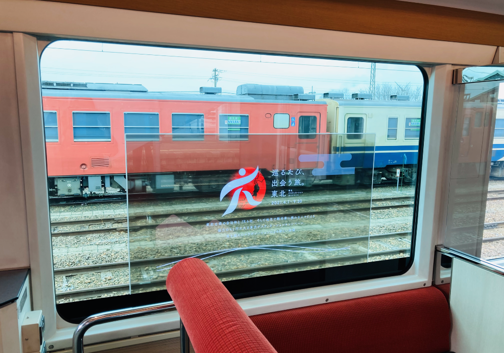
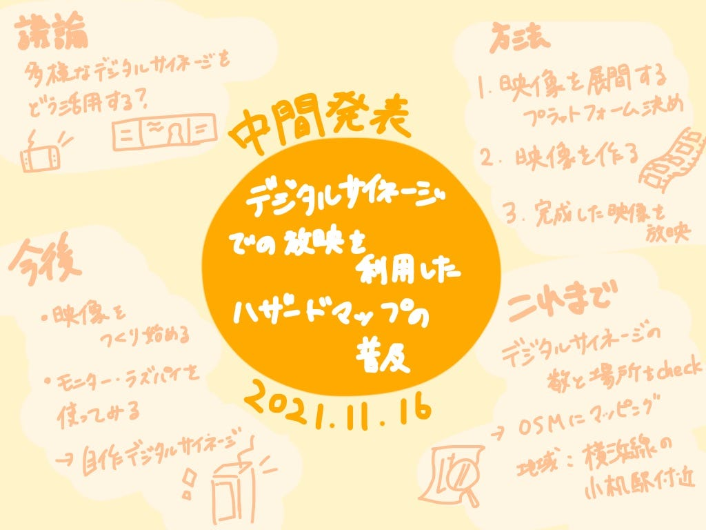

### デジタルサイネージ × ハザードマップ

3年の葉賀なつみです。私はゼミ論で、デジタルサイネージでの放映を利用したハザードマップの普及というテーマを扱うことにしました。

#### はじめに

以前洪水による水害にあった方にお会いした際に、ハザードマップであらかじめ水害が予想されていたにもか関わらず、対策が出来ていない住民がほとんどだったというお話を聞きました。

そこで、ハザードマップや防災について普段からもっと意識する方法は何かないかと考えた結果、デジタルサイネージを利用すると良いのではないかと思い、このテーマに決定しました。

#### 方法

１. 映像を展開できるプラットフォームを決定

(1-2. プラットフォーム自体を制作)

２. 映像を作成

３. 完成した映像を放映

#### これまで

・デジタルサイネージの設置場所に依存するため位置や数をある程度把握する必要あり。

→ 確認すると同時にOSMでマッピング

→地域：横浜市港北区の小机駅を中心

#### 議論

・駅等に設置してあるデジタルサイネージ以外にも種類(店頭のPOPサイネージ等)があるが、そちらの利用も考えられるのではないか。

例えば、東日本旅客鉄道株式会社と世界株式会社が制作した

「e-モーションウインドウ」

#### 今後の課題

・映像を制作

・モニター・ラズベリーパイを使ってデジタルサイネージを自作してみる

#### ゼミ論用リポジトリ

[GitHub - furuhashilab/2021gsc_NatsumiHaga: 2021年度古橋ゼミ論用レポジトリ
2021年度古橋ゼミ論用レポジトリ. Contribute to furuhashilab/2021gsc_NatsumiHaga development by creating an account on GitHub.github.com](https://github.com/furuhashilab/2021gsc_NatsumiHaga)

#### 参考文献リスト

[Google Sheets - create and edit spreadsheets online, for free.
Create a new spreadsheet and edit with others at the same time -- from your computer, phone or tablet. Get stuff done…docs.google.com](https://docs.google.com/spreadsheets/d/1QXFF2BYQ8-Bcgktrca2RO1P_d50pwnTIN-LIyE1u6pI/edit#gid=0)

#### スライド

#### グラレコ

