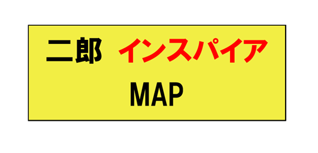
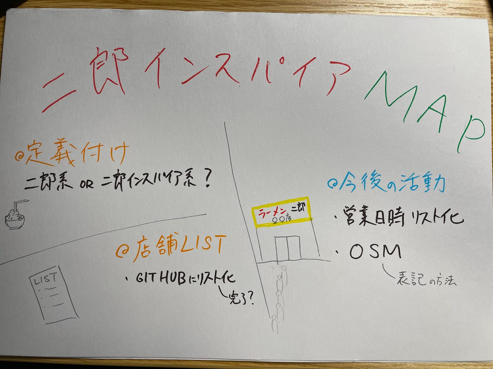

### 「二郎インスパイア系」改め「二郎系」？

> Intro: _テーマ_

私のゼミ論は「二郎インスパイア系」マップ制作だ。OSM上に二郎インスパイア系店舗のデータ、及びそのメタデータを整理することで、誰もが自由にそのデータにアクセスし、閲覧、二次利用できる状況を作ることが目標。

タギング等の基本的なルールは渡辺 氏のやり方に乗っ取る。

> Methods: OSM

OSM上で整理されていない二郎インスパイア系の店舗を先行研究である「ラーメン二郎マップ」に敬意を表し「二郎インスパイアマップ」もしくは「ラーメン二郎系マップ」（題は検討中である）と題しまとめ、公開することを目的とする。

> Results:

・二郎インスパイア系とは

マップを制作する前にまずは「二郎インスパイア系」とは何かについての定義付けが必要であるため、渡辺先輩と依田先輩の論文やネットでの検索結果を参考にすることにした。するとどうやら「ラーメン二郎」には直系・亜流・インスパイア系が存在し、直系は三田本店より暖簾分けした「ラーメン二郎」〇〇店となることを考えると、亜流・インスパイア系をまとめて二郎系と呼ぶのが妥当なのではないかと思い始めている。[メモ](https://github.com/furuhashilab/sotsuron2021/issues/26)

・店舗リスト化

県内のインスパイア系店舗のリストアップが[GitHub](https://github.com/furuhashilab/sotsuron2021/issues/24)で完了している。

・タギング

ラーメン二郎とは違い、ラーメン以外の定食などを提供している店もあることから、amenityタグはfastfoodとrestaurantのどちらを選択すべきか迷ったが、基本的にはどれもラーメン屋であることを考慮すると、回転率の高さは求めているはずと考え、amenity=fastfoodを採用したい。

> Discussion: _今後_

今後は「二郎インスパイア系Map」改め「二郎系Map」とする。

二郎系ラーメンを一部のメニューとして提供しているラーメン屋のcuisineタグをどうするか？

> _先行研究_

渡辺氏論文：[https://furuhashilab.github.io/www4yunawatanabe/](https://furuhashilab.github.io/www4yunawatanabe/)

依田氏論文：[https://github.com/furuhashilab/2020gsc_shunsuke-yoda](https://github.com/furuhashilab/2020gsc_shunsuke-yoda)

> _中間グラレコ_

> _中間発表スライド_

[https://docs.google.com/presentation/d/1GdsWKwX1UEcr1xT_h_7BgdLrDwKjb4r193GdDP6YwJ8/edit#slide=id.g101cf915726_0_97](https://docs.google.com/presentation/d/1GdsWKwX1UEcr1xT_h_7BgdLrDwKjb4r193GdDP6YwJ8/edit#slide=id.g101cf915726_0_97)
