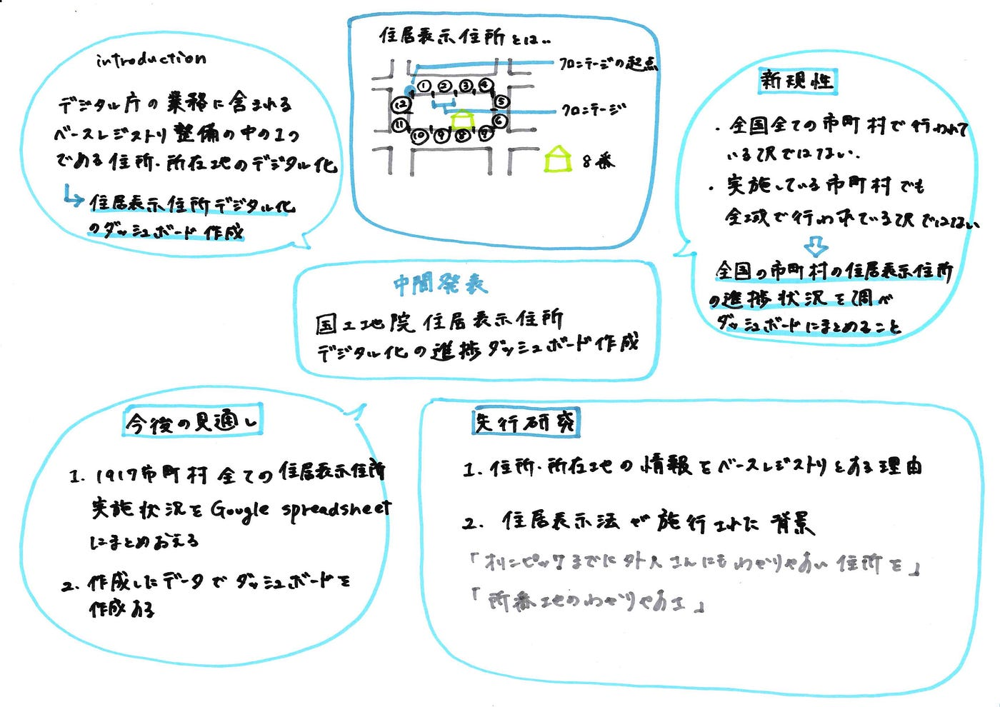

### 国土地理院 住居表示住所デジタル化の進捗ダッシュボード作成

ゼミ論中間発表 松山蘭

＃序文

私は、2021年９月１日に創設されたデジタル庁の業務に含まれるベースレジストリ整備の中の一つである住所・所在地のデジタル化に対し、2021年現在全国の市町村で住居表示住所デジタル化が実施されている地域の進捗状況を住居表示実施状況、実施状況公開情報公開フォーマット（公開レベル）、国土地理院住居表示住所デジタルデータの項目ごとに調べ、最終的にダッシュボードにまとめることをゼミ論のテーマにしました。

住居表示住所とは、住居表示に関する法律（昭和37年5月10日公布、施行）に基づき、建物に新しく番号を付け、住所を分かりやすく表す制度です。

住居表示が実施された場合は、街区縁上に一点「フロンテージの起点」を決めます。そして、そこから街区縁上に一定距離ごとにフロンテージと呼ばれる区間を定めて、それに順序よく番号（基礎番号）をふります。それぞれの建築物の住居番号は、建築物への入り口がかかるフロンテージの基礎番号を採用しています。

しかし、全国全ての市町村が実施している訳ではなく、また実施している市町村でも全ての地域が対象ではないこともあります。

また、国土地理院の電子国土基本図「住居表示住所」は、住居表示に関する法律による住居表示が行われている地区の住居番号を決める際に用いる「基礎番号」を国土地理院がデータ化した、基本測量成果のことです。

現在は、住居表示住所の実施状況は各市町村のWebページからしか閲覧することが出来ない状態です。そこで、全国の市町村の住居表示住所の進捗状況を調べダッシュボードにまとめることに新規性をだし、またこの作業がベースレジストリとなる一歩だと考えます。

＃先行研究

##住所・所在地の情報をベース・レジストリとする理由

”日本では、住所・所在地の情報は市区町村や登記所で個別に管 理されており、標準的な住所・所在地を一元的に管理できていない。加えて、 一般に流通している住所・所在地の表記は、地域により様々に異なり、特殊な ケースも多々存在している。デジタル社会の実現ならびに行政のデジタ ル化に資するよう、住所・所在地の情報をベース・レジストリとして整備・更 新する。”（ベース・レジストリとしての 住所・所在地マスターデータ整備について 、中村弘太郎、下山紗代子、関治之、平本健二）

##住居表示法が施行された背景

今尾（2004）によると、住居表示に関する法律、住居表示法が施行されたのは東京オリンピックの二年前にあたる昭和37年のことであり、「オリンピックまでに外人さんにもわかりやすい住所を」という気運のもと、地番を用いた従来の住所の表示とは別の合理的なシステムということで住居表示住所が導入されました。

それ以外にも、今尾（2007）では、日本の住所は明治以降、不動産登記の番号である地番を住居表示に代用していたため、最初は順を追って付けた地番も徐々に分かりにくくなっていき、特に高度成長期の急激な市街化によって人口が急激に増加した都市の周辺部の地番の錯雑は顕著でした。複雑な境界線と地番の錯綜に訪問者が戸惑うケースが急増していき、社会問題化していきました。その結果行政はもちろん、迷惑を被る郵便や運送会社から警察、マスコミに至るまで「所番地のわかりやすさ」を合唱するようになったそうです。

結果、海外の方式である住居表示が取り入れられました。日本では、街区方式（町の区画を道路、鉄道、軌道の線路、その他の恒久的な施設や河川、水路等で適切な大きさに区切って「街区」をつくり各**街区**に一定の順序により「街区符号」をつける）と道路方式（市区町村内の道路に名称を付け、その道路に接し、又はその道路に通ずる通路を有する建物その他の工作物につけられる住居番号を用いて表示する）を用いています。

＃研究方法

北海道から沖縄までの全国1917つの市町村のウェブサイトから住居表示住所の実施状況を調べ、６つの項目

・住居表示実施状況

・調査年月日

・実施状況公開情報

・公開フォーマット（PDF、CSVなど）

・公開レベル

・[国土地理院住居表示住所デジタルデータ](http://www.gsi.go.jp/kihonjohochousa/jukyo_jusho.html)

をGoogle spreadsheetに記載する。

また、全部調べ終えたあとこの情報をダッシュボードにまとめる。

＃途中経過報告

全１９１７中、 １０４６の市町村の調査を終えました。

そこで、いくつか気になる点があったので出しておきます。

・住居表示実施状況公開情報がPDFのものでも、表になっているものと地 図に記載されているものがある

・電子国土基本図があっても市のサイトに実施状況が掲載されていない市がある

・東京都中央区、神奈川県横須賀市では、電子国土基本図（地名情報）「住居表示住所」がないが、市のウェブサイトでは住居表示が実施されていると掲載されている

＃今後の見通し

1. １９１７市町村全ての住居表示住所実施状況をgoogle spreadsheetにまとめ終える

2. 電子国土基本図があっても市のサイトに実施状況が掲載されていない市、逆に、電子国土基本図（地名情報）「住居表示住所」がないが、市のウェブサイトでは住居表示が実施されていると掲載されている市に電話し、その理由を聞く。

3. また、住居表示住所が実施されているのに電子国土基本図住居表示住所がない市については国土地理院にも電話し理由を聞く

４．作成したデータでダッシュボードを作成する

・参考文献

ベース・レジストリとしての 住所・所在地マスターデータ整備について（中村弘太郎、下山紗代子、関治之、平本健二、2021年）

住所と地名の大研究（今尾恵介、2004年）

地名の社会学（今尾恵介、2008年）

[住居表示に関する法律](https://www.city.gosen.lg.jp/material/files/group/12/67499138.pdf)

参考文献リスト

[古橋ゼミ卒論2019-2021参考文献・参考資料リストテンプレート のコピー
Templete ID,大分類,中分類,小分類,著者,発行年,最終更新日,タイトル,雑誌名,雑誌号数,該当ページ,出版社,ISBN,URL,URL4archives,閲覧日,MEMO1,MEMO2…docs.google.com](https://docs.google.com/spreadsheets/d/12hYImMJoXR1vBGWnOyq_qk_Ti7jRhjjWGOkVetNJyM8/edit?usp=sharing)

卒論用リポジトリ

[GitHub - furuhashilab/2021gsc_RanMatsuyama: 2021年度古橋ゼミ卒論用リポジトリ
You can't perform that action at this time. You signed in with another tab or window. You signed out in another tab or…github.com](https://github.com/furuhashilab/2021gsc_RanMatsuyama)

＜スライド＞

＜グラレコ＞

