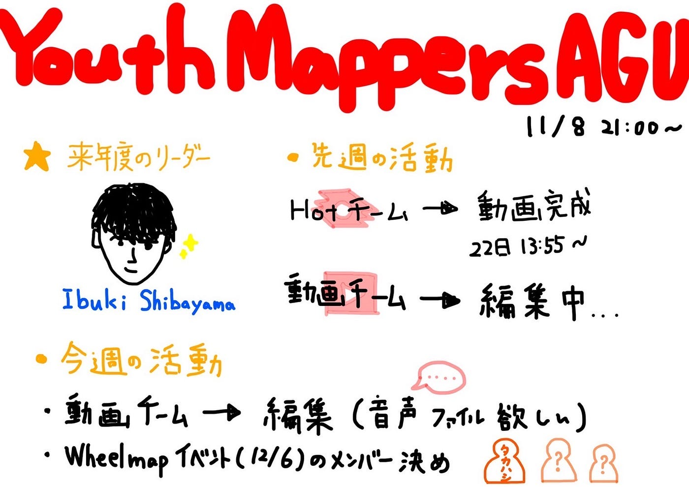

### 来年度に向けて

こんにちは、今回担当する3年の村松です。

11月8日に定例会議行いましたので、報告させていただきます。

来年度に向けて話し合い、柴山息吹さんがリーダーに決定しました。

動画チームからHOT summit の動画が完成しました。22日の13:55に公開する予定です。

今週の活動は、動画チームは編集を行い、今月末の伊豆大島に向けてタスクを考え、各自マッピングします。

今週のグラレコです。

