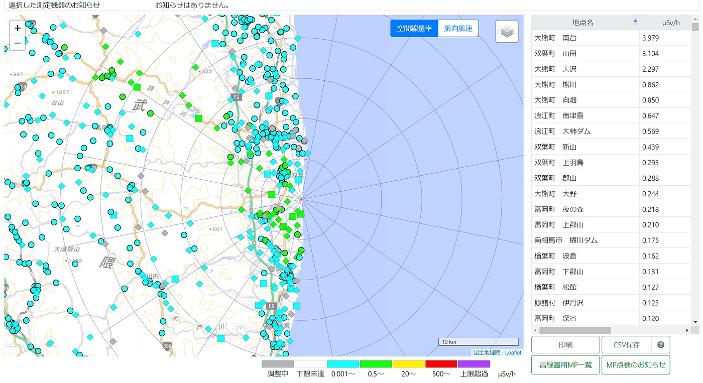
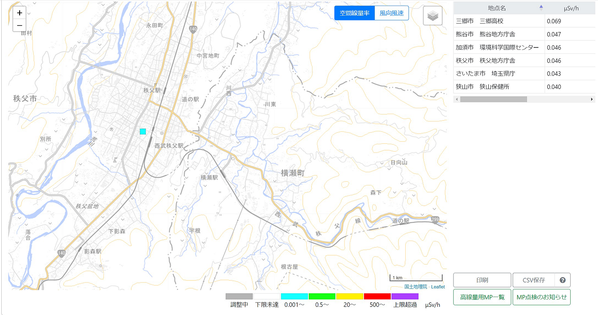
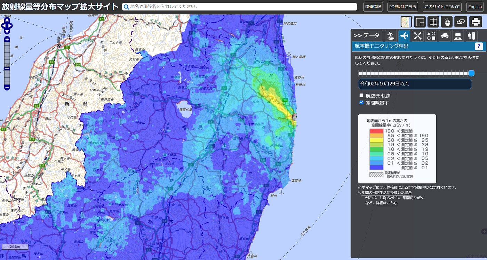
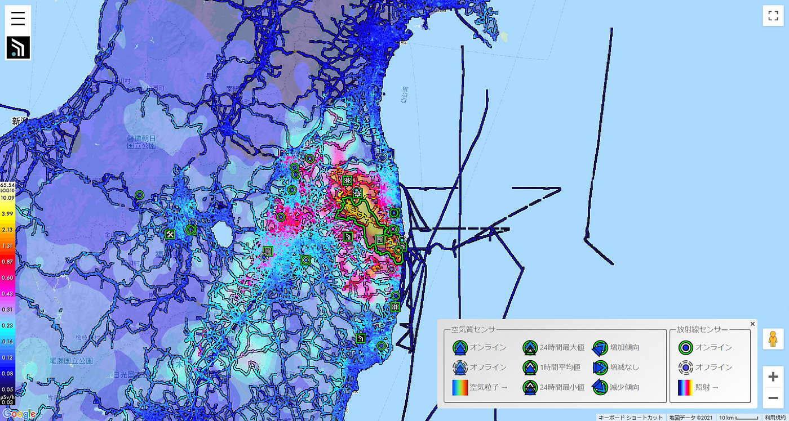
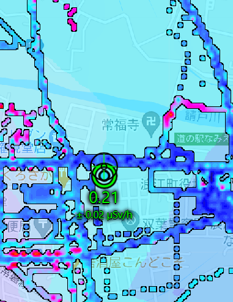
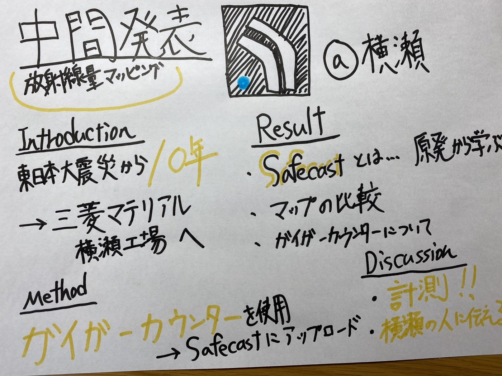

横瀬町の放射線量マッピング Safecast

今回、私のゼミ論は、「横瀬町の放射線量マッピング」をすることに決めました。

Introduction

東日本大震災から10年が経過しました。

多くの方が放射線量に関わるものになんとなく恐怖を感じてしまいます。

災害時では、どれくらいの放射線量だったら危険なのか、汚染されたものはどれくらい危険なのか分からなくなったと思います。

東日本大震災が起きた時も、福島県の米を買わないというニュースを見ました。

しかし、10年経過したことで放射線量は少なくなっています。横瀬町に放射線を処理する場所があるのでその場所が安全であるという事を証明するために放射線量の測量を行いマッピングしたいと思います。

Method

ガイガーカウンターを用いて、実際に横瀬町に放射線量の測定に行きます。

場所は検討中ですが、正丸トンネル付近から、三菱マテリアルの処理工場までを考えています。

測量が終わったら、Safecastにアップロードをしてデータを公開したいと思います。

公式サイトのYouTubeの動画を見ながらイメージをしています。

Result

今回は先行事例の研究と新規性について考えました。

まず先行事例として、Safecastがどのような組織であるのかを完全に知らなかったので調べました。

そのためSafecastがどのように福島第一原子力発電所で事故が起きた際にどのように取り組んでいったかを調べました。

[Safecast: successful citizen-science for radiation measurement and communication after Fukushima](https://iopscience.iop.org/article/10.1088/0952-4746/36/2/S82/pdf)

事故が起きた後、政府の準備不足で放射線のリスクの伝達に遅れが生じました。

そのため放射線の汚染や環境被害をSafecastが協調的なオープンイノベーションで参加型のオープンソースで活動をしました。その結果、専門家や一般の人にとっても有益な情報を伝達することが出来るようになりました。

このように事故が起きた際に、人々が欲しい情報を伝達することで災害時に不安を無くすことが出来ると感じました。

次にSafecastの公式サイトで掲載されている「[SAFECAST REPORT](https://medium.com/safecast-report)」を見てみました。

次に放射線量マップの比較をしてみました。

原子力規制委員会の放射線量測定マップで福島第一原子力発電所付近の場所を確認してみました。

このように場所によっては少し高いですが、上限超過はしていません。

このサイトは[こちら](https://www.erms.nsr.go.jp/nra-ramis-webg/)から閲覧することが出来ます。

横瀬町付近も見てみました。

先ほどの多く計測されている福島県とは異なり、横瀬町付近では、1ヶ所しか計測されていませんでした。

[放射線量等分布マップ拡大サイト](https://ramap.jmc.or.jp/map/#lat=37.28458799999977&lon=140.5831109999977&z=9&b=std&t=air&s=0,0,0,0&c=20201029_dr)も見てみました。

こちらの地図は比較的頻繁に更新されていますが、細かな場所がどれくらいの数値を示しているかは分かりません。

そのため多くの人が計測したデータを自由に利用できるようにすることが重要です。

それを担うのがSafecastです。

Safecastは3500万以上の測定値を収集しており、CC0パブリックドメインでリリースされているため、自由に利用することができます。

拠点は海外に置いていますが、日本での現場活動に重点的に行なっています。

実際にマップを比較してみます。

こちらが福島第一原子力発電所のマップです。

先ほどよりも具体的な数値を確認することが出来ます。また増加傾向や詳細もすぐに確認することができます。

クロスヘアで放射線量を細かく調べることが出来たり、レイヤを変更することも可能になっています。

他のマップを確認する上で、以下の2点が分かりました。

・東日本大震災後多くの県で放射線量のマップを確認できる。

・食品や土壌に含まれる放射線量も確認可能

Discussion

・2021年版のSafecastが出している動画を視聴する。（11時間）

・ガイガーカウンターを借りて、使い方を覚え実際に計測する。

・横瀬の人たちに伝える方法を考える。

予想としては、放射線量は基準より低めで、危険はない。

グラレコはこちら

プロジェクトはこちら

[NaokiIto · furuhashilab/sotsuron2021
You can't perform that action at this time. You signed in with another tab or window. You signed out in another tab or…github.com](https://github.com/furuhashilab/sotsuron2021/projects/24)

参考文献リストはこちら

[古橋ゼミ卒論2021参考文献・参考資料リストテンプレート
Templete ID,大分類,中分類,小分類,著者,発行年,最終更新日,タイトル,雑誌名,雑誌号数,該当ページ,出版社,ISBN,URL,URL4archives,閲覧日,MEMO1,MEMO2 論文,査読つき 論文,査読なし 書籍…docs.google.com](https://docs.google.com/spreadsheets/d/1C3ZDC9UUvsCMds6NQ4X8lB6X73fcz5gu-jCiJESdlHw/edit#gid=0)

レポジトリはこちら

[Build software better, together
You can't perform that action at this time. You signed in with another tab or window. You signed out in another tab or…github.com](https://github.com/furuhashilab/2021gsc_NaokiIto/edit/main/README.md)

スライドはこちらになります。
