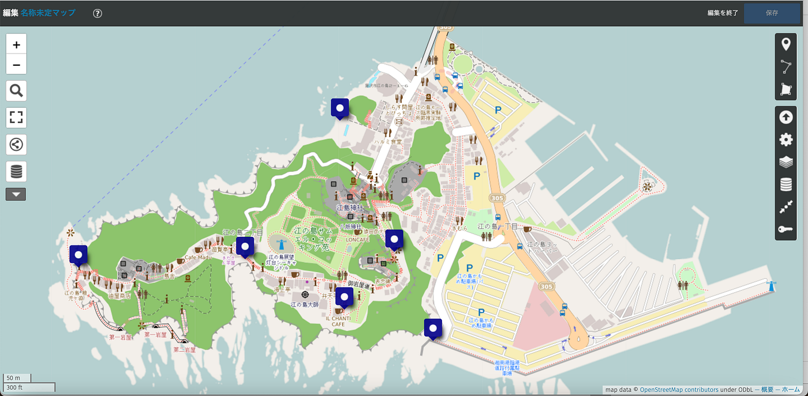
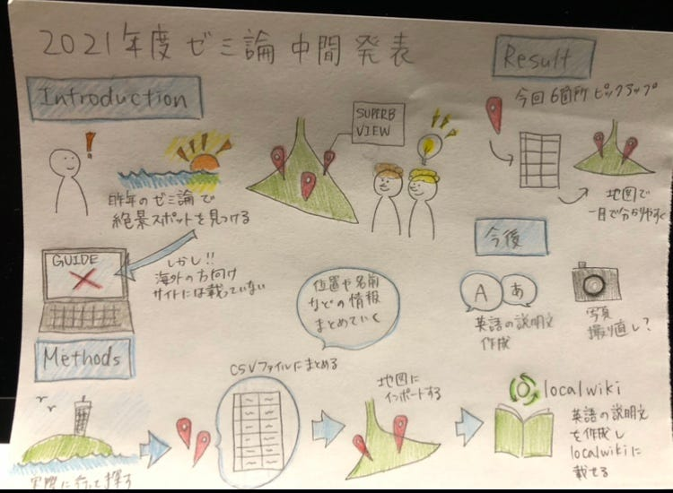

### 江の島の絶景スポットを海外の方向けにお届け

今回私はゼミ論で、江の島の絶景スポットを海外の方向けにまとめたサイト作成を行うことにしました。

Introduction

去年のゼミ論で江の島を歩き回った時に、ガイドブックなどには載っていない絶景をいくつか見つけました。しかし江の島の観光ガイドの英語版を見ると、これらの穴場スポットを分かりやすくまとめたものはありませんでした。そこでこれらを一目でわかりやすくまとめることで、今後江の島に訪れる海外の方にもこれらの穴場スポットを見てもらいたいと思い、今回のテーマに決めました。

Methods

まず実際に江の島に行き、去年のゼミ論も参考にしながら絶景スポットを探す。

ピックアップした箇所の名前や位置などの情報をCSVファイルにまとめます。

そのCSVファイルを地図にインポートして一目で分かるようにする。

英語の説明文を作成しLocal Wikiにまとめる。

Result

6箇所の場所を絶景スポットに選び、地図に落とし込みました。去年は綺麗な眺めだったのに今回見たら草が伸びてて絶景じゃなくなってた箇所も数箇所あることに気がつきました。

Discussion

今後のやることとしては、それぞれの箇所の写真を撮り直すことと、英語の説明文を作成しLocal Wikiに載せていくことです。

ゼミ論用リポジトリ

[GitHub - furuhashilab/2021gsc_MamiYahiro
2021年度古橋ゼミ論用リポジトリ 八尋舞美 青山学院大学 地球社会共生学部 地球社会共生学科 八尋舞美/Mami Yahiro 学籍番号 1A118170 指導教員 古橋 大地 教授 © Furuhashi…github.com](https://github.com/furuhashilab/2021gsc_MamiYahiro)

参考文献

[古橋ゼミ卒論2019-2021参考文献・参考資料リスト（八尋舞美）
Templete ID,大分類,中分類,小分類,著者,発行年,最終更新日,タイトル,雑誌名,雑誌号数,該当ページ,出版社,ISBN,URL,URL4archives,閲覧日,MEMO1,MEMO2 論文,査読つき 論文,査読なし 書籍…docs.google.com](https://docs.google.com/spreadsheets/d/1MxDfNtNdVV5fGdWIDxwt9DxHjt-asm9imttNbXWchT8/edit#gid=0)

スライド

グラレコ

