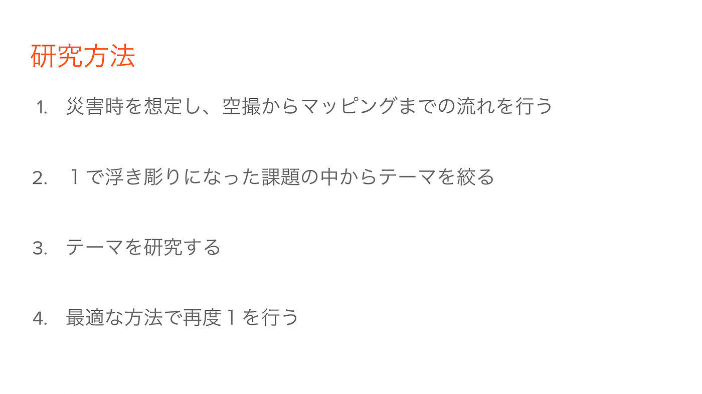
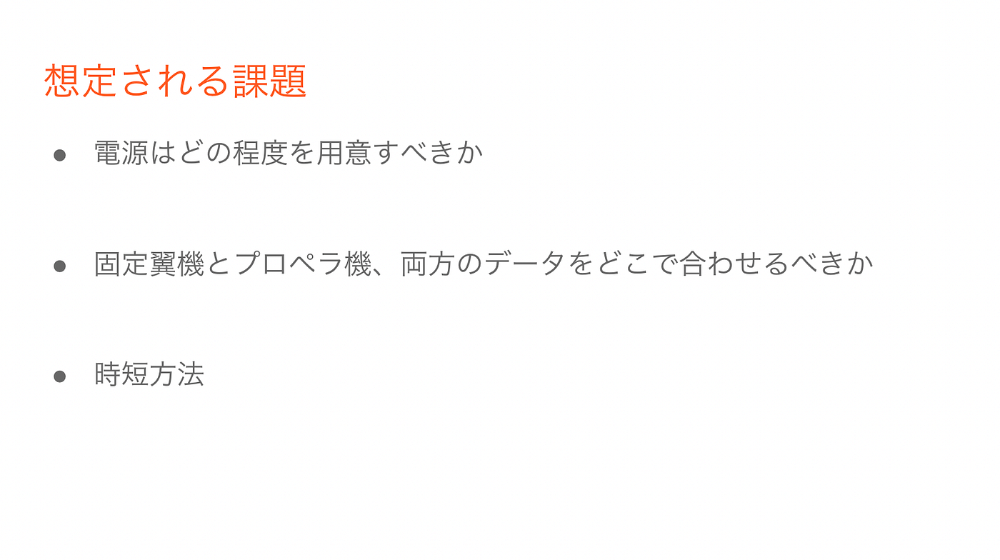
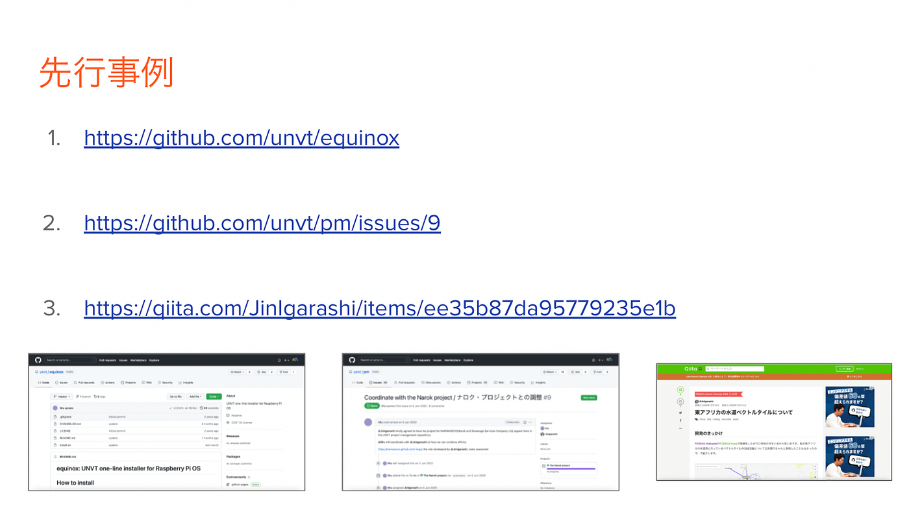
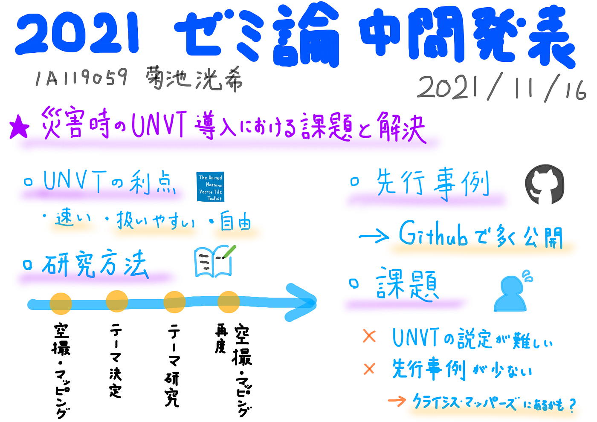

### 災害時にUNVTを導入するには

3年の菊池です。ゼミ論の中間発表ということで、非常に焦りながら当記事を書いています！

さて、今年のゼミ論は「災害時のUNVT導入における課題と解決」というテーマで取り組みます。UNVT（国連ベクトルタイル）ツールキットは、「速い」「扱いやすい」「自由」という三つの特徴を持っています。私は災害時に導入することで、迅速なマッピングに一役買うのではないかと考えました。そこで、UNVT導入にあたって想定される課題を解決することを目指していきたいと思います。

研究方法は以下の通りです。

ポイントは再度「空撮・マッピング」の工程を行うことで災害時に迅速に対応できるかを試すという点です。

また、想定される課題は以下の3点を考えていますが、実際に行うことで見えてくる課題もありそうです。

先行事例はありがたいことにGithubにいくつか公開されているので参考にしたいのですが、UNVTを災害時に活用した事例は見つかりませんでした。もしかするとクライシスマッパーズの活動に似たものがあるのでは？と考えています。

研究の課題としては、UNVTの設定自体にまだ苦戦しているので早急に対処したいです。遅れていると思うので、ここから巻き返して行ければと思います！

