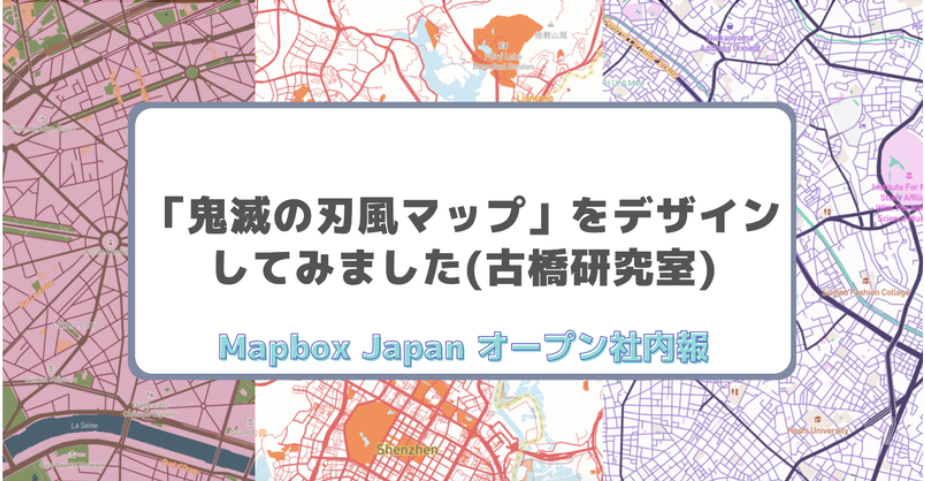
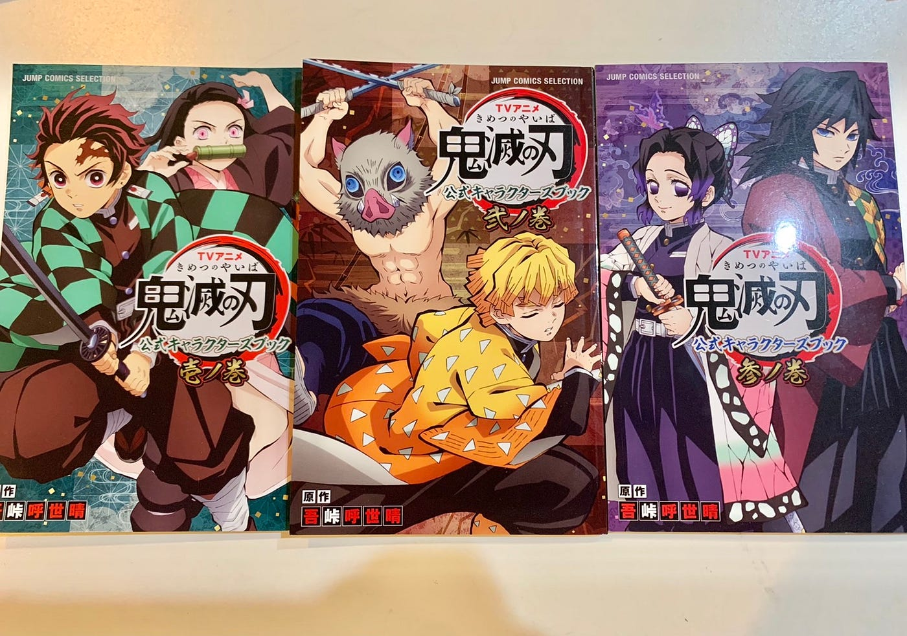
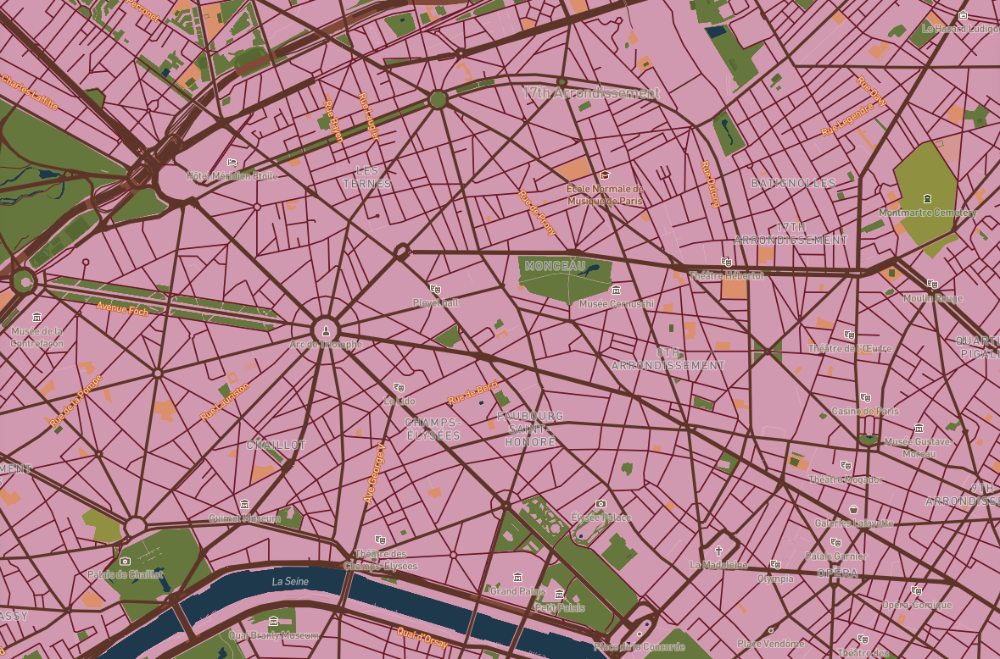
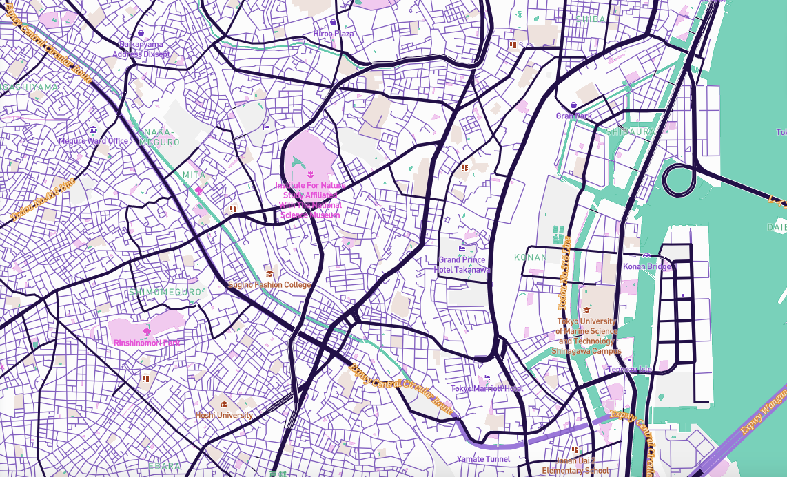
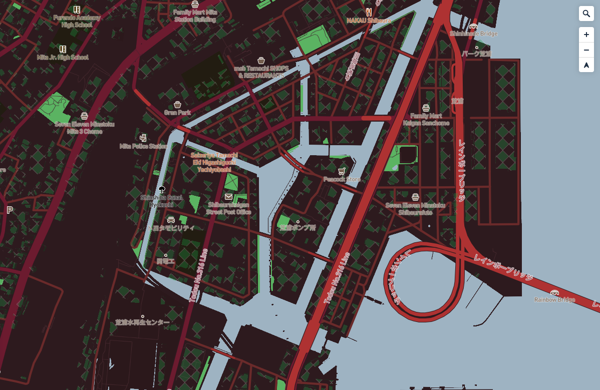
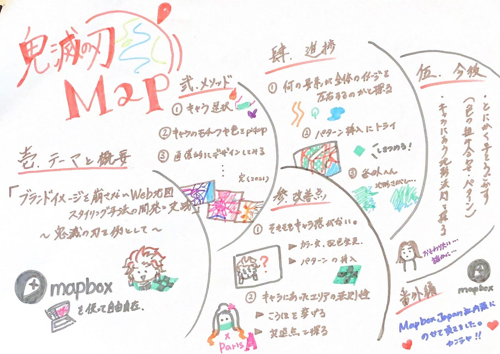

### 鬼滅の刃風マップ、ついに主人公登場

2021年 ゼミ論中間発表 by 斎藤祐花

中間報告の前に、昨年度までのゼミ論である「ブランドイメージを崩さないウェブ地図スタイリングの手法」の成果をMapbox Japan オープン社外報に２年の吉原さほちゃん（インターン中）のおかけで取り上げて頂きました！

▶︎ [https://blog.mapbox.jp/n/nd3c857b95c21](https://blog.mapbox.jp/n/nd3c857b95c21)

それでは本題に入ります。今回は改めて今年度のゼミ論テーマのおさらいとMethods、昨年度までのResult、改善点、進捗からスケジュールまでご報告いたします。

> **＃Introduction**

『ブランドイメージを崩さないweb地図スタイリング手法の開発と実践』〜鬼滅の刃を例として〜

▷昨年度のゼミ論テーマを継続 ！

改めて簡単に内容をまとめると、、

**・mapbox studioを使用し『鬼滅の刃』キャラをイメージした地図のデザインを行う
・実践で得た知見をもとにスタイリング手法をまとめる
・制作したデザイン地図の実際の用途を考察**

この３点が主になる。要するに決めつキャラモチーフのマップを作る過程でブランドイメージをどうマップ上に反映できるかの方法を模索するといった感じだ。

> **＃Methods**

**① キャラクターを選択**

**② 公式キャラブックからキャラのメインカラーやモチーフをピックアップ**

TVアニメで登場する主要キャラクターのモチーフや服装などの設定資料を収録した[公式キャラクターズブック](https://books.shueisha.co.jp/items/contents.html?isbn=978-4-8342-1721-6)からキャラクターのカラーや雰囲気、モチーフなどをいくつか抜き出しておく。そしてキャラクターイメージを構成する主な要素をまとめる。

**③ mapboxにて、2でまとめたものを参考に直感的にデザイン**

はじめはカラーを中心にデザインをしていき、その過程でキャラクターのモチーフとなる要素を地図上におとしこみ最後にキャラクターの性格や雰囲気からそのイメージにあったフォントを選択する。

> **＃results 
(昨年度までの)**

”Nezuko Kamado”

”Kyojuro Rengoku”

”Shinobu Kocho”

> **＃改善点**

私自身がまだ使いこなせてないのが主な原因だが最低限改善していきたい①と実践の中で深掘りすると面白そうだなと思った②をメインの改善ポイントとしてアップグレードさせていきたい。

**①そもそもキャラクター感を出せていない or 薄い**

▷カラーの選択、配色の仕方を変えてみる
 ▷パターンの導入 (building 3D modeへの)

**②キャラクターにあったエリアを探しその法則性をみつける**

▷作業と同時進行で相性の良いエリアを編集画面上で探し候補を挙げる
▷候補を比べ共通点を探っていく

> **＃進捗**

①改めてどんな要素の変更が全体イメージを左右するのかを探る

自分用のクオリティだがこれまでの作業である程度どの要素が全体のイメージをどれほど左右するかがわかってきた。そのためそれをまとめつつも新しくMapboxStudio上でいじれる部分を探していく。今のところBaseとroadカラーがダントツで印象が変わる。次にパターン変更が簡単に効くbuilding部分。

②パターンの挿入を試す

先述のbuildingを３D化した際に行うことができるパターンの挿入をいくつかで試した。まずは既存のNezuko Kamado MAPにドットやダイヤ型を入れたがこれは今までシンプルゆえにroadの輪郭がくっきり綺麗に出て全体のバランスがとれていたのが台無し。ではお兄ちゃんのほうはどうだろうと、Tanjiro Kamadoをいじるとまさかの大当たり（？）
既存の緑菱形を挿入したら遠目でバッチリ市松模様に見える。
だが縮尺に左右されるのでその辺を今後どうするか要検討だ。

③番外編（使えそうな地形をゆるっと収集中?）

こちらは本当に番外編なので文字のみでの記述になるが、特徴的な地形をマップを暇な時に見てピックアップしている。地形ももちろんのこと街の構造（曲線が多いのか、直線が多いのか、放射線状に道が広がっているかetc）を実際に作業画面で見ながら観察。

> **＃今後**

今後も以前同様あまりルールや自分が固めたメソッドに縛られすぎずとにかく手を動かしてみることが要になりそうだ。そこから得たひらめきをもとに方向性を整えながら最終的な形に仕上げたいと思う。

**・とにかく手を動かしながらスライド６であげた改善点部分の作業
（色の組み合わせ、パターン挿入、パターン作成）**

**・キャラ似合う地形の法則研究**

**・使い方を知る＆教わりたい**

> _**グラレコ_**

> _レポジトリ_

[GitHub - furuhashilab/2021gsc_Yuka-Saito: '21 ゼミ論用レポジトリ
'21 ゼミ論用レポジトリ 学籍番号：1A118074 氏名：斎藤 祐花 地球社会共生学部 地球社会共生学科 3年A組80番 指導教員：古橋 大地 教授 © Furuhashi Laboratory/Yuka Saito, CC BY…github.com](https://github.com/furuhashilab/2021gsc_Yuka-Saito)

> _発表用資料_

[https://docs.google.com/presentation/d/1HPFAN4-ck84yJVDlLfvUs7P0WPy5Q6LDRvPoqtNMtfM/edit?usp=sharing](https://docs.google.com/presentation/d/1HPFAN4-ck84yJVDlLfvUs7P0WPy5Q6LDRvPoqtNMtfM/edit?usp=sharing)
