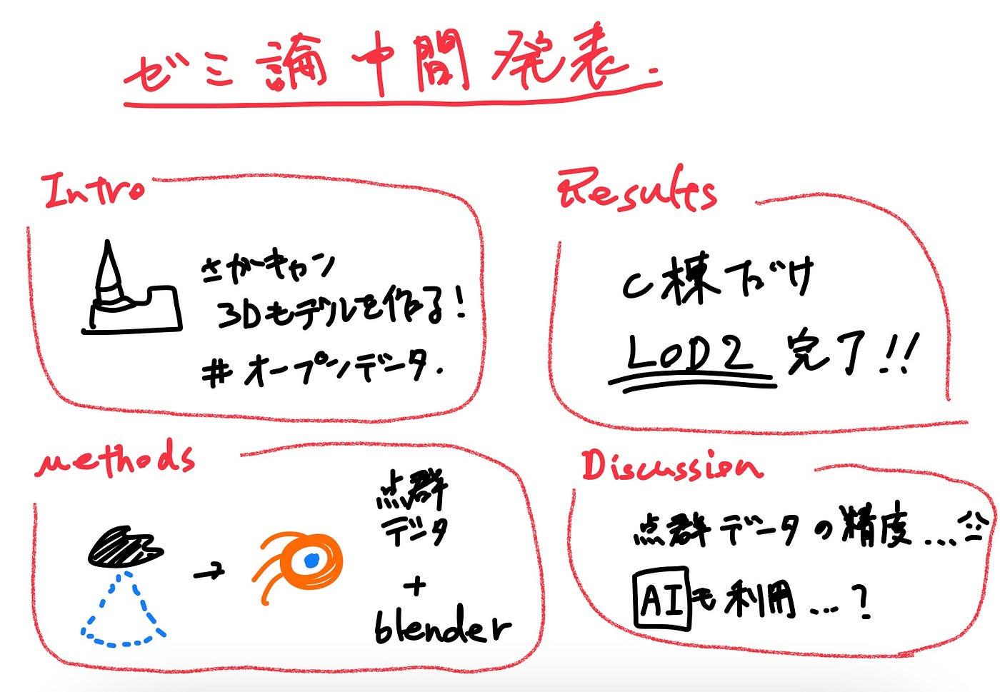

### 3Dチャペル作ってみました。（尖塔なしver.）

### 柴山息吹 ゼミ論研究の中間発表

#### Introduction

国土交通省が進める3D都市モデルのオープンデータプラットフォーム「PLATEAU」の整備フローを参考に、相模原キャンパスのモデリングを行ってきました。

3Dの都市モデルはVR東大などの例が有名ですが、今回の研究では「市民による3D都市モデルの整備」と、その「オープンデータ化」という点を新規性として進めていきます。

#### Methods

PLATEAUの整備フローを参考に、**OSM**、**ドローン空撮による点群データ**、**屋内の3D計測**を組み合わせてモデリングしていく手法です。

古橋先生による過去のキャンパス空撮データから得られた点群データをCloudCompareで調整し、それに合わせるようにblenderでモデリングしていきます。

#### Results

C棟ウェスレーチャペルのみ（尖塔を除く）LOD2相当のモデリングが完了しました。

#### Discussion

これまでに考えられた課題点は主に以下の3つです。

1. 点群データが崩れている所はモデリングが困難である。

1. 点群に合わせてポリゴンを作成する際に誤差が発生する。

1. 手作業でのモデリングは非効率になる。

#### 今後の予定

- **モデリング可能な棟から進めていく。**

- **屋内3D計測。**

#### グラレコ

#### スライド

#### ゼミ論レポジトリ

[GitHub - furuhashilab/2021gsc_IbukiShibayama: 2021年度古橋ゼミ論用レポジトリ
2021年度古橋ゼミ論用レポジトリ. Contribute to furuhashilab/2021gsc_IbukiShibayama development by creating an account on GitHub.github.com](https://github.com/furuhashilab/2021gsc_IbukiShibayama)
