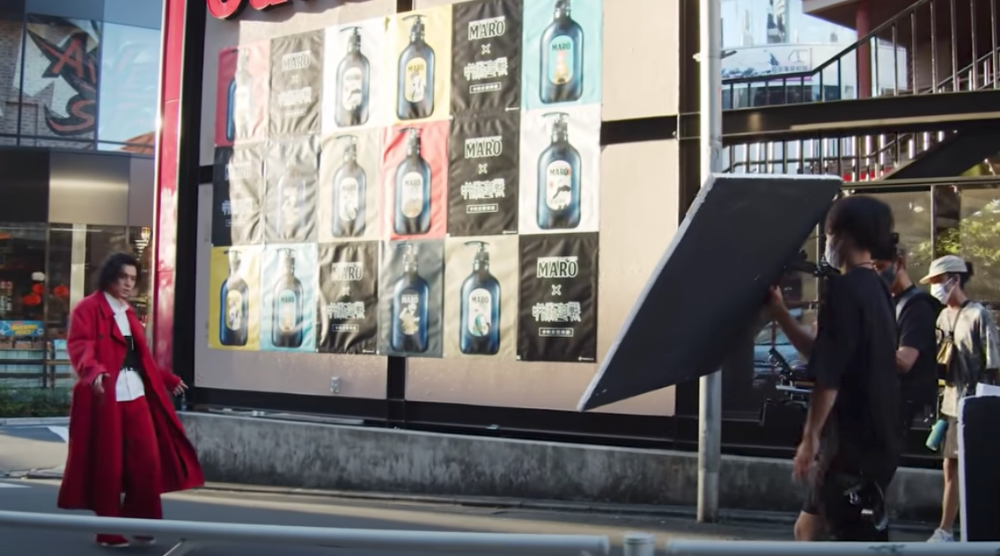
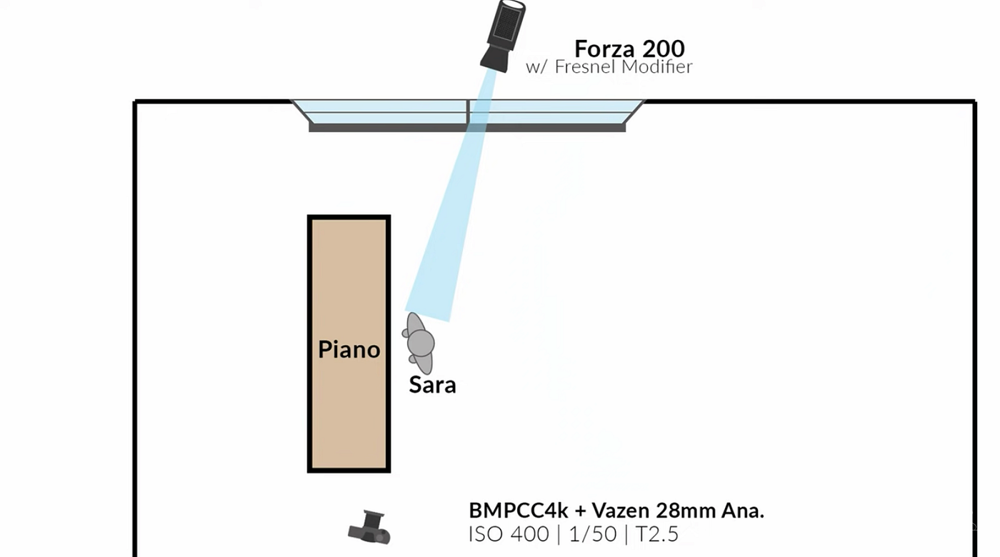
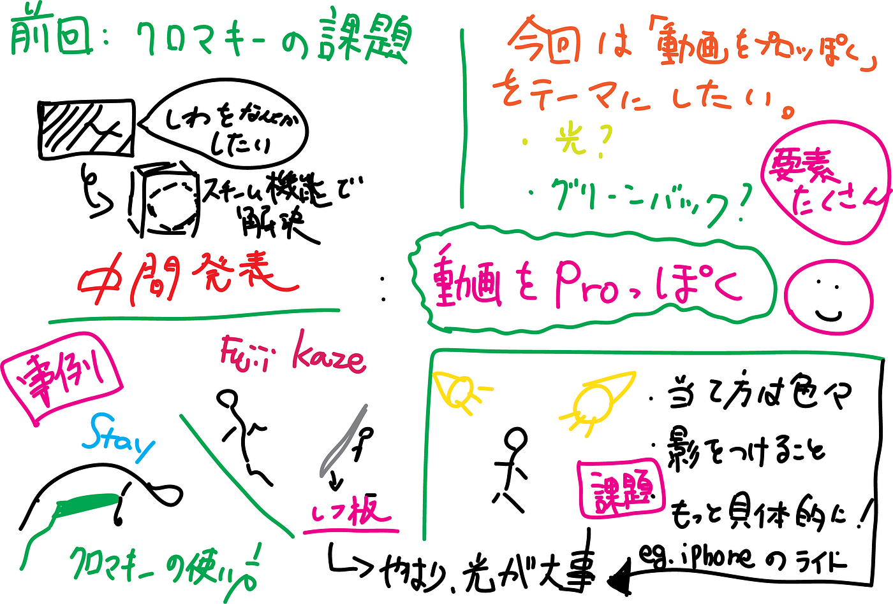

### “撮影”には光が大事。

こんにちは、今回は2021年度のゼミ論中間報告をします。

### 研究内容

本研究では去年のゼミ論「クロマキー撮影と編集における課題の整理と質の高い動画の撮影方法の提案」に引き続き、グリーンバックやその他撮影器具を使った “動画の撮影方法”について深ぼり、研究をしてきます。

前回の研究においては、クロマキー(グリーンバック)を使った撮影における不満の一つ「しわが目立つ」ことについて、特定の洗濯機についているスチームアイロン機能を使うとしわが少し消えるという意外な結果になりました。

今回は、グリーンバックも含め「一般人がよりプロっぽい映像を作るためにはどこに気をつければいいか」を明らかにし、そのコツ、方法をまとめます。

### 考えられる要素

- グリーンバックをいかに使いこなしているか？

- 光をうまく使っている

- 高額な機材を使っている

- 大人数の撮影チーム

### 先行事例

上の要素を踏まえて、グリーンバックを使っているもの、使っていないものを含めてプロの仕事を漁りました。

#### The Kid LAROI, Justin Bieber — STAY (Official Video)

#### Justin Bieber, The Kid LAROI — Stay (Montage)

#### 藤井 風 — “燃えよ” Official Video

#### 藤井 風 — “燃えよ” Behind The Scenes

メイキング動画はプロの技術が詰まっているので有益でした。色々なメイキング動画を見る中で、気づいたのが大きな板を斜めに傾けて被写体にむけているということです。

いわゆる「レフ板」で逆光や光をコントロールするものです。

ですが、レフ板と言っても素人はレフ板をどう扱えばいいかわからない。そもそも、レフ板なんか持ってない。という人がほとんどです。

ですが、なんとかして「光を操りたい」

今回の研究では「光」に注目して、一般の人でもプロっぽく撮影できる光の当て方について考えていきます。

### 光の当て方

こちらの動画にあるように実は１つのライトだけでこれだけの演出ができるということがわかりました。

また、光を使わない照明コントロールもあります。

そもそも、照明の基礎はどのような配置なのでしょう。答えは「Key Light」「Full Light」「Head Light 」の３点が基本だそうです。素人である私たちは前から一生懸命光を当てていましたが、実は３方向から当てるべきでした。

これらをまとめると大事な要素が見えてきました。

> 1 実はライト(照明)は使わなくて良い。自然光と影をまず最初に意識しければならない。

> 2 光を当てる方向は360°どこでも可能性がある。

これらを踏まえて「光の当て方」について試行錯誤していきます。

### 課題

要点は掴めましたが、そもそも「プロっぽさ」とはどの程度の動画のことを指すのかしっかり定義できていない部分があるので、光を意識しなかった時とどの程度クオリティが変化するのかという部分を意識しながら撮影しようと思います。

### 成果物の出し方

動画を撮影した上で、以下のような図で表現したいと考えています。実際に光を当てる角度が見えやすい形でまとめることで誰でも実現可能な撮影方法にしたいと考えています。

### グラレコ

### 参考文献

[古橋ゼミ卒論2021参考文献_青木怜
Templete ID,大分類,中分類,小分類,著者,発行年,最終更新日,タイトル,雑誌名,雑誌号数,該当ページ,出版社,ISBN,URL,URL4archives,閲覧日,MEMO1,MEMO2 論文,査読つき 論文,査読なし 書籍…docs.google.com](https://docs.google.com/spreadsheets/d/1aTm66UNxFB5cAVl1_44wyT1jAr8qmjzAisON0W4mXs0/edit?usp=sharing)

### スライド

### Github

[Ren Aoki · furuhashilab/sotsuron2021
You can't perform that action at this time. You signed in with another tab or window. You signed out in another tab or…github.com](https://github.com/furuhashilab/sotsuron2021/projects/17)
