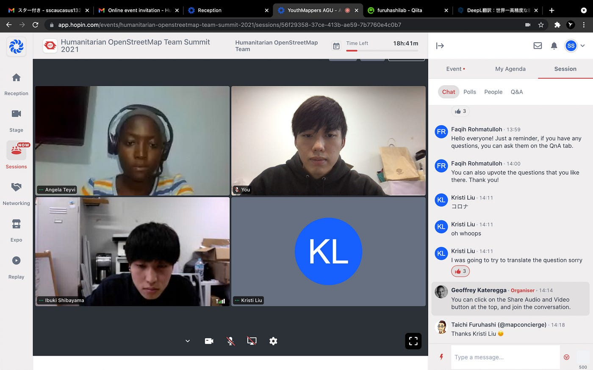

### HOT 緊張した…

> _HOT Summit 2021に参加しました。_

11月22日にオンライン上で開催されたHOT Summit 2021に [Ibuki Shibayama](None)とともにYouth Mappers AGUのメンバーとして2020年から2021年の間に行った活動報告を発表させていただきました！

今回はイギリス発のバーチャルイベントプラットフォームである[Hopin](https://ja.hopin.com/)を使用したもので、これは最大で10万人を相手に配信をすることができる、新しいオンライン会議ツールである。

まず主催者が設定したスケジュールに対して自分の参加する会議やイベントのチケットを事前に購入し、自分の登壇する時間に開かれるセッションに参加し発表を行うという流れだった。

今回はオンライン上のタイムラグや機材の不手際が起こることを考慮したてか、発表者たちはあらかじめその発表を録画し、それを当日に参加しながら視聴する形がとられた。我々の発表の後にはこれまでの活動の中で最も印象的だったものは何かなどど質問が来た。聞かれている質問の内容は何となく理解することができたが、それを英語で答える際、自分のひどい英語のスキルを発揮することとなってしまい、うまく伝えることができなかった。英語を勉強しなければ…

そうしていると参加者の一人だったUCSB（カルフォルニア大学・サンダーバーバラ校）の図書館で働いているKristi Liu氏に途中から通訳を担っていただき、たくさん助けてくださった。Kristiさんは親御さんが青学出身ということで我々のセッションに興味を持って参加してくださっていた。この場を借りて深く感謝を申し上げます。

発表を最後まで順調に進めることができほっとしている。古橋先生をはじめこの会議に参加する機会を与えてくださった方々にも感謝申し上げたい。

[HOT Summit 2021 - SOTA SUZUKI's 0.0 km walk
Sota S. completed 0.0 km on Nov 22, 2021.www.strava.com](https://www.strava.com/activities/6290994116?share_sig=190304AC1637563016&utm_medium=social&utm_source=ios_share)
