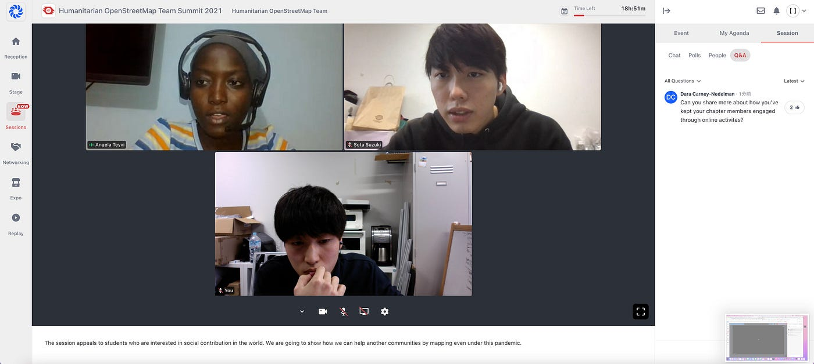

### はじめての国際会議 【HOT Summit 2021】

HOT Summit 2021 登壇レポート

こんにちは。古橋研究室3年の柴山息吹です。

11月22日開催の人道支援マッピングのオンライン国際会議、HOT Summit 2021 にてYouthMappers AGU のスピーカーとして [SOTA SUZUKI](None) と一緒に登壇しました！

[HOT Summit 2021 Call for Proposals
The 2021 HOT Summit Call for Proposals is now open! Submit your ideas for panels and talks today! Deadline is 31…www.hotosm.org](https://www.hotosm.org/updates/hot-summit-2021-call-for-proposals/)

今年は10分程度のプレゼンテーション動画と Q&A を行うDialogue の形式でエントリーし、"Activity Report 2021–2021" と題してYouthMappers AGUの最近の活動と課題について発表しました。

> **Hopin**でのオンラインサミット

今回はバーチャルイベントプラットフォーム「Hopin」が用いられ、はじめての国際会議ではじめてのツールを使うという試みとなりました。

Hopinでは複数のセッションにおいてミーティングを同時進行させることが可能で、オーディエンスはそれぞれのセッションを行き来しながらコメントや質問を投稿できるようになっていました。

予めHopinに登録し、イベントのチケットを購入していないと入室できない点が少しややこしく感じましたが、セッションを一覧で見ることができたり、テーマごとにチャットが分かれていたりするなど、UIが優れている印象を受けました。

> 英語が話せなかった…

Q&Aコーナーではいくつかの質問を頂きましたが、緊張と英会話の実力不足でうまく受け答えができず、一時微妙な雰囲気になってしまいました…。

思っていた以上に自分が英語を話せなかったこと思い知らされていたその時、オーディエンスの一人だったKristiさんが通訳をしながら助っ人に入ってくれました！

彼女はカリフォルニア大学の図書館に勤務されている方で、ご家族が青学出身のため、今回の我々の発表を見つけて偶然聴いていてくださっていたとのことです。彼女に助けられながら、自分にとって印象に残ったWheelmapのイベントや、これからいかにしてOSMを広めていくかについて話すことができました。ありがとうございました！

ファシリテーターの方やKristiさんの優しさに感謝しつつ、今回の経験をきっかけに英会話力を向上させていきたいです。

> スクリーンショット

> Strava

[Hot Summit 2021 - Ibuki Shibayama's 5.5 km walk
Ibuki S. completed 5.5 km on Nov 22, 2021.www.strava.com](https://www.strava.com/activities/6290996629)
