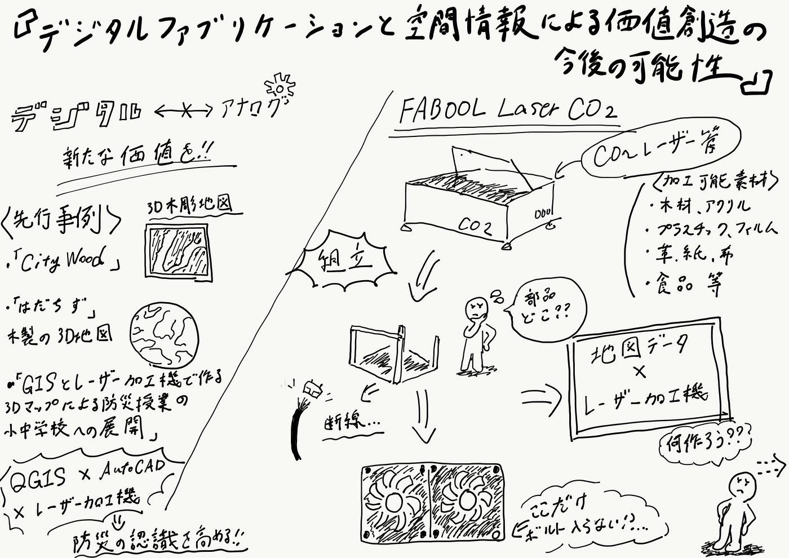

### 「デジタルファブリケーションと空間情報による価値創造の今後の可能性」

２０２１年度の私の卒論テーマとして今回挙げさせていただくのは、「デジタルファブリケーションと空間情報による価値創造の今後の可能性」である。

#### Introduction:

古橋研究室では、”空間情報”を大きなテーマに各ゼミ内サークルが様々な観点からアプローチをかけ活動してきている。その中で今回私は、研究室にある数年経っても未だに完成していない”古橋研究室のサグラダファミリア”とも言えるレーザー加工機を組み立て実際に使用していきながら、今後の空間情報にどれだけ価値を生み出すことが出来るのかを実施を踏まえて考えていく。

#### 選考事例：

- _[GISとレーザー加工機で作る３Dマップによる防災授業の小中学校への展開_](http://www.gisa-japan.org/file/kureteam.pdf)

- _[はだちず_](https://internet.watch.impress.co.jp/docs/column/chizu/1083137.html)

- _[City Wood_](https://fabcross.jp/news/2018/01/20180119_citywood.html)

- _[ArcGIS×デジタルファブリケーション_](https://blog.esrij.com/2017/06/20/post-26810/)

**Facebookグループ：**

smartDIYs社の製品を使用し製作した作品を共有し合うFacebookグループが存在していた。

[Log in or sign up to view
See posts, photos and more on Facebook.www.facebook.com](https://www.facebook.com/groups/1630210010590821/?ref=share)

#### Methods:

まずは、レーザー加工機が完成しないことには何も始まらないのでその組み立ての実施から入る。

当初は、「FABOOL Laser CO2」２台「FABOOL Laser DS」１台の計３台を組み立てる計画をしていた。しかし、実際に組み立て始めてみたところ、それを行うにはあまりにも時間が足りなさ過ぎることを痛感した。よって、「CO2」一台のみの組立を目標に、現在公式サイトにあるマニュアルを見ながら地道に組立作業を行なっている。

#### Result:

組み立て途中ながら、マニュアルの不完全さを認識できたり、レーザー加工機の構造を理解したりし多くの学びを得られた。

また、組み立てている段階で、ケーブルの断線やボルトの不具合等のトラブルも多々発生し、なかなか作業がスムーズに進んでいない。

現在、新たなケーブルを再度発注しており、それが届き次第再度組み立て作業を再開したいと考えている。

マニュアルで言うところの23/28の工程が終了しており、ラストスパートではあるが、同時に一番失敗出来ない工程に移っているので、慎重にいきたいところである。

#### Discussion:

現状、レーザー加工機を組み立て最中なのでまずはそれを完成させることを目標に、少しずつこれを活用した製作の具体案も考えていこうと思っている。

#### ゼミ論用リポジトリ：

[GitHub - furuhashilab/2021gsc_TatsumiBaba: 2021年度古橋ゼミ卒論用リポジトリ
2021年度古橋ゼミ卒論用リポジトリ. Contribute to furuhashilab/2021gsc_TatsumiBaba development by creating an account on GitHub.github.com](https://github.com/furuhashilab/2021gsc_TatsumiBaba)

#### 参考文献：

[古橋ゼミ卒論2021-2022参考文献・参考資料リスト(馬場)
Templete ID,大分類,中分類,小分類,著者,発行年,最終更新日,タイトル,雑誌名,雑誌号数,該当ページ,出版社,ISBN,URL,URL4archives,閲覧日,MEMO1,MEMO2 論文,査読つき 論文,査読なし 書籍…docs.google.com](https://docs.google.com/spreadsheets/d/1jpRv0i6nmzOQlFufo8qODGCFgeomgjxghMPRr35G7CM/edit?usp=sharing)

#### スライド：

#### グラレコ：

