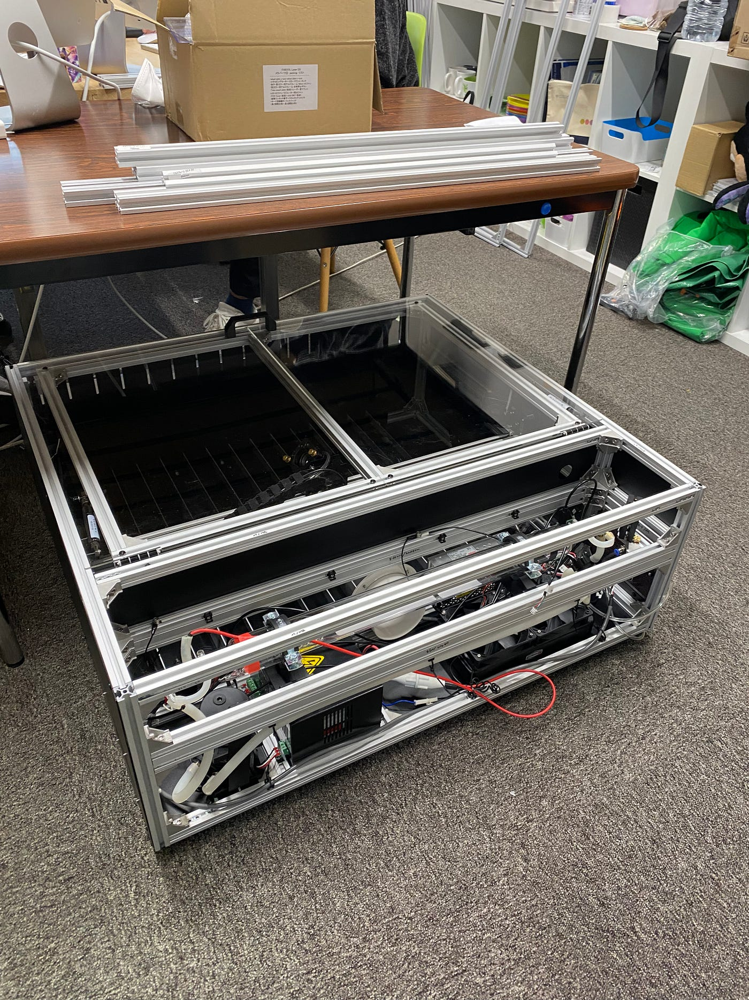
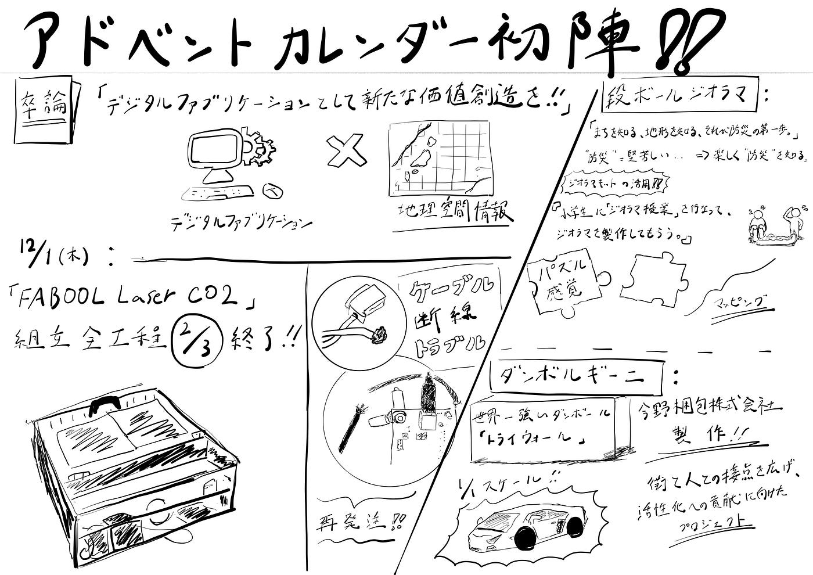

### アドベントカレンダー初陣！！

アドベントカレンダーとして、私の卒論の活動報告を行いたいと思う。

私が行なっている卒論は、研究室にあるレーザー加工機を組み立て、実際に使用し、デジタルファブリケーションとして新たな価値創造を行うというものである。その中で、空間情報や地理情報のデータも組み込むことをしたいと考えている。

12月1日（木）現在は、レーザー加工機の組み立てを行なっている段階で、残すところ全工程の3分の1ほどである。

ケーブル断線やボルトの不具合等の様々なトラブルも発生した。

そして、新たなケーブルを再発注しており、もうしばらくすると配達される予定なので、配達され次第残りの工程もなるべく早く終わらせたいと考えている。

そこで先日古橋先生から情報提供があった_**”段ボールジオラマ”、”ダンボルギーニ”_**について調べてみた。

_**[段ボールジオラマ](https://www.bosai-diorama.or.jp/)：_**

**「まちを知る、地形を知る、それが防災の第一歩。」**

”防災”と言うと堅苦しく感じ、なかなか一歩を踏み出しづらい。そのような方々のためにジオラマキットを用いり、楽しく”防災”を知れる。

これにより、子供から大人の専門家まで今まで幅広い方々、シーンに活用されてきている。

この段ボールジオラマは、土地を等高線ごとにパーツ分けし、パズル感覚で作れるのでとても簡単に楽しく作れ学べるのだ。

活用事例として最近では、

私の住んでいる横浜市の下野庭小学校で、_**[「ジオラマ授業」_**](https://www.bosai-diorama.or.jp/2021/10/29/shimonoba/)を行なっていた。周辺地域の方々にも見てもらえるような「資料室」を作る活動の一環でジオラマを小学6年生が製作した事例である。横浜市の防災マップデータも参照しながら”マッピング”を行なったのだ。このジオラマ、そして「資料室」が完成すれば、いざと言うときに街の皆の役に立つであろう。

_**[ダンボルギーニ](http://damborghini.com/)：_**

世界一強いダンボールと言われているトライウォールを販売されている今野梱包株式会社の今野さんが東日本大震災の経験をきっかけに立ち上げたプロジェクト。

実寸大のもので本物にそっくりに作られていた。

これにより、街と人との接点を広がり、活性化への貢献に向けてプロジェクトが動いている。

今野さんの、「地元をもっと盛り上げるには、夢や憧れを形にして示すしかない」という想いのもと始まったダンボルギーニは地域創生的な観点からも素晴らしいものであると感じた。

以上のようなユニークで新しい価値の持つ動きが現段階でもたくさん存在している事を改めて理解する事ができた。今回の事例以外にもたくさん調査しながら自分なりの”新たな価値”を見出して行けたらいいなと思っている。

この投稿は以下のアドベントカレンダー2021として登録されています。

[Calendar for Furuhashi Lab. | Advent Calendar 2021 - Qiita
Calendar page for Furuhashi Lab..qiita.com](https://qiita.com/advent-calendar/2021/furuhashilab)

#### ＜グラレコ＞

#### ＜GitHub＞

[GitHub - furuhashilab/2021gsc_TatsumiBaba: 2021年度古橋ゼミ卒論用リポジトリ
2021年度古橋卒論用レポジトリ 馬場 巽 青山学院大学 地球社会共生学部 地球社会共生学科 馬場 巽/TATSUMI BABA 学生番号 1A118124 指導教員 古橋 大地 教授 © Furuhashi…github.com](https://github.com/furuhashilab/2021gsc_TatsumiBaba)
