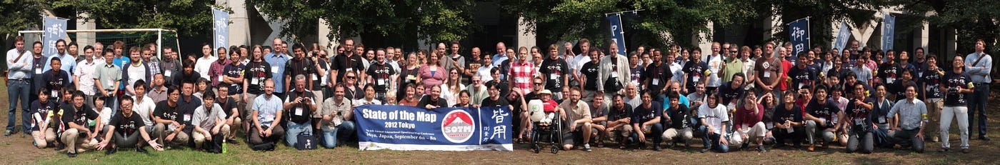
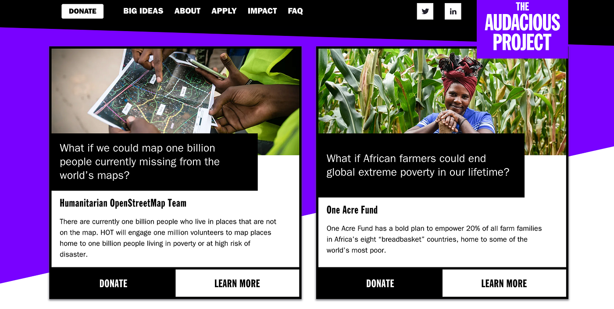

### 地図にない10億の人々。

TEDが認めた人道支援マッピングプロジェクトが切り開く明るい未来

世界には77億以上の人々が生活している。そして、その半分以上である[45億人がインターネットにつながるようになった](https://wearesocial.com/jp/blog/2020/01/gdt2020/)とも言われている。いくつかの課題と、[自由なウェブを遮断](https://jp.techcrunch.com/2021/11/02/2021-10-30-internet-shutdowns-are-a-political-weapon-its-time-to-disarm/)・[検閲するような国](https://ja.wikipedia.org/wiki/%E3%82%B0%E3%83%AC%E3%83%BC%E3%83%88%E3%83%BB%E3%83%95%E3%82%A1%E3%82%A4%E3%82%A2%E3%82%A6%E3%82%A9%E3%83%BC%E3%83%AB#:~:text=%E3%82%B0%E3%83%AC%E3%83%BC%E3%83%88%E3%83%BB%E3%83%95%E3%82%A1%E3%82%A4%E3%82%A2%E3%82%A6%E3%82%A9%E3%83%BC%E3%83%AB%EF%BC%88%E4%B8%AD%E5%9B%BD%E8%AA%9E%3A,1998%E5%B9%B4%E3%81%AB%E9%81%8B%E7%94%A8%E9%96%8B%E5%A7%8B%E3%80%82)も存在するが、多少の足踏みはあれど、世界は着実につながりはじめている。

コロナ禍によってオンラインコミュニケーションが加速しても、人と人がリアルにつながり直接対話する価値は相対的に高まり、今後もその両方を使いこなせる人が活躍する未来はもう見えてきてきたのではないだろうか。

筆者が所属する[青山学院大学](https://www.aoyama.ac.jp/)の[地球社会共生学部](https://www.aoyama.ac.jp/faculty/gsc/)には、世界をもっと良くしたいという熱い想いを持った学生たちが毎年入学してくるが、その多くが、[TED: Ideas Worth Spreading](https://www.ted.com/playlists/171/the_most_popular_talks_of_all) で紹介された[3,500を超える様々なアイディア](https://www.ted.com/talks)をオンラインメディアとして大量に浴びている。つまり、世の中をもっと良くする、もっと楽しくするための知識と事例は日常的にキャッチアップしているのが今どきの学生の当たり前である。たぶん。

そういう意味で、TEDというブランドは、社会貢献を意識している学生にとって大きな存在であり、いつかはTEDに登壇したいという夢を持っている学生も多い。一方で、漠然とした夢は持っていても具体的に何をしたら良いのかわからない学生が多いことも事実である。意識が高いまま何もできない「[意識高い系](https://ja.wikipedia.org/wiki/%E6%84%8F%E8%AD%98%E9%AB%98%E3%81%84%E7%B3%BB)」と揶揄されるのも世知辛い世の中だ。

**# 意識高い系学生はまず手を動かすところから始めろ**

口だけで実践が伴わない学生には、まずTEDで紹介されているアイディアの一つに、直接参加してみることをオススメしたい。TEDに紹介されるようなNGOは、多少の差はあれど本気で自分たちのミッションを成し得ようと努力している。自分でゼロから立ち上げる社会貢献ではなく、すでに動き始めている社会貢献活動に自分も加わってみて、多くを学び、それを糧に自分のやりたいことへ徐々にシフトしていけば良い。

TEDxKids@Chiyoda で筆者(古橋)が登壇したときのトーク

**# TED Prize から TED The Audacious Project へ**

TEDに集まった世界中の数千ものアイディアを厳選したら何が選ばれるのか。それが [TED Prize](https://www.ted.com/about/programs-initiatives/ted-prize) である。

[TED Prize
The TED Prize amplified big ideas from visionary leaders, sparking change all over the world. Each TED Prize winner…www.ted.com](https://www.ted.com/about/programs-initiatives/ted-prize)

世界をより良くするためのベストアイディアとして毎年 TED Prize が選ばれ100万ドルの支援金が贈られてきた。初代 TED Prize 受賞者である U2 のボノや2007年受賞のビル・クリントンなど、文字通り錚々たるメンバーや活動が選ばれてきたが、この TED Prize は2018年にその形を [The Audacious Project](https://audaciousproject.org/) と変え、より実践的に世の中を良くするための社会貢献活動に寄付を誘導するための仕組みへと切り替わっていった。

[The Audacious Project
Housed at TED, The Audacious Project is a collaborative funding initiative that is unlocking social impact on a grand…audaciousproject.org](https://audaciousproject.org/)

[TED](https://www.ted.com/)は知っていても [The Audacious Project](https://audaciousproject.org/) を知っている人は案外少ない。

しかし、TEDを取り囲んでいる本気で世の中を良い方向に変えようとしている人たちが注目している活動は[このThe Audacious Project](https://audaciousproject.org/) に集約されている。世の中にはグローバル系学部と呼ばれる組織はたくさんあると思うが、 [The Audacious Project](https://audaciousproject.org/) を知っているか、もしくはそれに関わっているかを質問すれば、その学部や教員が本当に最先端の世界の動きをウォッチしているか、本当に世の中を変えようと実践しているのか判断できるだろう。

**# 人道支援マッピングプロジェクトは2020年に選ばれた！**

古橋が所属する [Humanitarian OpenStreetMap Team](https://www.hotosm.org/) 通称 HOT は2020年に[The Audacious Project](https://audaciousproject.org/) に選ばれた。理由はこのブログのタイトルにもある通り、まだ世界で8人に1人は、自分の家が、生活している空間が地図に掲載されていない状況なのである。地図が存在して当たり前の日本で生活をしていると、地図が存在しない世界は想像できないかもしれない。学生たちに授業していても、そういう環境で生活したことがなく、世界中Googleマップされあればなんとかなると思っている学生の方が圧倒的多数だ。彼ら・彼女らは地図を持たない10億人の人々の存在に気づかないし、自然災害の多い日本に住んでいる自分自身がいつ地図を持たない10億の側の人間になるかという想像もできない。

2010年のハイチ地震でその重要性に気づいたボランティア活動としてのクライシスマッピングが、[HOT](https://www.hotosm.org/)という組織を作り、10年以上の実績のもとで世界から注目されている。

国連や各国の赤十字、国境なき医師団といった現場で活動する組織と、我々のような人道支援を基軸とした国際デジタルマッピング活動が、貧困や感染症、自然災害や政治的混乱において、相互に連携し合う時代はすでに到来している。あとはそのことに気づき、実際に手を動かしてこれらの活動に参画する人々をどれだけ増やすことができるのか。それだけだ。

青山学院大学の古橋研究室はまさにそのような視点で引き続き [HOT](https://www.hotosm.org/) の活動を支援していくし、世界中の地図ボランティア（マッパー）と協働して新しい世の中を作っていきたいと考えている。

ぜひ、[HOT](https://www.hotosm.org/)が取り組んでいるさまざまな活動と連携プロジェクトを見てほしい。とくに年次カンファレンスである [HOT Summit 2021](https://summit.hotosm.org/) の動画もすでに [YouTube で公開](https://www.youtube.com/playlist?list=PLb9506_-6FMGdjJSF4SmLW-_S204m7GrR)されている。

人道支援マッピング国際会議 HOT Summit 2021 動画再生リスト on YouTube

**# コミュニティの動的平衡を維持しやすい仕組みは教育機関である。**

コミュニティには新陳代謝が重要である。常に同じメンバーが変わらずにコミュニティの中心にいるとすると動的平衡が維持できずに死を迎えるだろう。経験的には10年くらいでメンバーが刷新し、平均年齢が維持されることが望ましいのではないかと思っている。

大学などの教育機関には毎年新入生がやってきて、毎年卒業生として卒業していく。

彼ら・彼女らが所属する数年間に、[The Audacious Project](https://audaciousproject.org/) のような本当に価値のある国際プロジェクトに関わる機会を提供し、その経験が評価され、自分のキャリアアップの糧にしてもらいたいと、古橋研究室では学部生でも容赦なく国際会議の場に登壇者として放り込まれる。

HOT Summit 2021 で登壇する古橋研究室 YouthMappersAGU メンバー

もちろん、英語での質疑応答やディスカッションは思うようにできず歯がゆい経験も沢山するだろう。それでも、日本からも、世界のあちこちからも、とにかく多様なメンバーが一緒になって、まだ地図上では未知の世界となっている世の中を、文字通り手を動かしながらマッピングしていくそんな未来はやってきている。

HOT Summit 2021 での災害ドローン救援隊DRONEBIRD 活動紹介

**# 地図にはないけれど、われわれはここにいる。**

最後に、**[他国のマッパーが良かれと思って一方的に地図を作る行為は植民地主義と捉えられる側面もあること**](https://graphia.jp/article/2021/02/22/120/)を知ってほしい。そこに住む人々と共に我々は地図を作るべきである。HOTの活動はすべての人が手放しで称賛しているわけではない。時間をかけながら、対話を続け、現地の人々とインターネットでつながった多様な人々が地図づくりという行為を通じて、お互いを理解していくことからすべてが始まる。

だからこそ、コロナ禍が収まった後は、また世界中のマッパーたちに逢いに行こうと思っている。

[【翻訳】地図にはないけれど、われわれはここにいる。 - グラフィア - 地図や位置情報に特化したWebメディア「graphia（グラフィア）」
発展途上国のクライシスレスポンスをより効率的に支援するために「前もって」その地域のマッピング活動を行う団体「Missing Maps」のブログに掲載された、David Garcia(@mapmakerdavid) さんに [...]graphia.jp](https://graphia.jp/article/2021/02/22/120/)

この投稿は 以下のアドベントカレンダー2021として登録されています。
* [https://qiita.com/advent-calendar/2021/osmjp](https://qiita.com/advent-calendar/2021/osmjp)
* [https://qiita.com/advent-calendar/2021/furuhashilab](https://qiita.com/advent-calendar/2021/furuhashilab)
* [https://qiita.com/advent-calendar/2021/dronebird](https://qiita.com/advent-calendar/2021/dronebird)
