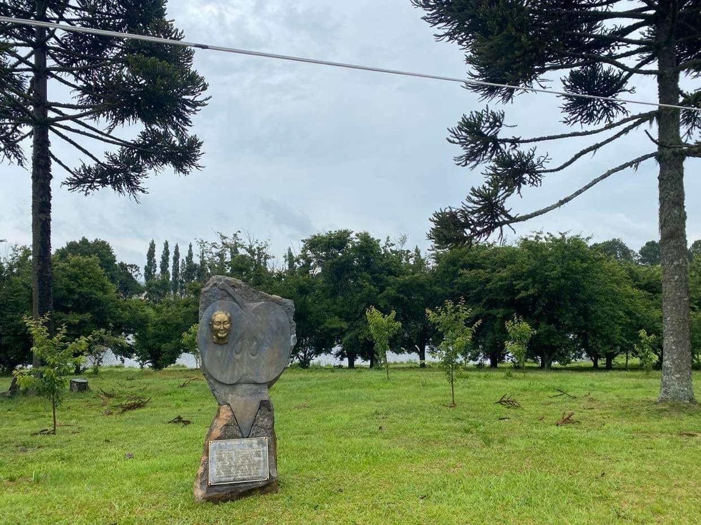

### アドベントカレンダー12/3!!!

祖父の胸像を探し続けている吉田です。

この前の中間発表からあまり日が経っていないですが発表させていただきます。

この前のスライドを作成した時にはまだ、佐藤さまと軽く連絡を取り合うくらいのことしかできなかったため、その後中間発表あたりの連絡の内容を踏まえて改めて進捗報告させていただきます。

この前のスライドの内容と変わった部分

⚠️新規情報

・今も胸像は無事 手入れされている

・佐藤さまは当時とても幼かったため、記憶が少し曖昧

・現地に祖父と活動していた方がまだご存命→後日電話

・リンゴの栽培は本当に多くのブラジル人とブラジルを救った

・祖父と一緒に活動をしていた方の連絡先を入手！！！連絡をとってみます。

ブラジルとの時差は丸半日☀️

なかなかビデオ通話するのも難しかったです。

> **Discussion**

いまだに銅像の位置は掴めない （googlemapなどで探すことができていない。）

祖父の銅像の除幕式の際に父が泊まったホテルはわかるのに…

どんな暮らし、生活をしていたのか細かく聞く必要がある。

肺炎は治すことはできなかったのか…

> **現在の胸像の様子**

> **スライド**

> グラレコ

（作成中）

> **GitHub**

[GitHub - furuhashilab/2021gsc_Suzuka-Yoshida: 2021年度ゼミ論
2021年度古橋ゼミ論用レポジトリ 吉田 涼香 青山学院大学 地球社会共生学部 地球社会共生学科 吉田涼香/Suzuka Yoshida 学生番号 1A118179 指導教員 古橋 大地 教授 © Furuhashi…github.com](https://github.com/furuhashilab/2021gsc_Suzuka-Yoshida)
