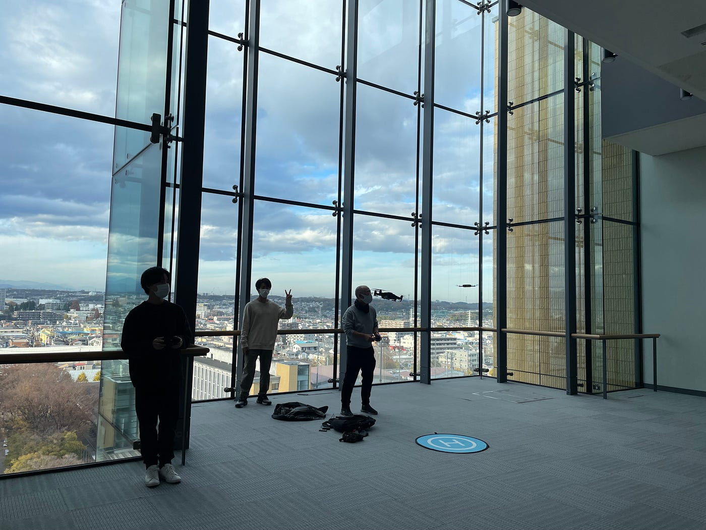
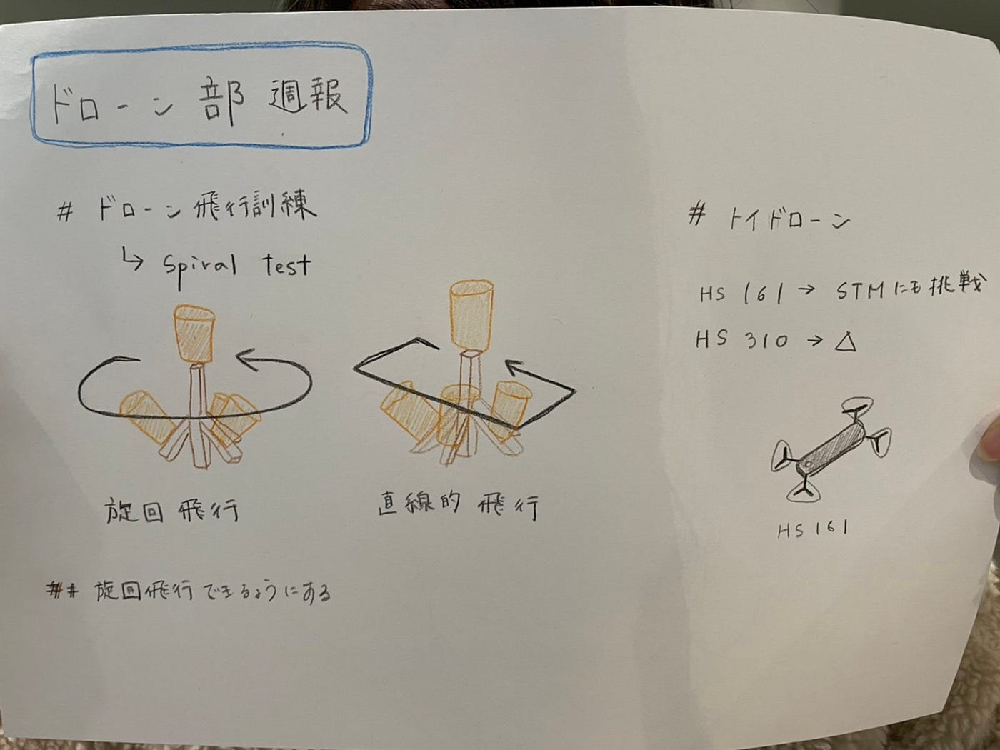

### ドローン週報

＃STM訓練

今週もドローン部はB棟９階にて飛行練習とSTM訓練を行いました。

ドローン部に加え、今週は研究室の学生やアドグルの方が練習に参加しました。

今週は特にSpiral testにおいて、直線的な動きではなく綺麗に旋回できるよう練習しました。しかし、STMキットの大きさに合わせた円を描きながら旋回するのはなかなか難しく、今のところはタイムを計ると直線的に飛ばした方が速くなっています。

円が小さいほど旋回しやすいですが大きくなると、ラダーとエルロンの力の入れ加減が中々難しく、STMにぶつかりそうになってしまうのでまだまだ練習が必要です。。。

もっと旋回飛行の技術を上げてタイムを縮めていきたいです。

また、今回は東藤さんが二つトイドローン(HS310とHS161)を持ってきてくださり、みんなで練習してみました。

[HS161](https://holystone.co.jp/product/hs161/)は静かで比較的流されなかったので、STM練習に参加しました。

HS310の方はだいぶ流されてしまい、９階で飛ばすには少し危険でした。

次回も持ってきてくださるようなので、Mavic Airと共に練習していきます。

STMキットが壊れてしまい、ガムテープで止めているだけなので、次回修理します。

＜グラレコ＞

