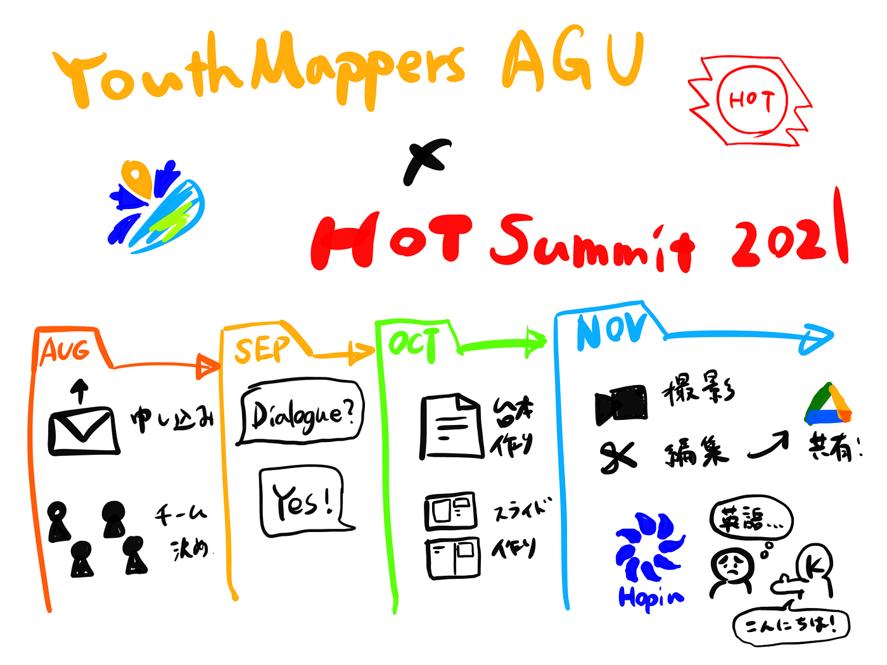

### 英語練習します。【HOT Summit 2021】

YouthMappers AGU 12/7 週報

[HOT Summit 2021 | Home
On 22 November 2021, HOT is hosting its 7th global summit dedicated to humanitarian action and community development…summit2021.hotosm.org](https://summit2021.hotosm.org/)

こんにちは。3年の柴山です。

少し前になりますが、11/22に開催された人道支援マッピングのオンライン国際会議 HOT Summit 2021 に登壇しました！

Dialogue という発表方式でエントリーし、発表動画を提出して質疑応答に臨みました。久しぶりの英会話に苦戦する中、オーディエンスの方にサポートしてもらいつつやり切りました。

> 夏からの道のり

今年8月に HOT Summit 2021 の登壇者募集があり、YouthMappers AGU の代表スピーカーとして [Ibuki Shibayama](None), [SOTA SUZUKI](None), サポーターとして [Kuniharu Higano](None), Ayako Takahashi の4名のチームでエントリーと準備を始めました。

当初は昨年と同じく5分間の発表の Lightning Talk 方式でエントリーしていたのですが、9月に運営側から「Dialogue 方式で話してみないか」と訊かれ、昨年からのレベルアップするためにご提案を受けてみることにしました。

今年度は全ての発表は事前に動画を提出してリアルタイムで流していく方式が採用され、我々は10月から発表の台本とスライドの作成、11月上旬に収録と編集を行いました。“Activity Report 2020–2021” と題して作成に取り組み、スライド作成には [Prezi](https://prezi.com/ja/) 、動画編集には [DaVinci Resolve](https://www.blackmagicdesign.com/jp/products/davinciresolve/) を使用しました。

完成した動画や資料は指定された共有ドライブにアップロードし、本番に備えました。

> Hopin でのオンライン会議

今年の HOT Summit は Hopin というバーチャルイベントプラットフォームが採用され、同時進行する複数のセッションの行き来が分かりやすい点や、チャット欄が各テーマごとに整理されている点などのメリットを体感できました。

各セッションごとに運営の方が配置されていて、古橋先生の発表のセッションでは8月の Asia-Pacific Mapathon に参加してくださった Mikko さんがファシリテーターを担当されていました！！

HOT公式チャンネルで公開されているYouthの発表動画

> 質疑応答に苦戦

練習や撮り直しができる動画とは違い、リアルタイムでのやり取りが必要とされる質疑応答は非常に難しかったです。特に英会話にご無沙汰だったことと国際会議の場に立つという緊張が相まって上手く話せませんでした。この悔しさをばねに英会話の練習に励みたいと思います。

しかし、そんな我々を救ってくれたオーディエンスの方がいました！

青学に縁があって日本語と英語が話せる Kristi さんの通訳に助けられながらなんとか質疑応答を乗り越えました。Kristiさん、ありがとうございました！！

> 今後は…

今回の反省から、海外の YouthMappers たちともっとコミュニケーションを取っていく必要があると感じました。

Ayako Takahashi によると、昨年 Mapathon をした UCC が Wheelmap に興味があるとのことなので、それに関連したイベントを考えていく予定です。

さらに、今月の UNVT ハッカソンをきっかけにアジアのマッパーとも交流していけたらと思っています。

> グラレコ

