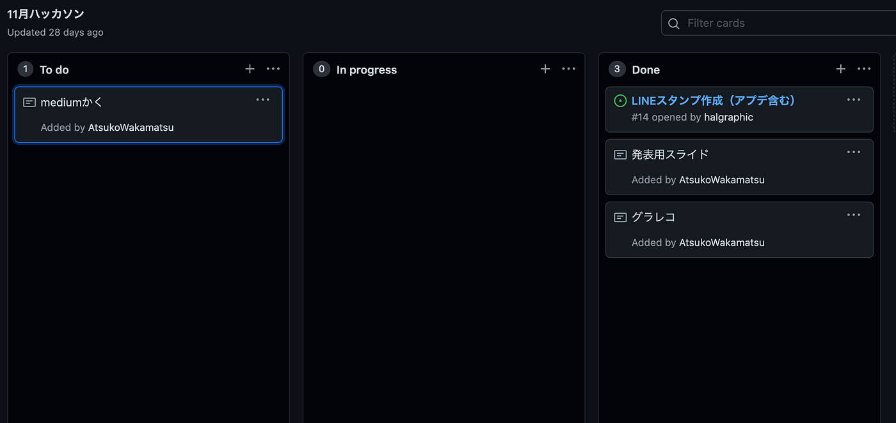
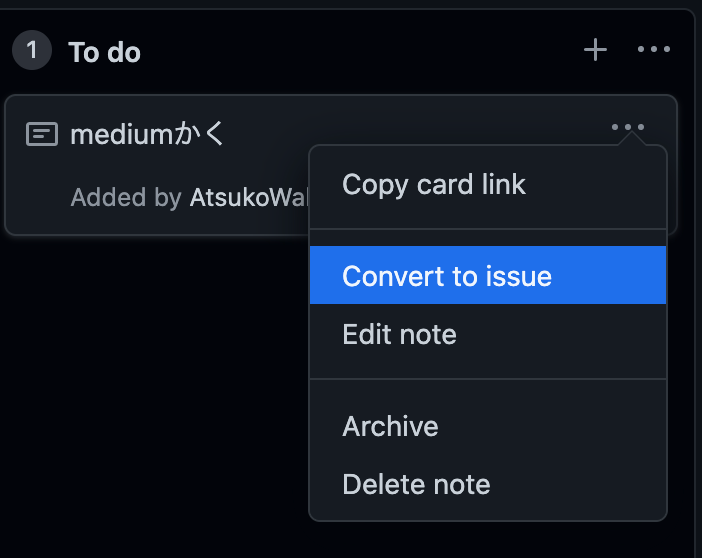
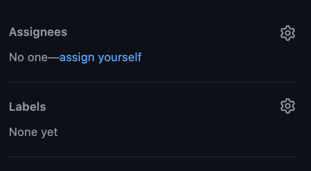
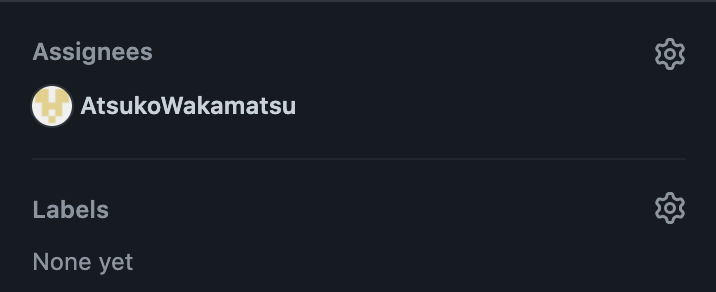
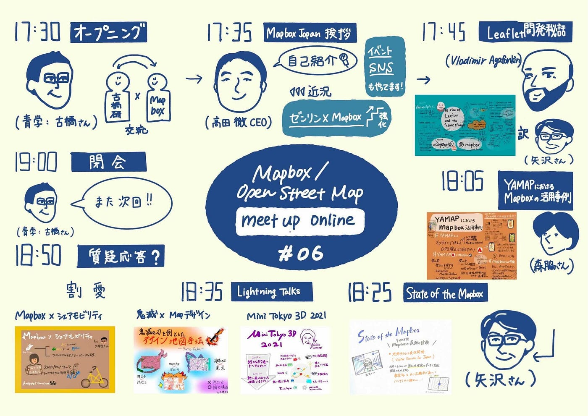

### **ハッカソン反省会**

こんにちは！デザイン部です

先月行ったハッカソンでの反省会を行いました。

GitHubがプロジェクトを立てたままで終わっていたので活用できていないことが課題としてのこりました。

#### ＃GithHubのプロジェクト管理方法

プロジェクトを立てる→**Issueに変換（超大事）→assignする（**→マイルストーンをおく）

プロジェクトを立てて終わり！ではなくissueに変換しassignまで行うことで誰がどの作業を行うのかを明確化することが重要と学びました。

今後のハッカソン、プロジェクト進行にも重要だと思うのでメンバー全員マスターして円滑に作業が進められるようにしていきたいと思います。

参考記事：[GitHubによるプロジェクト管理方法](https://upd.world/projects-management-github/)

MeetUpのグラレコ完成しました！！！！

＃グラレコ（はるかさん）

来週はGOOD Designのレポをします！！！！！
