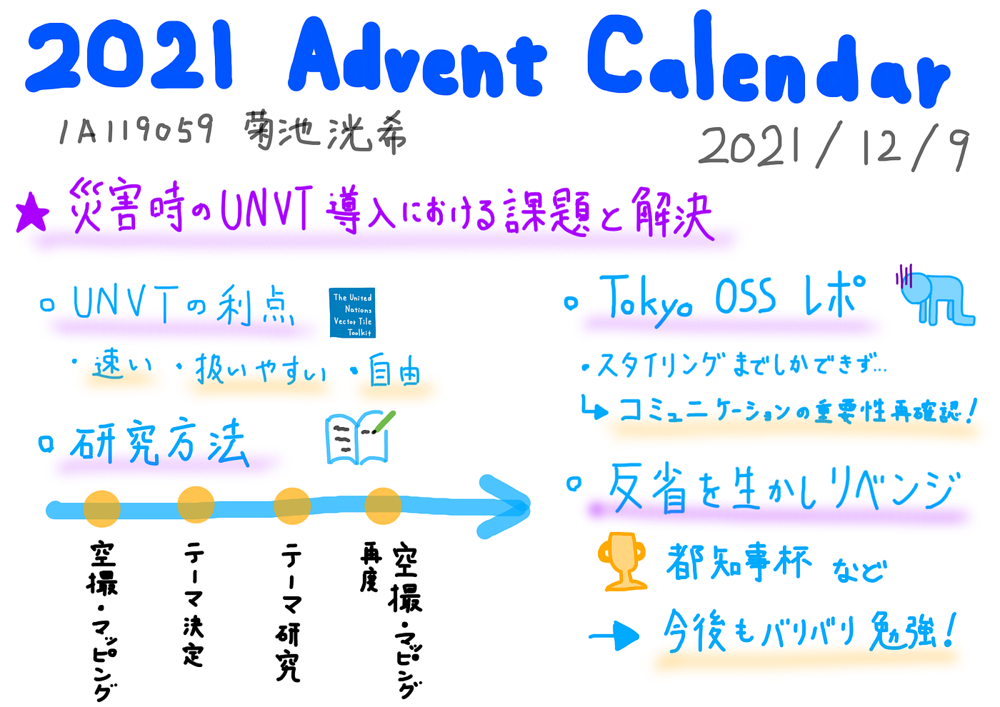

### 12/9 Advent Calendar

こんにちは！

地球3年の菊池です。

ゼミ論中間報告を含め、進捗を報告したいと思います。

まず、今年度ゼミ論のテーマは「災害時のUNVT導入における課題と解決」です！

国連ベクトルタイルツールキットを災害地のマッピングに活用することで、より迅速かつ柔軟な地図作りを目指します。その上で課題として挙げられるものの中からいくつか選定し、解決しようという試みです。

さて、一歩目となるイベント「Tokyo OSS Party!!」が終了しました。

結果、我が青学チームは惨敗。UNVTを活用する以前に、スタイリングのステップまでしか進めず、悔しい結果となりました。知識不足、共有不足など自分にはまだまだ足りないことばかり。

しかし、悔しさをバネに「都知事杯 Open Data Hackathon」へ挑戦します。今度こそ目標達成、そしてUNVTの活用を実現したいと思います！

さらに今後もUNVT関連のイベントが目白押し。絶賛勉強中の私にはこれ以上ないタイミングです。これから、さらに勉強していきたいと思います！

[GitHub - furuhashilab/2021gsc_Kohki_Kikuchi
Contribute to furuhashilab/2021gsc_Kohki_Kikuchi development by creating an account on GitHub.github.com](https://github.com/furuhashilab/2021gsc_Kohki_Kikuchi)
